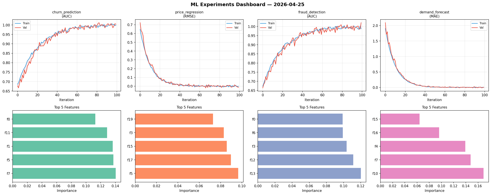
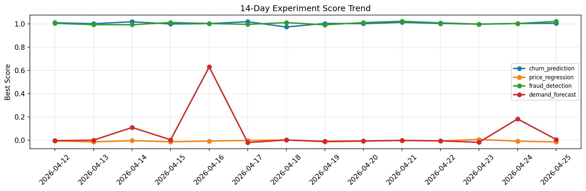

# ML Experiments Report — 2026-04-25

**Run ID:** `c9b22e3b5b` | **Experiments:** 4 | **Trials:** 19

## Delta vs Yesterday

| Experiment | Today | Yesterday | Change |
|-----------|-------|-----------|--------|
| churn_prediction | 1.0044 | 1.0028 | 📈 0.2% |
| price_regression | -0.014 | -0.0066 | 📉 -112.1% |
| fraud_detection | 1.0209 | 1.0028 | 📈 1.8% |
| demand_forecast | 0.008 | 0.184 | 📉 -95.7% |

## churn_prediction (AUC)

**Best Score:** 1.0044 (Trial 4)

| Trial | Score | Overfit Gap | Time | LR | Trees | Leaves |
|-------|-------|-------------|------|-----|-------|--------|
| 1 | 0.985 | 0.0089 | 5.99s | 0.1 | 100 | 15 |
| 2 | 0.677 | 0.0228 | 16.24s | 0.01 | 100 | 31 |
| 3 | 0.9838 | 0.0262 | 1.22s | 0.05 | 100 | 127 |
| 4 ⭐ | 1.0044 | 0.0057 | 19.96s | 0.1 | 100 | 127 |
| 5 | 0.9939 | 0.01 | 18.73s | 0.1 | 100 | 63 |

## price_regression (RMSE)

**Best Score:** -0.014 (Trial 1)

| Trial | Score | Overfit Gap | Time | LR | Trees | Leaves |
|-------|-------|-------------|------|-----|-------|--------|
| 1 ⭐ | -0.014 | 0.0138 | 12.49s | 0.2 | 100 | 31 |
| 2 | 0.0043 | 0.0176 | 111.27s | 0.2 | 500 | 63 |
| 3 | 0.3898 | 0.0235 | 45.06s | 0.01 | 200 | 127 |

## fraud_detection (AUC)

**Best Score:** 1.0209 (Trial 5)

| Trial | Score | Overfit Gap | Time | LR | Trees | Leaves |
|-------|-------|-------------|------|-----|-------|--------|
| 1 | 1.0059 | 0.0076 | 43.94s | 0.2 | 200 | 127 |
| 2 | 1.0003 | 0.0037 | 37.06s | 0.2 | 500 | 127 |
| 3 | 0.6813 | 0.032 | 26.17s | 0.01 | 100 | 63 |
| 4 | 0.9514 | 0.019 | 296.63s | 0.05 | 1000 | 15 |
| 5 ⭐ | 1.0209 | 0.0334 | 8.4s | 0.1 | 100 | 127 |

## demand_forecast (MAE)

**Best Score:** 0.008 (Trial 1)

| Trial | Score | Overfit Gap | Time | LR | Trees | Leaves |
|-------|-------|-------------|------|-----|-------|--------|
| 1 ⭐ | 0.008 | 0.008 | 237.81s | 0.2 | 1000 | 31 |
| 2 | 0.0854 | 0.0059 | 7.84s | 0.05 | 100 | 127 |
| 3 | 0.8344 | 0.0313 | 5.01s | 0.01 | 100 | 63 |
| 4 | 0.0691 | 0.0095 | 50.48s | 0.05 | 200 | 63 |
| 5 | 0.9572 | 0.0104 | 30.68s | 0.01 | 200 | 127 |
| 6 | 0.531 | 0.0727 | 206.19s | 0.01 | 1000 | 31 |
