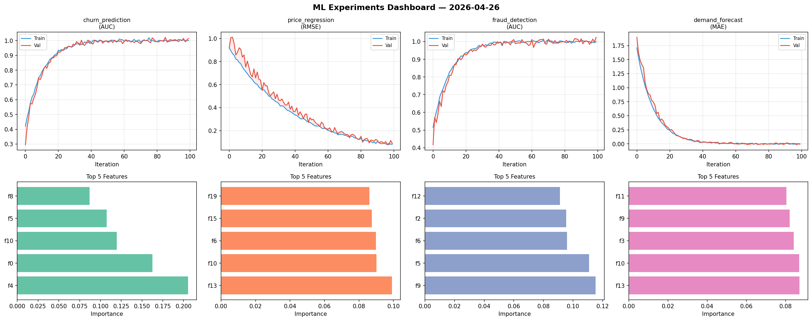
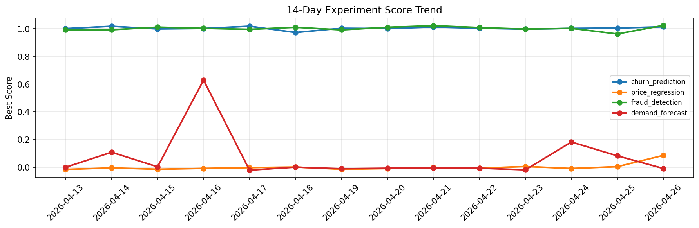

# ML Experiments Report — 2026-04-26

**Run ID:** `d952b09a3f` | **Experiments:** 4 | **Trials:** 18

## Delta vs Yesterday

| Experiment | Today | Yesterday | Change |
|-----------|-------|-----------|--------|
| churn_prediction | 1.0141 | 1.005 | 📈 0.9% |
| price_regression | 0.0876 | 0.0064 | 📈 1268.7% |
| fraud_detection | 1.024 | 0.9626 | 📈 6.4% |
| demand_forecast | -0.0066 | 0.0844 | 📉 -107.8% |

## churn_prediction (AUC)

**Best Score:** 1.0141 (Trial 1)

| Trial | Score | Overfit Gap | Time | LR | Trees | Leaves |
|-------|-------|-------------|------|-----|-------|--------|
| 1 ⭐ | 1.0141 | 0.0145 | 9.1s | 0.2 | 200 | 15 |
| 2 | 0.7106 | 0.035 | 221.9s | 0.01 | 1000 | 31 |
| 3 | 0.6322 | 0.0463 | 20.97s | 0.01 | 200 | 31 |

## price_regression (RMSE)

**Best Score:** 0.0876 (Trial 2)

| Trial | Score | Overfit Gap | Time | LR | Trees | Leaves |
|-------|-------|-------------|------|-----|-------|--------|
| 1 | 0.6033 | 0.0894 | 43.11s | 0.01 | 200 | 31 |
| 2 ⭐ | 0.0876 | 0.0051 | 179.08s | 0.05 | 1000 | 15 |
| 3 | 0.7279 | 0.1193 | 286.3s | 0.01 | 1000 | 31 |
| 4 | 0.1779 | 0.0322 | 19.05s | 0.05 | 100 | 63 |

## fraud_detection (AUC)

**Best Score:** 1.024 (Trial 6)

| Trial | Score | Overfit Gap | Time | LR | Trees | Leaves |
|-------|-------|-------------|------|-----|-------|--------|
| 1 | 0.9588 | 0.0068 | 82.23s | 0.05 | 1000 | 31 |
| 2 | 0.9788 | 0.0183 | 40.07s | 0.2 | 200 | 63 |
| 3 | 0.9753 | 0.0024 | 21.04s | 0.05 | 200 | 15 |
| 4 | 1.0014 | 0.0039 | 83.43s | 0.1 | 1000 | 31 |
| 5 | 1.0085 | 0.0001 | 23.44s | 0.2 | 100 | 127 |
| 6 ⭐ | 1.024 | 0.025 | 42.26s | 0.2 | 200 | 127 |

## demand_forecast (MAE)

**Best Score:** -0.0066 (Trial 2)

| Trial | Score | Overfit Gap | Time | LR | Trees | Leaves |
|-------|-------|-------------|------|-----|-------|--------|
| 1 | 0.0108 | 0.0023 | 7.86s | 0.1 | 100 | 15 |
| 2 ⭐ | -0.0066 | 0.0089 | 92.32s | 0.2 | 500 | 127 |
| 3 | 0.1229 | 0.0089 | 260.02s | 0.05 | 1000 | 127 |
| 4 | 0.1193 | 0.0013 | 7.09s | 0.05 | 100 | 31 |
| 5 | 0.1685 | 0.0195 | 23.6s | 0.05 | 500 | 127 |
