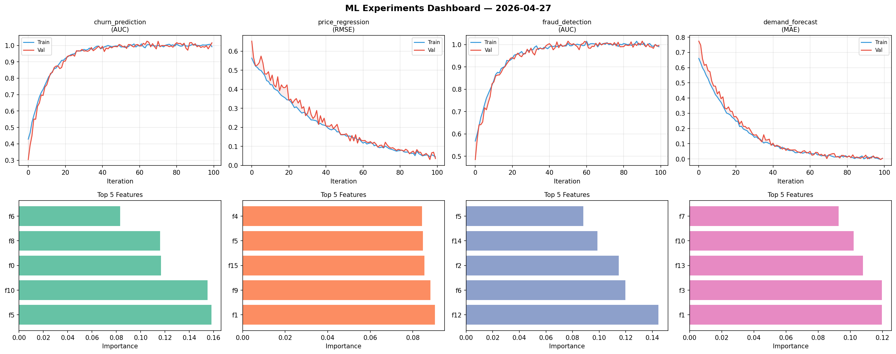
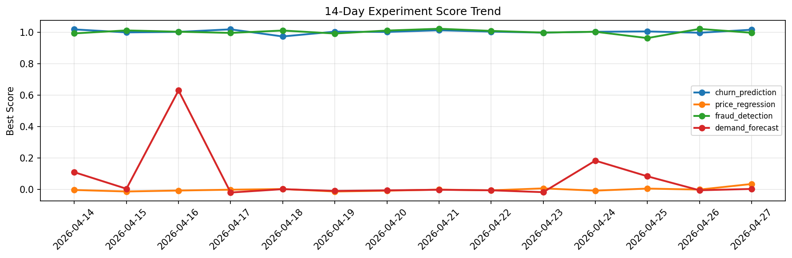

# ML Experiments Report — 2026-04-27

**Run ID:** `9a22d094a6` | **Experiments:** 4 | **Trials:** 18

## Delta vs Yesterday

| Experiment | Today | Yesterday | Change |
|-----------|-------|-----------|--------|
| churn_prediction | 1.0158 | 0.9966 | 📈 1.9% |
| price_regression | 0.0356 | -0.0 | 📈 3560.0% |
| fraud_detection | 0.9964 | 1.0211 | 📉 -2.4% |
| demand_forecast | 0.0041 | -0.0043 | 📈 195.3% |

## churn_prediction (AUC)

**Best Score:** 1.0158 (Trial 3)

| Trial | Score | Overfit Gap | Time | LR | Trees | Leaves |
|-------|-------|-------------|------|-----|-------|--------|
| 1 | 1.0063 | 0.0135 | 39.23s | 0.2 | 500 | 127 |
| 2 | 0.9924 | 0.0057 | 82.29s | 0.2 | 500 | 127 |
| 3 ⭐ | 1.0158 | 0.0239 | 20.19s | 0.2 | 1000 | 127 |
| 4 | 0.9718 | 0.0253 | 7.55s | 0.1 | 500 | 31 |
| 5 | 0.9877 | 0.011 | 21.1s | 0.2 | 200 | 127 |
| 6 | 0.9984 | 0.0038 | 175.65s | 0.1 | 1000 | 31 |

## price_regression (RMSE)

**Best Score:** 0.0356 (Trial 1)

| Trial | Score | Overfit Gap | Time | LR | Trees | Leaves |
|-------|-------|-------------|------|-----|-------|--------|
| 1 ⭐ | 0.0356 | 0.009 | 116.09s | 0.05 | 500 | 63 |
| 2 | 1.1423 | 0.0122 | 46.81s | 0.01 | 200 | 15 |
| 3 | 0.0798 | 0.0081 | 148.8s | 0.05 | 500 | 127 |
| 4 | 0.0932 | 0.0152 | 39.63s | 0.05 | 1000 | 15 |
| 5 | 0.0523 | 0.013 | 271.08s | 0.05 | 1000 | 127 |
| 6 | 0.5559 | 0.0719 | 63.72s | 0.01 | 1000 | 31 |

## fraud_detection (AUC)

**Best Score:** 0.9964 (Trial 3)

| Trial | Score | Overfit Gap | Time | LR | Trees | Leaves |
|-------|-------|-------------|------|-----|-------|--------|
| 1 | 0.6273 | 0.0688 | 146.53s | 0.01 | 500 | 63 |
| 2 | 0.9908 | 0.0072 | 88.31s | 0.1 | 1000 | 127 |
| 3 ⭐ | 0.9964 | 0.0063 | 36.37s | 0.2 | 200 | 63 |

## demand_forecast (MAE)

**Best Score:** 0.0041 (Trial 3)

| Trial | Score | Overfit Gap | Time | LR | Trees | Leaves |
|-------|-------|-------------|------|-----|-------|--------|
| 1 | 0.0361 | 0.0387 | 187.56s | 0.1 | 1000 | 63 |
| 2 | 0.1109 | 0.0096 | 15.69s | 0.05 | 100 | 63 |
| 3 ⭐ | 0.0041 | 0.0007 | 0.98s | 0.1 | 100 | 15 |
