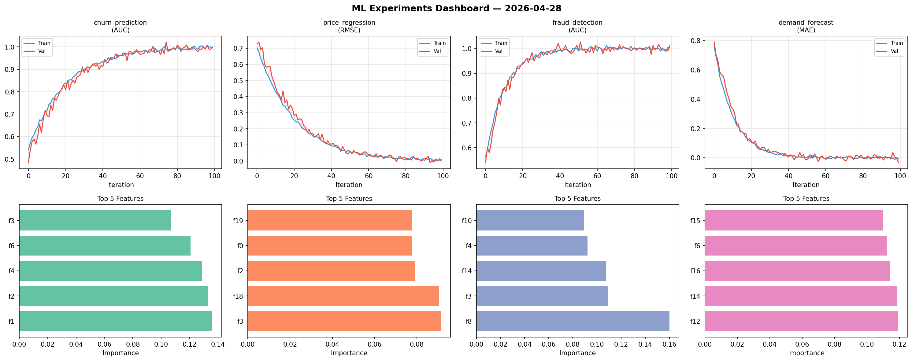
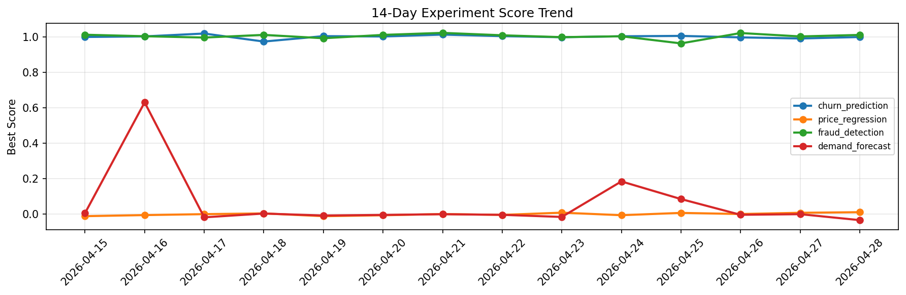

# ML Experiments Report — 2026-04-28

**Run ID:** `c96eb0e6a2` | **Experiments:** 4 | **Trials:** 18

## Delta vs Yesterday

| Experiment | Today | Yesterday | Change |
|-----------|-------|-----------|--------|
| churn_prediction | 0.9987 | 0.9903 | 📈 0.8% |
| price_regression | 0.0104 | 0.007 | 📈 48.6% |
| fraud_detection | 1.0104 | 1.0019 | 📈 0.8% |
| demand_forecast | -0.0344 | -0.0008 | 📉 -3360.0% |

## churn_prediction (AUC)

**Best Score:** 0.9987 (Trial 4)

| Trial | Score | Overfit Gap | Time | LR | Trees | Leaves |
|-------|-------|-------------|------|-----|-------|--------|
| 1 | 0.7505 | 0.0383 | 124.35s | 0.01 | 500 | 63 |
| 2 | 0.8028 | 0.0072 | 293.98s | 0.01 | 1000 | 15 |
| 3 | 0.9861 | 0.0085 | 42.34s | 0.2 | 500 | 127 |
| 4 ⭐ | 0.9987 | 0.0003 | 132.03s | 0.1 | 1000 | 127 |

## price_regression (RMSE)

**Best Score:** 0.0104 (Trial 3)

| Trial | Score | Overfit Gap | Time | LR | Trees | Leaves |
|-------|-------|-------------|------|-----|-------|--------|
| 1 | 1.006 | 0.1412 | 21.15s | 0.01 | 200 | 31 |
| 2 | 0.7066 | 0.0324 | 10.07s | 0.01 | 500 | 127 |
| 3 ⭐ | 0.0104 | 0.0098 | 15.37s | 0.1 | 200 | 63 |

## fraud_detection (AUC)

**Best Score:** 1.0104 (Trial 3)

| Trial | Score | Overfit Gap | Time | LR | Trees | Leaves |
|-------|-------|-------------|------|-----|-------|--------|
| 1 | 0.9974 | 0.003 | 10.24s | 0.1 | 200 | 15 |
| 2 | 0.9452 | 0.011 | 5.95s | 0.05 | 100 | 15 |
| 3 ⭐ | 1.0104 | 0.0068 | 29.38s | 0.2 | 100 | 15 |
| 4 | 1.0057 | 0.0116 | 57.07s | 0.1 | 1000 | 15 |
| 5 | 0.9644 | 0.0107 | 27.44s | 0.05 | 200 | 31 |
| 6 | 0.9981 | 0.0013 | 5.9s | 0.1 | 200 | 15 |

## demand_forecast (MAE)

**Best Score:** -0.0344 (Trial 1)

| Trial | Score | Overfit Gap | Time | LR | Trees | Leaves |
|-------|-------|-------------|------|-----|-------|--------|
| 1 ⭐ | -0.0344 | 0.0313 | 76.61s | 0.2 | 500 | 127 |
| 2 | 0.0632 | 0.0188 | 18.2s | 0.05 | 100 | 127 |
| 3 | 0.8722 | 0.0361 | 2.65s | 0.01 | 200 | 15 |
| 4 | 0.0072 | 0.0057 | 3.2s | 0.2 | 100 | 127 |
| 5 | 1.2106 | 0.1793 | 36.93s | 0.01 | 200 | 15 |
