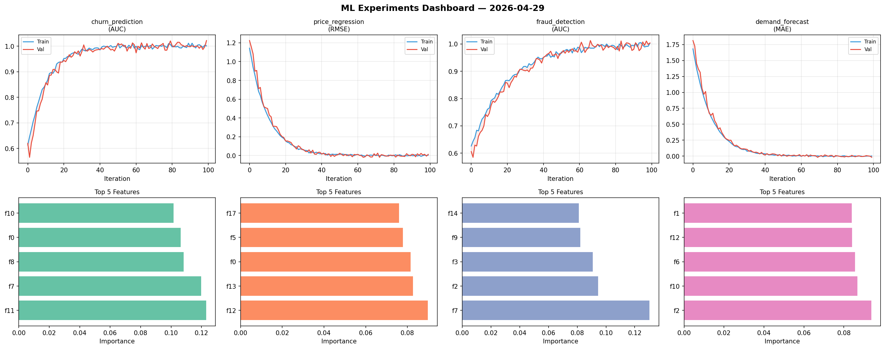
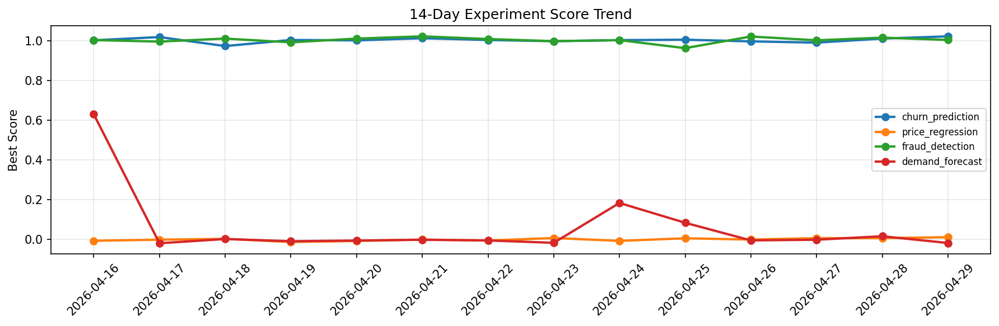

# ML Experiments Report — 2026-04-29

**Run ID:** `6c4f1d52c1` | **Experiments:** 4 | **Trials:** 16

## Delta vs Yesterday

| Experiment | Today | Yesterday | Change |
|-----------|-------|-----------|--------|
| churn_prediction | 1.0219 | 1.0106 | 📈 1.1% |
| price_regression | 0.0119 | 0.0074 | 📈 60.8% |
| fraud_detection | 1.0038 | 1.0154 | 📉 -1.1% |
| demand_forecast | -0.0173 | 0.0167 | 📉 -203.6% |

## churn_prediction (AUC)

**Best Score:** 1.0219 (Trial 1)

| Trial | Score | Overfit Gap | Time | LR | Trees | Leaves |
|-------|-------|-------------|------|-----|-------|--------|
| 1 ⭐ | 1.0219 | 0.021 | 19.2s | 0.2 | 100 | 127 |
| 2 | 1.0184 | 0.0213 | 23.41s | 0.1 | 200 | 31 |
| 3 | 0.9978 | 0.0025 | 8.05s | 0.1 | 100 | 127 |
| 4 | 0.9978 | 0.0023 | 25.55s | 0.2 | 100 | 15 |

## price_regression (RMSE)

**Best Score:** 0.0119 (Trial 4)

| Trial | Score | Overfit Gap | Time | LR | Trees | Leaves |
|-------|-------|-------------|------|-----|-------|--------|
| 1 | 0.0153 | 0.005 | 55.24s | 0.1 | 500 | 15 |
| 2 | 0.1291 | 0.0171 | 283.47s | 0.05 | 1000 | 31 |
| 3 | 0.161 | 0.0142 | 0.91s | 0.05 | 100 | 63 |
| 4 ⭐ | 0.0119 | 0.009 | 81.46s | 0.2 | 500 | 31 |
| 5 | 0.0299 | 0.0205 | 10.13s | 0.05 | 100 | 15 |

## fraud_detection (AUC)

**Best Score:** 1.0038 (Trial 2)

| Trial | Score | Overfit Gap | Time | LR | Trees | Leaves |
|-------|-------|-------------|------|-----|-------|--------|
| 1 | 0.9883 | 0.0086 | 38.86s | 0.2 | 500 | 127 |
| 2 ⭐ | 1.0038 | 0.0007 | 137.46s | 0.1 | 1000 | 31 |
| 3 | 0.6429 | 0.052 | 138.97s | 0.01 | 500 | 127 |

## demand_forecast (MAE)

**Best Score:** -0.0173 (Trial 4)

| Trial | Score | Overfit Gap | Time | LR | Trees | Leaves |
|-------|-------|-------------|------|-----|-------|--------|
| 1 | 0.1431 | 0.0346 | 116.72s | 0.05 | 1000 | 127 |
| 2 | 0.0006 | 0.0093 | 2.01s | 0.1 | 200 | 63 |
| 3 | 0.0194 | 0.0281 | 121.35s | 0.1 | 500 | 63 |
| 4 ⭐ | -0.0173 | 0.0196 | 18.25s | 0.2 | 100 | 31 |
