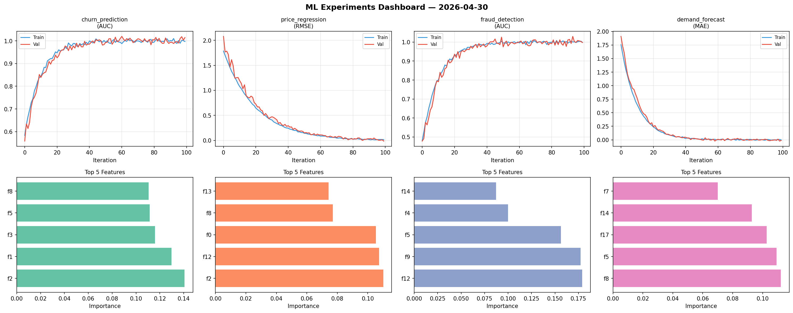
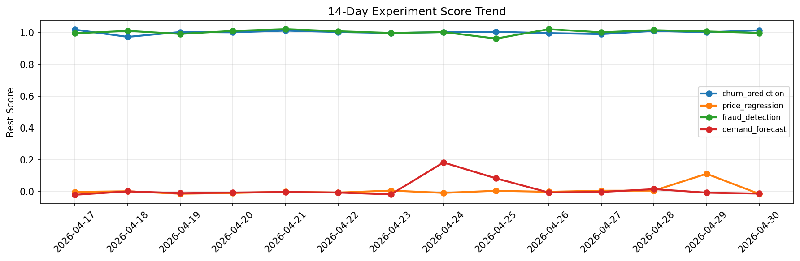

# ML Experiments Report — 2026-04-30

**Run ID:** `cce523d3b5` | **Experiments:** 4 | **Trials:** 20

## Delta vs Yesterday

| Experiment | Today | Yesterday | Change |
|-----------|-------|-----------|--------|
| churn_prediction | 1.0144 | 1.0018 | 📈 1.3% |
| price_regression | -0.013 | 0.1131 | 📉 -111.5% |
| fraud_detection | 0.9979 | 1.0072 | 📉 -0.9% |
| demand_forecast | -0.0112 | -0.0054 | 📉 -107.4% |

## churn_prediction (AUC)

**Best Score:** 1.0144 (Trial 6)

| Trial | Score | Overfit Gap | Time | LR | Trees | Leaves |
|-------|-------|-------------|------|-----|-------|--------|
| 1 | 1.0101 | 0.0136 | 266.54s | 0.2 | 1000 | 63 |
| 2 | 0.7809 | 0.0008 | 204.01s | 0.01 | 1000 | 31 |
| 3 | 0.9807 | 0.0186 | 225.51s | 0.2 | 1000 | 31 |
| 4 | 0.9803 | 0.0057 | 2.2s | 0.05 | 100 | 63 |
| 5 | 0.9589 | 0.0021 | 147.14s | 0.05 | 1000 | 31 |
| 6 ⭐ | 1.0144 | 0.0174 | 18.1s | 0.2 | 100 | 127 |

## price_regression (RMSE)

**Best Score:** -0.013 (Trial 6)

| Trial | Score | Overfit Gap | Time | LR | Trees | Leaves |
|-------|-------|-------------|------|-----|-------|--------|
| 1 | 0.12 | 0.0104 | 117.12s | 0.05 | 500 | 31 |
| 2 | 0.0109 | 0.0011 | 94.98s | 0.1 | 500 | 15 |
| 3 | 0.0894 | 0.0373 | 44.37s | 0.05 | 200 | 127 |
| 4 | 0.4514 | 0.0267 | 22.87s | 0.01 | 200 | 127 |
| 5 | 0.0032 | 0.0026 | 25.62s | 0.1 | 100 | 63 |
| 6 ⭐ | -0.013 | 0.0298 | 183.69s | 0.1 | 1000 | 31 |

## fraud_detection (AUC)

**Best Score:** 0.9979 (Trial 1)

| Trial | Score | Overfit Gap | Time | LR | Trees | Leaves |
|-------|-------|-------------|------|-----|-------|--------|
| 1 ⭐ | 0.9979 | 0.0008 | 213.43s | 0.2 | 1000 | 127 |
| 2 | 0.7035 | 0.0206 | 24.13s | 0.01 | 200 | 15 |
| 3 | 0.959 | 0.0033 | 36.68s | 0.05 | 1000 | 127 |

## demand_forecast (MAE)

**Best Score:** -0.0112 (Trial 2)

| Trial | Score | Overfit Gap | Time | LR | Trees | Leaves |
|-------|-------|-------------|------|-----|-------|--------|
| 1 | 0.0597 | 0.0044 | 61.48s | 0.05 | 500 | 31 |
| 2 ⭐ | -0.0112 | 0.0087 | 10.66s | 0.2 | 200 | 63 |
| 3 | 0.0047 | 0.0019 | 166.06s | 0.2 | 1000 | 127 |
| 4 | 0.7325 | 0.0704 | 85.1s | 0.01 | 1000 | 31 |
| 5 | 0.164 | 0.0123 | 113.67s | 0.05 | 500 | 31 |
