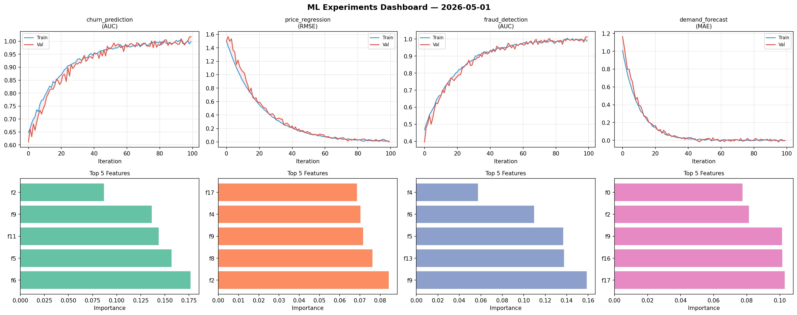
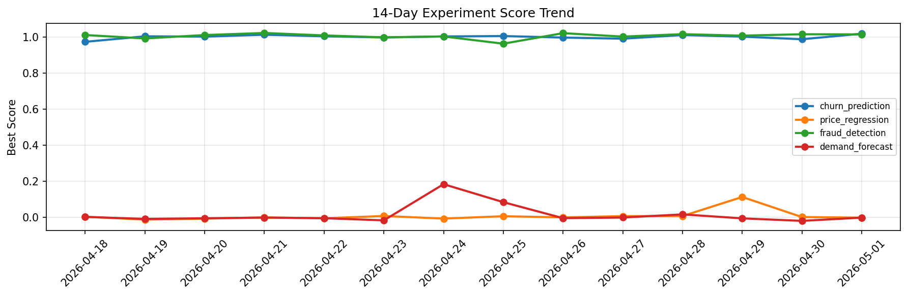

# ML Experiments Report — 2026-05-01

**Run ID:** `a69a6127c6` | **Experiments:** 4 | **Trials:** 19

## Delta vs Yesterday

| Experiment | Today | Yesterday | Change |
|-----------|-------|-----------|--------|
| churn_prediction | 1.018 | 0.9872 | 📈 3.1% |
| price_regression | -0.0014 | 0.0019 | 📉 -173.7% |
| fraud_detection | 1.0141 | 1.015 | 📉 -0.1% |
| demand_forecast | -0.0013 | -0.0193 | 📈 93.3% |

## churn_prediction (AUC)

**Best Score:** 1.018 (Trial 6)

| Trial | Score | Overfit Gap | Time | LR | Trees | Leaves |
|-------|-------|-------------|------|-----|-------|--------|
| 1 | 0.9937 | 0.0002 | 5.06s | 0.2 | 100 | 127 |
| 2 | 1.0098 | 0.0078 | 19.06s | 0.2 | 1000 | 63 |
| 3 | 0.9522 | 0.0044 | 43.85s | 0.05 | 200 | 63 |
| 4 | 0.6649 | 0.0256 | 2.38s | 0.01 | 100 | 63 |
| 5 | 0.9894 | 0.0179 | 9.26s | 0.05 | 200 | 31 |
| 6 ⭐ | 1.018 | 0.0196 | 13.6s | 0.1 | 500 | 127 |

## price_regression (RMSE)

**Best Score:** -0.0014 (Trial 2)

| Trial | Score | Overfit Gap | Time | LR | Trees | Leaves |
|-------|-------|-------------|------|-----|-------|--------|
| 1 | 0.0051 | 0.0083 | 35.99s | 0.1 | 200 | 127 |
| 2 ⭐ | -0.0014 | 0.0129 | 12.77s | 0.1 | 100 | 15 |
| 3 | 0.0002 | 0.0016 | 16.82s | 0.2 | 100 | 31 |
| 4 | 0.0035 | 0.0006 | 280.79s | 0.1 | 1000 | 63 |

## fraud_detection (AUC)

**Best Score:** 1.0141 (Trial 5)

| Trial | Score | Overfit Gap | Time | LR | Trees | Leaves |
|-------|-------|-------------|------|-----|-------|--------|
| 1 | 0.9999 | 0.0075 | 12.4s | 0.2 | 100 | 31 |
| 2 | 0.7637 | 0.0222 | 88.22s | 0.01 | 1000 | 63 |
| 3 | 0.9463 | 0.0169 | 286.33s | 0.05 | 1000 | 15 |
| 4 | 0.9385 | 0.01 | 274.41s | 0.05 | 1000 | 63 |
| 5 ⭐ | 1.0141 | 0.0268 | 290.02s | 0.1 | 1000 | 127 |
| 6 | 0.962 | 0.0105 | 132.16s | 0.05 | 500 | 31 |

## demand_forecast (MAE)

**Best Score:** -0.0013 (Trial 3)

| Trial | Score | Overfit Gap | Time | LR | Trees | Leaves |
|-------|-------|-------------|------|-----|-------|--------|
| 1 | 0.1869 | 0.0173 | 86.73s | 0.05 | 1000 | 31 |
| 2 | 0.0186 | 0.0141 | 37.73s | 0.1 | 500 | 15 |
| 3 ⭐ | -0.0013 | 0.0004 | 109.38s | 0.2 | 500 | 15 |
