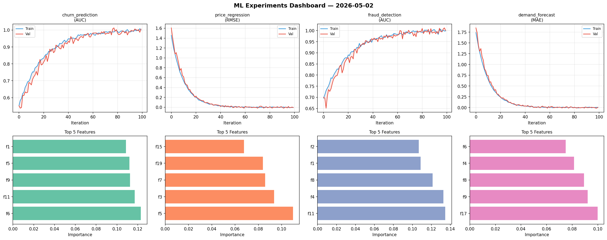
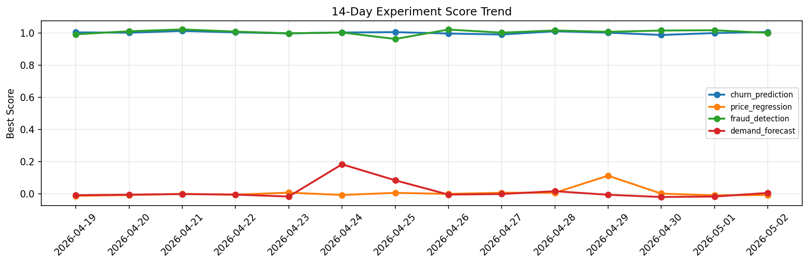

# ML Experiments Report — 2026-05-02

**Run ID:** `8edc628508` | **Experiments:** 4 | **Trials:** 21

## Delta vs Yesterday

| Experiment | Today | Yesterday | Change |
|-----------|-------|-----------|--------|
| churn_prediction | 1.0058 | 0.9994 | 📈 0.6% |
| price_regression | -0.0067 | -0.0091 | 📈 26.4% |
| fraud_detection | 1.0007 | 1.0168 | 📉 -1.6% |
| demand_forecast | 0.006 | -0.0166 | 📈 136.1% |

## churn_prediction (AUC)

**Best Score:** 1.0058 (Trial 2)

| Trial | Score | Overfit Gap | Time | LR | Trees | Leaves |
|-------|-------|-------------|------|-----|-------|--------|
| 1 | 0.6634 | 0.0511 | 19.03s | 0.01 | 500 | 127 |
| 2 ⭐ | 1.0058 | 0.0058 | 144.96s | 0.1 | 500 | 63 |
| 3 | 1.0001 | 0.0031 | 25.03s | 0.2 | 200 | 63 |
| 4 | 0.9586 | 0.0079 | 39.66s | 0.05 | 500 | 15 |

## price_regression (RMSE)

**Best Score:** -0.0067 (Trial 5)

| Trial | Score | Overfit Gap | Time | LR | Trees | Leaves |
|-------|-------|-------------|------|-----|-------|--------|
| 1 | 0.1072 | 0.027 | 123.88s | 0.05 | 500 | 31 |
| 2 | 0.1163 | 0.0274 | 265.94s | 0.05 | 1000 | 63 |
| 3 | 0.0095 | 0.016 | 35.26s | 0.2 | 200 | 127 |
| 4 | -0.0016 | 0.021 | 36.04s | 0.1 | 200 | 127 |
| 5 ⭐ | -0.0067 | 0.0022 | 269.34s | 0.2 | 1000 | 31 |
| 6 | 0.012 | 0.0076 | 16.53s | 0.2 | 200 | 15 |

## fraud_detection (AUC)

**Best Score:** 1.0007 (Trial 2)

| Trial | Score | Overfit Gap | Time | LR | Trees | Leaves |
|-------|-------|-------------|------|-----|-------|--------|
| 1 | 0.9962 | 0.0061 | 53.57s | 0.2 | 200 | 15 |
| 2 ⭐ | 1.0007 | 0.0024 | 10.51s | 0.1 | 500 | 63 |
| 3 | 0.7727 | 0.0289 | 20.53s | 0.01 | 100 | 31 |
| 4 | 0.9969 | 0.0052 | 15.21s | 0.2 | 100 | 31 |
| 5 | 0.955 | 0.0017 | 9.11s | 0.05 | 100 | 63 |

## demand_forecast (MAE)

**Best Score:** 0.006 (Trial 1)

| Trial | Score | Overfit Gap | Time | LR | Trees | Leaves |
|-------|-------|-------------|------|-----|-------|--------|
| 1 ⭐ | 0.006 | 0.0072 | 44.98s | 0.2 | 500 | 31 |
| 2 | 0.8432 | 0.1053 | 25.93s | 0.01 | 1000 | 127 |
| 3 | 0.1148 | 0.0057 | 96.52s | 0.05 | 500 | 31 |
| 4 | 0.021 | 0.0263 | 190.79s | 0.2 | 1000 | 15 |
| 5 | 0.0682 | 0.013 | 14.17s | 0.05 | 100 | 127 |
| 6 | 0.9483 | 0.139 | 16.61s | 0.01 | 500 | 31 |
