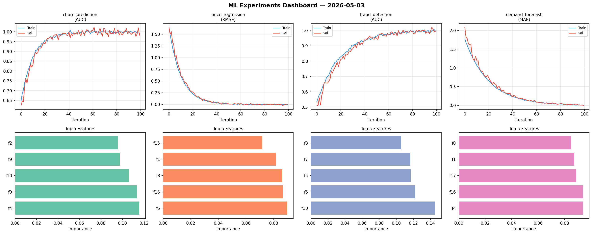
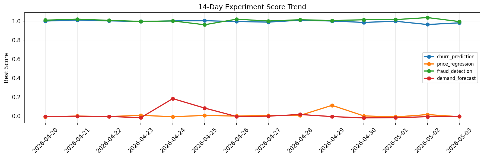

# ML Experiments Report — 2026-05-03

**Run ID:** `2e928a5c0d` | **Experiments:** 4 | **Trials:** 15

## Delta vs Yesterday

| Experiment | Today | Yesterday | Change |
|-----------|-------|-----------|--------|
| churn_prediction | 0.9827 | 0.9649 | 📈 1.8% |
| price_regression | -0.0063 | 0.0157 | 📉 -140.1% |
| fraud_detection | 0.9962 | 1.0382 | 📉 -4.0% |
| demand_forecast | -0.002 | -0.0065 | 📈 69.2% |

## churn_prediction (AUC)

**Best Score:** 0.9827 (Trial 4)

| Trial | Score | Overfit Gap | Time | LR | Trees | Leaves |
|-------|-------|-------------|------|-----|-------|--------|
| 1 | 0.9589 | 0.0065 | 7.47s | 0.05 | 100 | 127 |
| 2 | 0.7884 | 0.0222 | 16.91s | 0.01 | 500 | 63 |
| 3 | 0.6933 | 0.0273 | 147.18s | 0.01 | 500 | 15 |
| 4 ⭐ | 0.9827 | 0.0097 | 21.36s | 0.2 | 100 | 63 |

## price_regression (RMSE)

**Best Score:** -0.0063 (Trial 2)

| Trial | Score | Overfit Gap | Time | LR | Trees | Leaves |
|-------|-------|-------------|------|-----|-------|--------|
| 1 | 0.6826 | 0.1245 | 16.29s | 0.01 | 100 | 127 |
| 2 ⭐ | -0.0063 | 0.003 | 6.88s | 0.2 | 100 | 31 |
| 3 | 0.0264 | 0.0225 | 54.5s | 0.1 | 200 | 63 |

## fraud_detection (AUC)

**Best Score:** 0.9962 (Trial 3)

| Trial | Score | Overfit Gap | Time | LR | Trees | Leaves |
|-------|-------|-------------|------|-----|-------|--------|
| 1 | 0.992 | 0.0077 | 45.41s | 0.1 | 500 | 15 |
| 2 | 0.9949 | 0.0091 | 13.82s | 0.1 | 200 | 63 |
| 3 ⭐ | 0.9962 | 0.0025 | 20.95s | 0.1 | 100 | 15 |

## demand_forecast (MAE)

**Best Score:** -0.002 (Trial 1)

| Trial | Score | Overfit Gap | Time | LR | Trees | Leaves |
|-------|-------|-------------|------|-----|-------|--------|
| 1 ⭐ | -0.002 | 0.0104 | 148.63s | 0.1 | 500 | 127 |
| 2 | 0.0092 | 0.0138 | 54.98s | 0.2 | 500 | 15 |
| 3 | 1.1816 | 0.1755 | 50.68s | 0.01 | 200 | 63 |
| 4 | 0.0025 | 0.0005 | 49.35s | 0.1 | 200 | 63 |
| 5 | 0.0133 | 0.0093 | 120.29s | 0.1 | 1000 | 31 |
