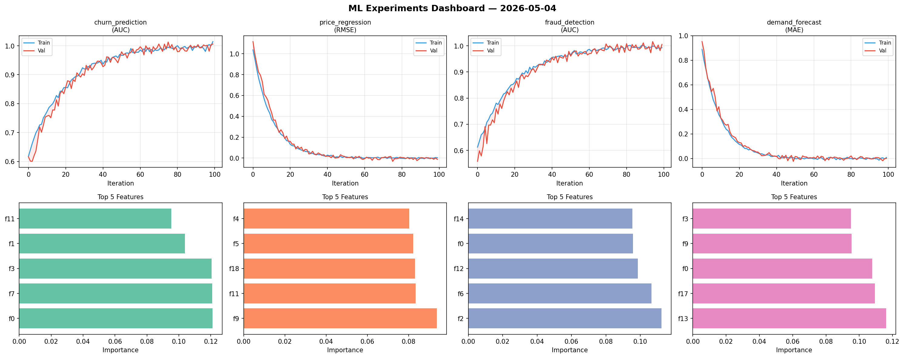
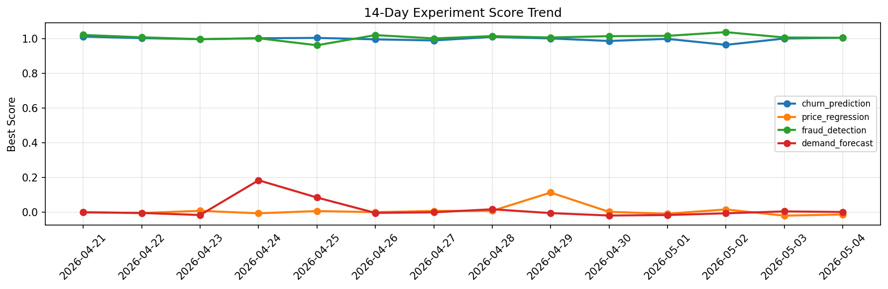

# ML Experiments Report — 2026-05-04

**Run ID:** `9b5654fd5c` | **Experiments:** 4 | **Trials:** 20

## Delta vs Yesterday

| Experiment | Today | Yesterday | Change |
|-----------|-------|-----------|--------|
| churn_prediction | 1.0058 | 1.0013 | 📈 0.4% |
| price_regression | -0.0135 | -0.0201 | 📈 32.8% |
| fraud_detection | 1.0057 | 1.0074 | 📉 -0.2% |
| demand_forecast | 0.001 | 0.0043 | 📉 -76.7% |

## churn_prediction (AUC)

**Best Score:** 1.0058 (Trial 5)

| Trial | Score | Overfit Gap | Time | LR | Trees | Leaves |
|-------|-------|-------------|------|-----|-------|--------|
| 1 | 0.995 | 0.001 | 28.46s | 0.1 | 100 | 15 |
| 2 | 0.7736 | 0.0138 | 80.0s | 0.01 | 1000 | 127 |
| 3 | 0.7054 | 0.0236 | 158.29s | 0.01 | 1000 | 63 |
| 4 | 0.9557 | 0.0045 | 145.27s | 0.05 | 1000 | 63 |
| 5 ⭐ | 1.0058 | 0.0086 | 12.14s | 0.1 | 100 | 15 |

## price_regression (RMSE)

**Best Score:** -0.0135 (Trial 6)

| Trial | Score | Overfit Gap | Time | LR | Trees | Leaves |
|-------|-------|-------------|------|-----|-------|--------|
| 1 | 0.0152 | 0.0 | 88.79s | 0.1 | 1000 | 63 |
| 2 | 0.0859 | 0.0071 | 76.61s | 0.05 | 500 | 15 |
| 3 | 0.0266 | 0.0199 | 226.77s | 0.1 | 1000 | 15 |
| 4 | 0.0063 | 0.005 | 37.02s | 0.2 | 200 | 31 |
| 5 | -0.0019 | 0.0063 | 14.25s | 0.1 | 100 | 63 |
| 6 ⭐ | -0.0135 | 0.0164 | 55.61s | 0.2 | 200 | 127 |

## fraud_detection (AUC)

**Best Score:** 1.0057 (Trial 2)

| Trial | Score | Overfit Gap | Time | LR | Trees | Leaves |
|-------|-------|-------------|------|-----|-------|--------|
| 1 | 1.0028 | 0.0069 | 294.21s | 0.2 | 1000 | 127 |
| 2 ⭐ | 1.0057 | 0.0129 | 51.47s | 0.1 | 200 | 63 |
| 3 | 0.9957 | 0.0029 | 221.58s | 0.1 | 1000 | 15 |

## demand_forecast (MAE)

**Best Score:** 0.001 (Trial 3)

| Trial | Score | Overfit Gap | Time | LR | Trees | Leaves |
|-------|-------|-------------|------|-----|-------|--------|
| 1 | 0.0814 | 0.0046 | 194.13s | 0.05 | 1000 | 15 |
| 2 | 1.3216 | 0.1782 | 14.5s | 0.01 | 100 | 63 |
| 3 ⭐ | 0.001 | 0.007 | 6.08s | 0.2 | 200 | 31 |
| 4 | 1.101 | 0.156 | 81.71s | 0.01 | 1000 | 63 |
| 5 | 0.0252 | 0.0271 | 57.82s | 0.2 | 500 | 31 |
| 6 | 0.5882 | 0.1034 | 21.08s | 0.01 | 500 | 15 |
