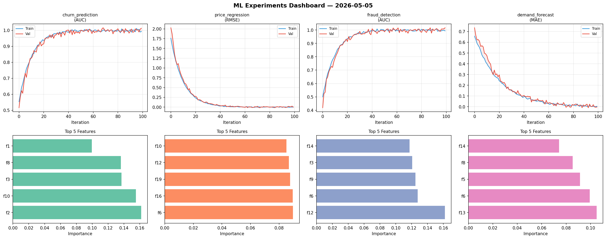
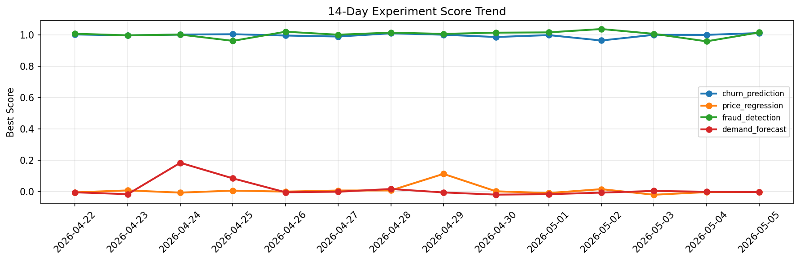

# ML Experiments Report — 2026-05-05

**Run ID:** `ab17b4b27b` | **Experiments:** 4 | **Trials:** 19

## Delta vs Yesterday

| Experiment | Today | Yesterday | Change |
|-----------|-------|-----------|--------|
| churn_prediction | 1.0126 | 1.0009 | 📈 1.2% |
| price_regression | -0.0024 | -0.0032 | 📈 25.0% |
| fraud_detection | 1.0165 | 0.9596 | 📈 5.9% |
| demand_forecast | -0.0025 | -0.001 | 📉 -150.0% |

## churn_prediction (AUC)

**Best Score:** 1.0126 (Trial 4)

| Trial | Score | Overfit Gap | Time | LR | Trees | Leaves |
|-------|-------|-------------|------|-----|-------|--------|
| 1 | 0.7013 | 0.018 | 56.36s | 0.01 | 500 | 63 |
| 2 | 0.6025 | 0.0549 | 78.1s | 0.01 | 1000 | 31 |
| 3 | 0.6392 | 0.0689 | 4.96s | 0.01 | 200 | 63 |
| 4 ⭐ | 1.0126 | 0.0207 | 191.04s | 0.2 | 1000 | 31 |
| 5 | 0.6718 | 0.0289 | 8.85s | 0.01 | 200 | 15 |
| 6 | 0.9893 | 0.0185 | 22.86s | 0.2 | 100 | 31 |

## price_regression (RMSE)

**Best Score:** -0.0024 (Trial 3)

| Trial | Score | Overfit Gap | Time | LR | Trees | Leaves |
|-------|-------|-------------|------|-----|-------|--------|
| 1 | 0.8863 | 0.1201 | 45.44s | 0.01 | 500 | 31 |
| 2 | 0.9571 | 0.0315 | 5.79s | 0.01 | 100 | 63 |
| 3 ⭐ | -0.0024 | 0.0082 | 43.63s | 0.2 | 200 | 15 |
| 4 | 0.6534 | 0.0977 | 244.4s | 0.01 | 1000 | 31 |
| 5 | 0.1775 | 0.0389 | 119.93s | 0.05 | 1000 | 31 |
| 6 | 0.0247 | 0.0145 | 49.49s | 0.1 | 1000 | 63 |

## fraud_detection (AUC)

**Best Score:** 1.0165 (Trial 1)

| Trial | Score | Overfit Gap | Time | LR | Trees | Leaves |
|-------|-------|-------------|------|-----|-------|--------|
| 1 ⭐ | 1.0165 | 0.0231 | 8.72s | 0.2 | 500 | 127 |
| 2 | 0.6162 | 0.0204 | 145.98s | 0.01 | 1000 | 127 |
| 3 | 1.0036 | 0.0032 | 5.75s | 0.2 | 200 | 127 |

## demand_forecast (MAE)

**Best Score:** -0.0025 (Trial 3)

| Trial | Score | Overfit Gap | Time | LR | Trees | Leaves |
|-------|-------|-------------|------|-----|-------|--------|
| 1 | -0.0004 | 0.0008 | 39.76s | 0.2 | 200 | 15 |
| 2 | 0.0252 | 0.013 | 11.24s | 0.1 | 200 | 31 |
| 3 ⭐ | -0.0025 | 0.0068 | 36.21s | 0.1 | 200 | 127 |
| 4 | 0.1064 | 0.0182 | 17.64s | 0.05 | 500 | 127 |
