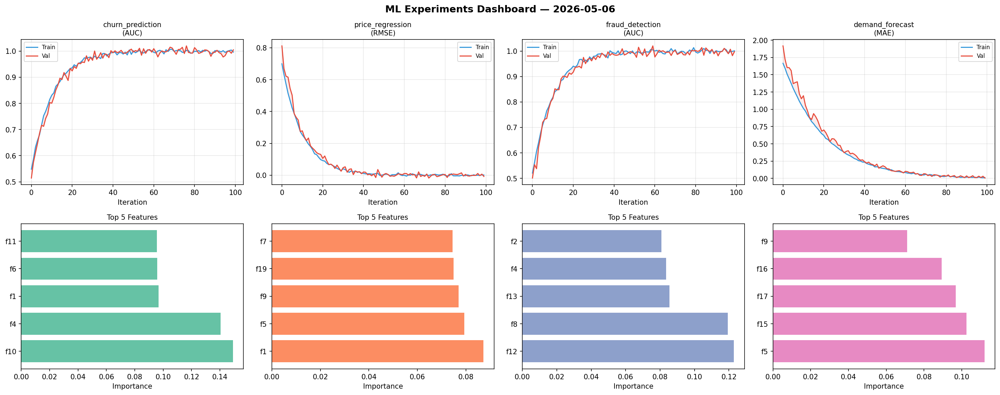
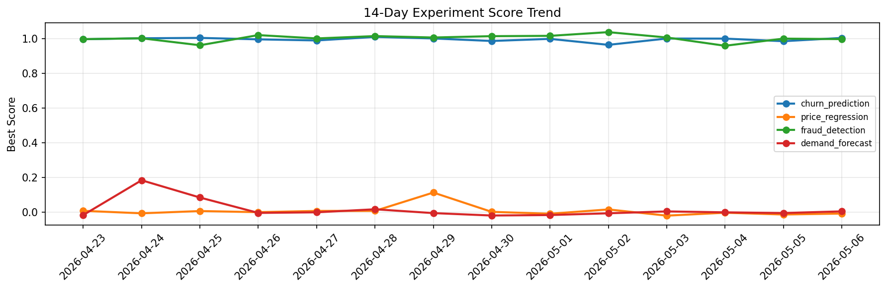

# ML Experiments Report — 2026-05-06

**Run ID:** `9ecaff442b` | **Experiments:** 4 | **Trials:** 20

## Delta vs Yesterday

| Experiment | Today | Yesterday | Change |
|-----------|-------|-----------|--------|
| churn_prediction | 1.0048 | 0.9859 | 📈 1.9% |
| price_regression | -0.008 | -0.0134 | 📈 40.3% |
| fraud_detection | 0.998 | 1.0008 | 📉 -0.3% |
| demand_forecast | 0.0046 | -0.005 | 📈 192.0% |

## churn_prediction (AUC)

**Best Score:** 1.0048 (Trial 3)

| Trial | Score | Overfit Gap | Time | LR | Trees | Leaves |
|-------|-------|-------------|------|-----|-------|--------|
| 1 | 0.6884 | 0.0047 | 67.25s | 0.01 | 500 | 127 |
| 2 | 0.9983 | 0.0024 | 180.55s | 0.2 | 1000 | 31 |
| 3 ⭐ | 1.0048 | 0.0085 | 3.17s | 0.2 | 100 | 127 |
| 4 | 0.9867 | 0.0107 | 82.02s | 0.1 | 500 | 127 |
| 5 | 0.9344 | 0.0177 | 228.64s | 0.05 | 1000 | 31 |
| 6 | 0.9612 | 0.0072 | 77.08s | 0.05 | 500 | 63 |

## price_regression (RMSE)

**Best Score:** -0.008 (Trial 4)

| Trial | Score | Overfit Gap | Time | LR | Trees | Leaves |
|-------|-------|-------------|------|-----|-------|--------|
| 1 | 0.1618 | 0.0077 | 20.01s | 0.05 | 100 | 31 |
| 2 | 1.1713 | 0.1296 | 2.69s | 0.01 | 100 | 127 |
| 3 | 0.0009 | 0.0018 | 14.45s | 0.2 | 200 | 31 |
| 4 ⭐ | -0.008 | 0.0088 | 2.51s | 0.2 | 100 | 63 |

## fraud_detection (AUC)

**Best Score:** 0.998 (Trial 5)

| Trial | Score | Overfit Gap | Time | LR | Trees | Leaves |
|-------|-------|-------------|------|-----|-------|--------|
| 1 | 0.9548 | 0.0013 | 23.53s | 0.05 | 200 | 127 |
| 2 | 0.9519 | 0.0004 | 105.87s | 0.05 | 500 | 127 |
| 3 | 0.9818 | 0.0186 | 8.99s | 0.05 | 1000 | 15 |
| 4 | 0.9974 | 0.0044 | 46.75s | 0.1 | 200 | 63 |
| 5 ⭐ | 0.998 | 0.0032 | 149.78s | 0.2 | 500 | 31 |
| 6 | 0.994 | 0.0061 | 21.21s | 0.2 | 200 | 63 |

## demand_forecast (MAE)

**Best Score:** 0.0046 (Trial 1)

| Trial | Score | Overfit Gap | Time | LR | Trees | Leaves |
|-------|-------|-------------|------|-----|-------|--------|
| 1 ⭐ | 0.0046 | 0.0051 | 41.76s | 0.1 | 200 | 31 |
| 2 | 0.0168 | 0.0163 | 23.1s | 0.1 | 200 | 127 |
| 3 | 0.0999 | 0.0073 | 20.99s | 0.05 | 100 | 127 |
| 4 | 0.0112 | 0.0003 | 14.63s | 0.1 | 500 | 31 |
