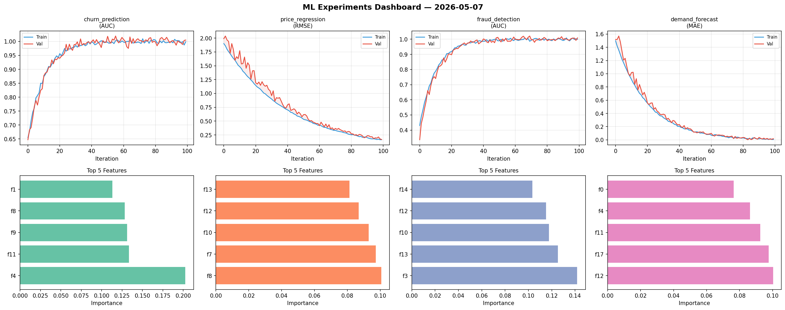
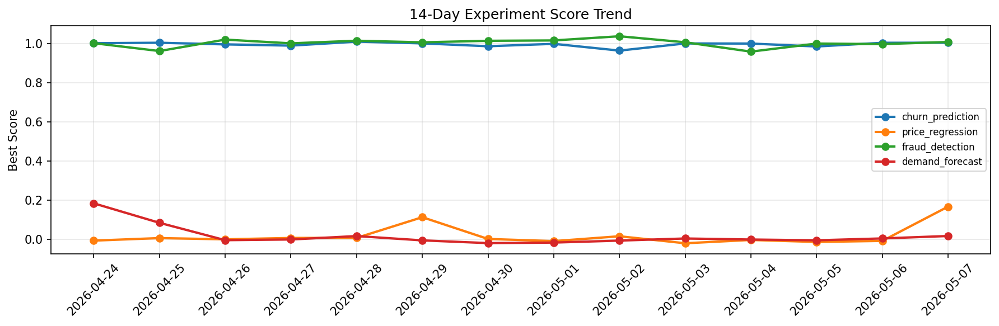

# ML Experiments Report — 2026-05-07

**Run ID:** `ec266d4741` | **Experiments:** 4 | **Trials:** 18

## Delta vs Yesterday

| Experiment | Today | Yesterday | Change |
|-----------|-------|-----------|--------|
| churn_prediction | 1.0051 | 1.0048 | 📉 0.0% |
| price_regression | 0.167 | -0.008 | 📈 2187.5% |
| fraud_detection | 1.009 | 0.998 | 📈 1.1% |
| demand_forecast | 0.017 | 0.0046 | 📈 269.6% |

## churn_prediction (AUC)

**Best Score:** 1.0051 (Trial 1)

| Trial | Score | Overfit Gap | Time | LR | Trees | Leaves |
|-------|-------|-------------|------|-----|-------|--------|
| 1 ⭐ | 1.0051 | 0.0061 | 108.97s | 0.2 | 500 | 127 |
| 2 | 0.9466 | 0.0187 | 21.3s | 0.05 | 1000 | 63 |
| 3 | 1.0033 | 0.0175 | 15.68s | 0.2 | 100 | 63 |

## price_regression (RMSE)

**Best Score:** 0.167 (Trial 6)

| Trial | Score | Overfit Gap | Time | LR | Trees | Leaves |
|-------|-------|-------------|------|-----|-------|--------|
| 1 | 0.7919 | 0.1283 | 139.68s | 0.01 | 1000 | 127 |
| 2 | 1.0912 | 0.0978 | 6.69s | 0.01 | 100 | 31 |
| 3 | 1.2145 | 0.0737 | 22.56s | 0.01 | 100 | 15 |
| 4 | 0.4967 | 0.0245 | 2.17s | 0.01 | 200 | 63 |
| 5 | 1.1619 | 0.149 | 142.44s | 0.01 | 1000 | 15 |
| 6 ⭐ | 0.167 | 0.0021 | 96.51s | 0.05 | 500 | 31 |

## fraud_detection (AUC)

**Best Score:** 1.009 (Trial 3)

| Trial | Score | Overfit Gap | Time | LR | Trees | Leaves |
|-------|-------|-------------|------|-----|-------|--------|
| 1 | 0.7952 | 0.0117 | 62.43s | 0.01 | 500 | 15 |
| 2 | 1.0043 | 0.0063 | 16.44s | 0.1 | 500 | 15 |
| 3 ⭐ | 1.009 | 0.0097 | 24.19s | 0.2 | 200 | 127 |
| 4 | 0.9882 | 0.0062 | 149.46s | 0.1 | 1000 | 15 |
| 5 | 1.0006 | 0.004 | 249.87s | 0.2 | 1000 | 31 |
| 6 | 1.0076 | 0.0028 | 9.2s | 0.2 | 100 | 15 |

## demand_forecast (MAE)

**Best Score:** 0.017 (Trial 1)

| Trial | Score | Overfit Gap | Time | LR | Trees | Leaves |
|-------|-------|-------------|------|-----|-------|--------|
| 1 ⭐ | 0.017 | 0.0117 | 221.38s | 0.1 | 1000 | 31 |
| 2 | 0.1267 | 0.017 | 257.75s | 0.05 | 1000 | 63 |
| 3 | 0.1451 | 0.0085 | 27.03s | 0.05 | 200 | 31 |
