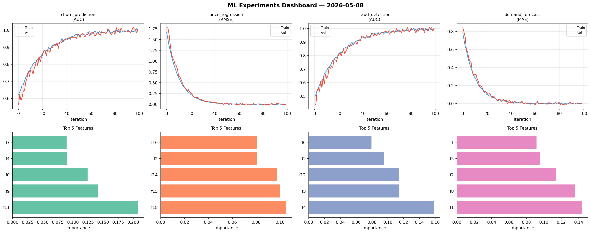
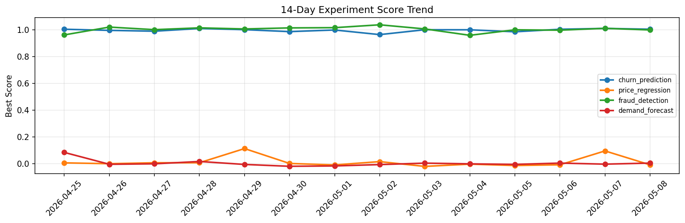

# ML Experiments Report — 2026-05-08

**Run ID:** `362f98c5a4` | **Experiments:** 4 | **Trials:** 14

## Delta vs Yesterday

| Experiment | Today | Yesterday | Change |
|-----------|-------|-----------|--------|
| churn_prediction | 1.0051 | 1.0113 | 📉 -0.6% |
| price_regression | -0.0084 | 0.0956 | 📉 -108.8% |
| fraud_detection | 0.9996 | 1.0118 | 📉 -1.2% |
| demand_forecast | 0.0046 | -0.0032 | 📈 243.7% |

## churn_prediction (AUC)

**Best Score:** 1.0051 (Trial 3)

| Trial | Score | Overfit Gap | Time | LR | Trees | Leaves |
|-------|-------|-------------|------|-----|-------|--------|
| 1 | 0.9525 | 0.0003 | 25.91s | 0.05 | 500 | 127 |
| 2 | 0.9457 | 0.0001 | 26.5s | 0.05 | 100 | 63 |
| 3 ⭐ | 1.0051 | 0.0049 | 116.87s | 0.1 | 500 | 127 |

## price_regression (RMSE)

**Best Score:** -0.0084 (Trial 4)

| Trial | Score | Overfit Gap | Time | LR | Trees | Leaves |
|-------|-------|-------------|------|-----|-------|--------|
| 1 | 0.1412 | 0.0097 | 28.62s | 0.05 | 200 | 31 |
| 2 | 0.9904 | 0.0743 | 231.2s | 0.01 | 1000 | 31 |
| 3 | 0.0895 | 0.0128 | 39.86s | 0.05 | 200 | 63 |
| 4 ⭐ | -0.0084 | 0.0071 | 253.02s | 0.2 | 1000 | 63 |

## fraud_detection (AUC)

**Best Score:** 0.9996 (Trial 2)

| Trial | Score | Overfit Gap | Time | LR | Trees | Leaves |
|-------|-------|-------------|------|-----|-------|--------|
| 1 | 0.6232 | 0.027 | 220.21s | 0.01 | 1000 | 127 |
| 2 ⭐ | 0.9996 | 0.0022 | 15.01s | 0.1 | 100 | 15 |
| 3 | 0.6384 | 0.0214 | 47.79s | 0.01 | 500 | 63 |

## demand_forecast (MAE)

**Best Score:** 0.0046 (Trial 1)

| Trial | Score | Overfit Gap | Time | LR | Trees | Leaves |
|-------|-------|-------------|------|-----|-------|--------|
| 1 ⭐ | 0.0046 | 0.0005 | 50.27s | 0.2 | 1000 | 63 |
| 2 | 0.1167 | 0.0095 | 15.4s | 0.05 | 200 | 31 |
| 3 | 0.0102 | 0.0113 | 8.14s | 0.2 | 100 | 127 |
| 4 | 0.0058 | 0.0007 | 122.45s | 0.2 | 500 | 15 |
