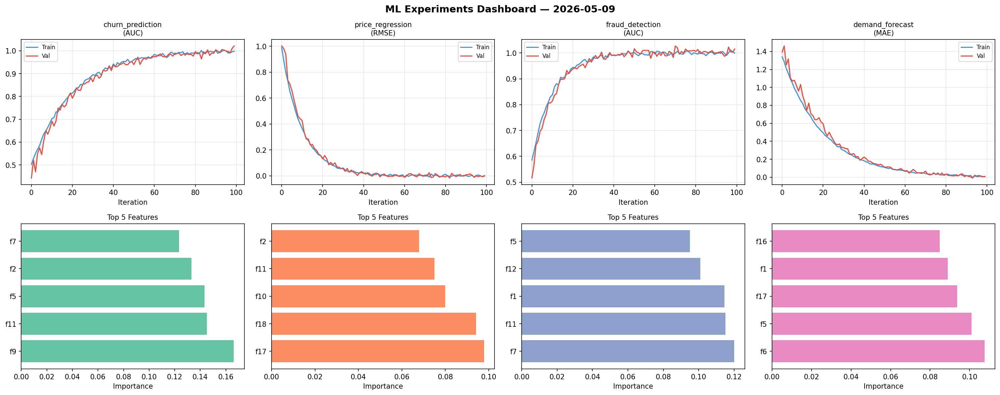
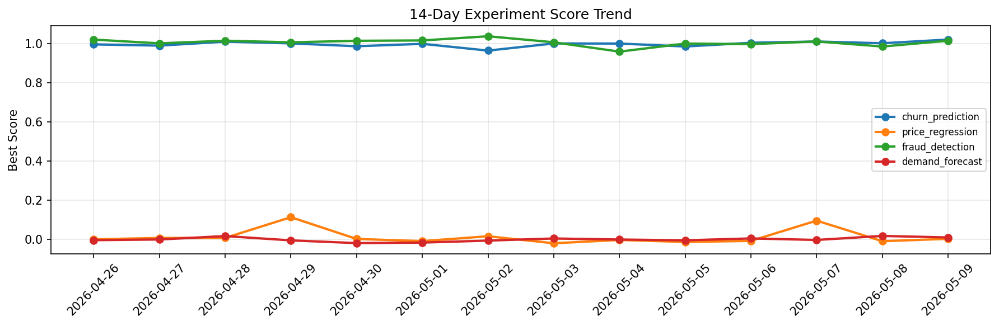

# ML Experiments Report — 2026-05-09

**Run ID:** `d86481582d` | **Experiments:** 4 | **Trials:** 16

## Delta vs Yesterday

| Experiment | Today | Yesterday | Change |
|-----------|-------|-----------|--------|
| churn_prediction | 1.0213 | 1.0023 | 📈 1.9% |
| price_regression | 0.0025 | -0.0096 | 📈 126.0% |
| fraud_detection | 1.0154 | 0.9857 | 📈 3.0% |
| demand_forecast | 0.0096 | 0.0174 | 📉 -44.8% |

## churn_prediction (AUC)

**Best Score:** 1.0213 (Trial 4)

| Trial | Score | Overfit Gap | Time | LR | Trees | Leaves |
|-------|-------|-------------|------|-----|-------|--------|
| 1 | 0.9486 | 0.001 | 55.22s | 0.05 | 1000 | 31 |
| 2 | 0.9538 | 0.008 | 4.26s | 0.05 | 200 | 63 |
| 3 | 0.79 | 0.0094 | 41.99s | 0.01 | 500 | 31 |
| 4 ⭐ | 1.0213 | 0.0233 | 21.93s | 0.1 | 100 | 63 |
| 5 | 0.9853 | 0.0087 | 70.26s | 0.1 | 500 | 15 |

## price_regression (RMSE)

**Best Score:** 0.0025 (Trial 1)

| Trial | Score | Overfit Gap | Time | LR | Trees | Leaves |
|-------|-------|-------------|------|-----|-------|--------|
| 1 ⭐ | 0.0025 | 0.0064 | 183.73s | 0.2 | 1000 | 127 |
| 2 | 0.0288 | 0.0301 | 15.66s | 0.2 | 100 | 31 |
| 3 | 0.0139 | 0.0056 | 162.08s | 0.1 | 1000 | 15 |

## fraud_detection (AUC)

**Best Score:** 1.0154 (Trial 3)

| Trial | Score | Overfit Gap | Time | LR | Trees | Leaves |
|-------|-------|-------------|------|-----|-------|--------|
| 1 | 1.0133 | 0.0122 | 1.5s | 0.1 | 100 | 63 |
| 2 | 0.7643 | 0.0237 | 1.69s | 0.01 | 200 | 127 |
| 3 ⭐ | 1.0154 | 0.0162 | 255.65s | 0.2 | 1000 | 127 |
| 4 | 0.7736 | 0.0339 | 155.53s | 0.01 | 1000 | 31 |

## demand_forecast (MAE)

**Best Score:** 0.0096 (Trial 3)

| Trial | Score | Overfit Gap | Time | LR | Trees | Leaves |
|-------|-------|-------------|------|-----|-------|--------|
| 1 | 0.0188 | 0.0085 | 250.86s | 0.1 | 1000 | 31 |
| 2 | 0.011 | 0.0181 | 23.87s | 0.2 | 100 | 127 |
| 3 ⭐ | 0.0096 | 0.0045 | 13.32s | 0.1 | 100 | 31 |
| 4 | 0.0183 | 0.0057 | 26.13s | 0.1 | 100 | 15 |
