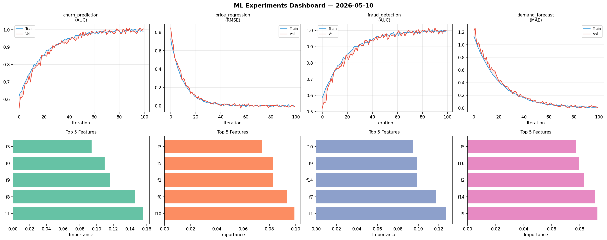
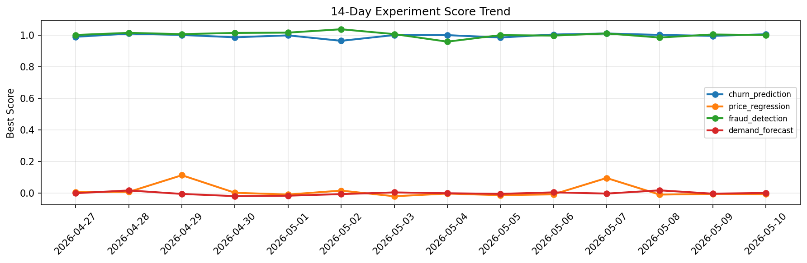

# ML Experiments Report — 2026-05-10

**Run ID:** `74cb1587f4` | **Experiments:** 4 | **Trials:** 22

## Delta vs Yesterday

| Experiment | Today | Yesterday | Change |
|-----------|-------|-----------|--------|
| churn_prediction | 1.0065 | 0.9961 | 📈 1.0% |
| price_regression | -0.0066 | -0.005 | 📉 -32.0% |
| fraud_detection | 1.0011 | 1.0051 | 📉 -0.4% |
| demand_forecast | 0.001 | -0.0037 | 📈 127.0% |

## churn_prediction (AUC)

**Best Score:** 1.0065 (Trial 2)

| Trial | Score | Overfit Gap | Time | LR | Trees | Leaves |
|-------|-------|-------------|------|-----|-------|--------|
| 1 | 0.9716 | 0.0042 | 81.58s | 0.05 | 500 | 15 |
| 2 ⭐ | 1.0065 | 0.0156 | 45.37s | 0.1 | 200 | 31 |
| 3 | 0.9294 | 0.0207 | 1.34s | 0.05 | 200 | 15 |
| 4 | 0.7395 | 0.0378 | 6.94s | 0.01 | 100 | 127 |
| 5 | 0.9764 | 0.023 | 31.55s | 0.2 | 1000 | 15 |

## price_regression (RMSE)

**Best Score:** -0.0066 (Trial 1)

| Trial | Score | Overfit Gap | Time | LR | Trees | Leaves |
|-------|-------|-------------|------|-----|-------|--------|
| 1 ⭐ | -0.0066 | 0.0002 | 63.48s | 0.2 | 500 | 63 |
| 2 | 0.0278 | 0.0228 | 42.51s | 0.1 | 200 | 127 |
| 3 | 1.2025 | 0.1078 | 257.23s | 0.01 | 1000 | 15 |
| 4 | 0.0042 | 0.0087 | 143.28s | 0.2 | 500 | 31 |
| 5 | 0.0099 | 0.0107 | 18.54s | 0.1 | 1000 | 15 |
| 6 | -0.0064 | 0.0094 | 242.43s | 0.1 | 1000 | 127 |

## fraud_detection (AUC)

**Best Score:** 1.0011 (Trial 5)

| Trial | Score | Overfit Gap | Time | LR | Trees | Leaves |
|-------|-------|-------------|------|-----|-------|--------|
| 1 | 0.9842 | 0.0072 | 249.76s | 0.2 | 1000 | 127 |
| 2 | 0.9905 | 0.0058 | 185.07s | 0.1 | 1000 | 15 |
| 3 | 0.7841 | 0.0106 | 49.19s | 0.01 | 500 | 127 |
| 4 | 0.9819 | 0.0205 | 59.23s | 0.1 | 500 | 127 |
| 5 ⭐ | 1.0011 | 0.0002 | 134.59s | 0.1 | 500 | 31 |

## demand_forecast (MAE)

**Best Score:** 0.001 (Trial 5)

| Trial | Score | Overfit Gap | Time | LR | Trees | Leaves |
|-------|-------|-------------|------|-----|-------|--------|
| 1 | 0.0039 | 0.0106 | 89.16s | 0.1 | 500 | 15 |
| 2 | 0.8777 | 0.0784 | 4.97s | 0.01 | 100 | 31 |
| 3 | 0.0047 | 0.0096 | 12.16s | 0.2 | 500 | 63 |
| 4 | 0.9518 | 0.0484 | 280.38s | 0.01 | 1000 | 15 |
| 5 ⭐ | 0.001 | 0.0096 | 264.47s | 0.1 | 1000 | 31 |
| 6 | 1.2014 | 0.098 | 22.17s | 0.01 | 200 | 127 |
