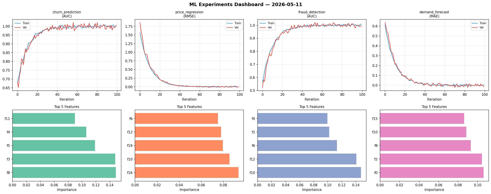
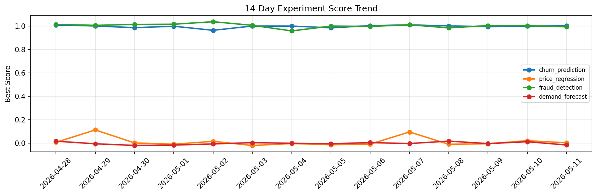

# ML Experiments Report — 2026-05-11

**Run ID:** `9129caedd5` | **Experiments:** 4 | **Trials:** 14

## Delta vs Yesterday

| Experiment | Today | Yesterday | Change |
|-----------|-------|-----------|--------|
| churn_prediction | 1.0042 | 1.001 | 📈 0.3% |
| price_regression | 0.0032 | 0.0211 | 📉 -84.8% |
| fraud_detection | 0.9947 | 1.0047 | 📉 -1.0% |
| demand_forecast | -0.0157 | 0.0124 | 📉 -226.6% |

## churn_prediction (AUC)

**Best Score:** 1.0042 (Trial 1)

| Trial | Score | Overfit Gap | Time | LR | Trees | Leaves |
|-------|-------|-------------|------|-----|-------|--------|
| 1 ⭐ | 1.0042 | 0.0014 | 38.38s | 0.2 | 200 | 15 |
| 2 | 0.9531 | 0.0124 | 29.51s | 0.05 | 100 | 31 |
| 3 | 0.9956 | 0.0051 | 11.06s | 0.1 | 200 | 63 |

## price_regression (RMSE)

**Best Score:** 0.0032 (Trial 1)

| Trial | Score | Overfit Gap | Time | LR | Trees | Leaves |
|-------|-------|-------------|------|-----|-------|--------|
| 1 ⭐ | 0.0032 | 0.0014 | 56.65s | 0.2 | 200 | 15 |
| 2 | 0.4894 | 0.0742 | 51.46s | 0.01 | 200 | 63 |
| 3 | 0.3688 | 0.0364 | 21.4s | 0.01 | 100 | 15 |
| 4 | 0.1448 | 0.004 | 84.95s | 0.05 | 1000 | 15 |

## fraud_detection (AUC)

**Best Score:** 0.9947 (Trial 1)

| Trial | Score | Overfit Gap | Time | LR | Trees | Leaves |
|-------|-------|-------------|------|-----|-------|--------|
| 1 ⭐ | 0.9947 | 0.0129 | 174.92s | 0.2 | 1000 | 127 |
| 2 | 0.9869 | 0.0147 | 37.52s | 0.2 | 1000 | 31 |
| 3 | 0.9591 | 0.0108 | 44.35s | 0.05 | 200 | 15 |
| 4 | 0.9534 | 0.0065 | 80.73s | 0.05 | 1000 | 31 |

## demand_forecast (MAE)

**Best Score:** -0.0157 (Trial 2)

| Trial | Score | Overfit Gap | Time | LR | Trees | Leaves |
|-------|-------|-------------|------|-----|-------|--------|
| 1 | 1.2372 | 0.1882 | 112.37s | 0.01 | 500 | 127 |
| 2 ⭐ | -0.0157 | 0.0229 | 23.88s | 0.2 | 100 | 31 |
| 3 | 0.0219 | 0.011 | 275.37s | 0.1 | 1000 | 31 |
