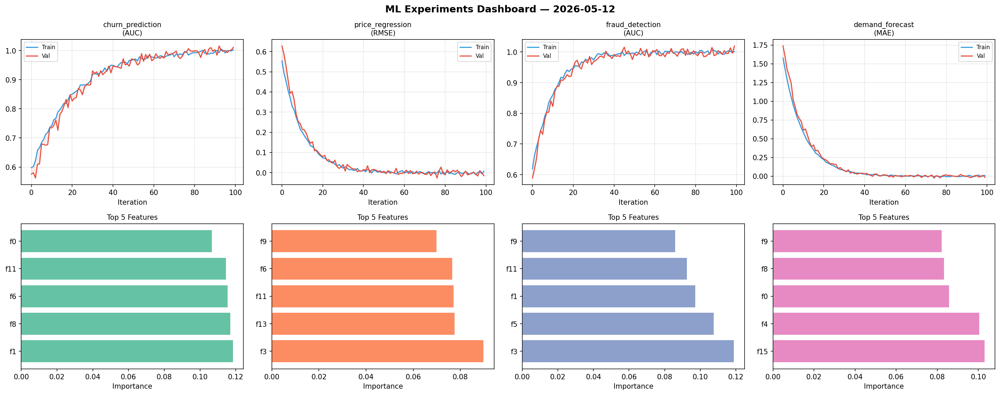
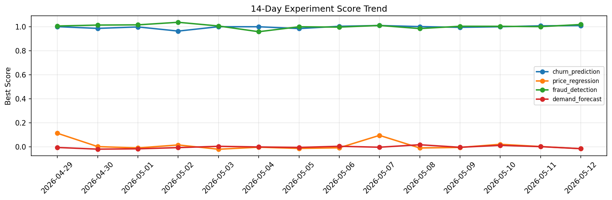

# ML Experiments Report — 2026-05-12

**Run ID:** `493594d56f` | **Experiments:** 4 | **Trials:** 20

## Delta vs Yesterday

| Experiment | Today | Yesterday | Change |
|-----------|-------|-----------|--------|
| churn_prediction | 1.0108 | 1.0087 | 📈 0.2% |
| price_regression | -0.0154 | 0.0024 | 📉 -741.7% |
| fraud_detection | 1.0197 | 1.0019 | 📈 1.8% |
| demand_forecast | -0.0154 | 0.0016 | 📉 -1062.5% |

## churn_prediction (AUC)

**Best Score:** 1.0108 (Trial 4)

| Trial | Score | Overfit Gap | Time | LR | Trees | Leaves |
|-------|-------|-------------|------|-----|-------|--------|
| 1 | 0.9643 | 0.0078 | 37.61s | 0.05 | 200 | 127 |
| 2 | 0.9947 | 0.0088 | 75.36s | 0.2 | 500 | 15 |
| 3 | 0.9932 | 0.0021 | 43.19s | 0.2 | 200 | 31 |
| 4 ⭐ | 1.0108 | 0.0086 | 68.65s | 0.1 | 500 | 31 |
| 5 | 0.9471 | 0.0161 | 8.35s | 0.05 | 100 | 31 |

## price_regression (RMSE)

**Best Score:** -0.0154 (Trial 1)

| Trial | Score | Overfit Gap | Time | LR | Trees | Leaves |
|-------|-------|-------------|------|-----|-------|--------|
| 1 ⭐ | -0.0154 | 0.0221 | 50.81s | 0.2 | 200 | 15 |
| 2 | -0.0005 | 0.0061 | 143.06s | 0.1 | 1000 | 31 |
| 3 | 0.0501 | 0.0013 | 18.84s | 0.05 | 1000 | 15 |
| 4 | 0.0147 | 0.0076 | 197.11s | 0.1 | 1000 | 63 |
| 5 | 0.1445 | 0.0084 | 3.36s | 0.05 | 100 | 127 |

## fraud_detection (AUC)

**Best Score:** 1.0197 (Trial 3)

| Trial | Score | Overfit Gap | Time | LR | Trees | Leaves |
|-------|-------|-------------|------|-----|-------|--------|
| 1 | 1.0089 | 0.0127 | 15.01s | 0.1 | 100 | 31 |
| 2 | 1.0007 | 0.0159 | 25.81s | 0.2 | 200 | 31 |
| 3 ⭐ | 1.0197 | 0.0182 | 3.29s | 0.2 | 100 | 15 |
| 4 | 0.9972 | 0.0014 | 12.2s | 0.1 | 100 | 31 |

## demand_forecast (MAE)

**Best Score:** -0.0154 (Trial 2)

| Trial | Score | Overfit Gap | Time | LR | Trees | Leaves |
|-------|-------|-------------|------|-----|-------|--------|
| 1 | 0.0117 | 0.0132 | 118.62s | 0.1 | 500 | 15 |
| 2 ⭐ | -0.0154 | 0.0256 | 10.35s | 0.2 | 200 | 31 |
| 3 | 0.0181 | 0.0116 | 211.51s | 0.1 | 1000 | 31 |
| 4 | 0.0737 | 0.0098 | 272.6s | 0.05 | 1000 | 127 |
| 5 | 0.0095 | 0.0141 | 12.74s | 0.1 | 500 | 63 |
| 6 | -0.0002 | 0.0052 | 88.07s | 0.1 | 1000 | 63 |
