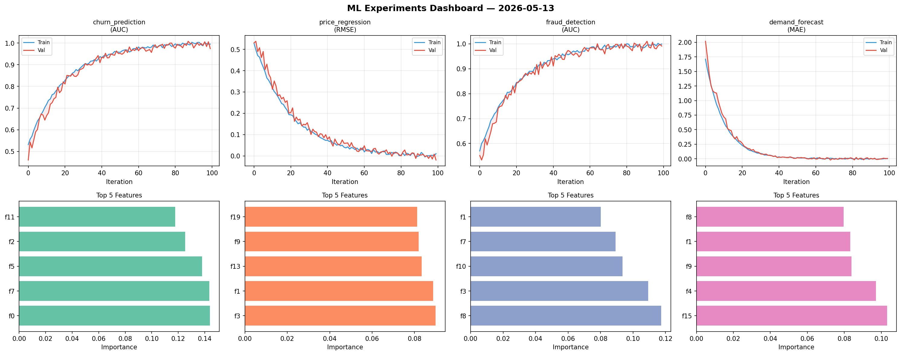
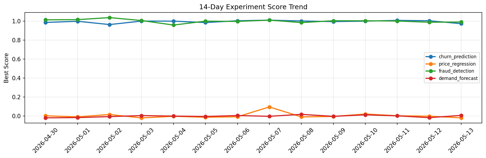

# ML Experiments Report — 2026-05-13

**Run ID:** `fac5c43725` | **Experiments:** 4 | **Trials:** 16

## Delta vs Yesterday

| Experiment | Today | Yesterday | Change |
|-----------|-------|-----------|--------|
| churn_prediction | 0.974 | 1.0051 | 📉 -3.1% |
| price_regression | -0.0191 | -0.0022 | 📉 -768.2% |
| fraud_detection | 0.9913 | 0.9894 | 📈 0.2% |
| demand_forecast | 0.0066 | -0.0174 | 📈 137.9% |

## churn_prediction (AUC)

**Best Score:** 0.974 (Trial 4)

| Trial | Score | Overfit Gap | Time | LR | Trees | Leaves |
|-------|-------|-------------|------|-----|-------|--------|
| 1 | 0.9632 | 0.0048 | 52.69s | 0.05 | 200 | 31 |
| 2 | 0.6325 | 0.0055 | 94.96s | 0.01 | 500 | 15 |
| 3 | 0.5841 | 0.066 | 10.83s | 0.01 | 100 | 127 |
| 4 ⭐ | 0.974 | 0.0209 | 6.38s | 0.1 | 200 | 127 |
| 5 | 0.636 | 0.0053 | 13.76s | 0.01 | 100 | 15 |

## price_regression (RMSE)

**Best Score:** -0.0191 (Trial 1)

| Trial | Score | Overfit Gap | Time | LR | Trees | Leaves |
|-------|-------|-------------|------|-----|-------|--------|
| 1 ⭐ | -0.0191 | 0.0298 | 56.48s | 0.1 | 200 | 63 |
| 2 | 0.5174 | 0.0853 | 59.28s | 0.01 | 500 | 127 |
| 3 | 0.0124 | 0.0028 | 0.84s | 0.1 | 100 | 127 |

## fraud_detection (AUC)

**Best Score:** 0.9913 (Trial 1)

| Trial | Score | Overfit Gap | Time | LR | Trees | Leaves |
|-------|-------|-------------|------|-----|-------|--------|
| 1 ⭐ | 0.9913 | 0.0081 | 145.69s | 0.1 | 500 | 15 |
| 2 | 0.6967 | 0.0035 | 12.85s | 0.01 | 200 | 31 |
| 3 | 0.7695 | 0.0062 | 55.95s | 0.01 | 1000 | 15 |
| 4 | 0.9833 | 0.0092 | 8.1s | 0.2 | 1000 | 15 |

## demand_forecast (MAE)

**Best Score:** 0.0066 (Trial 2)

| Trial | Score | Overfit Gap | Time | LR | Trees | Leaves |
|-------|-------|-------------|------|-----|-------|--------|
| 1 | 0.0164 | 0.0204 | 18.33s | 0.1 | 100 | 15 |
| 2 ⭐ | 0.0066 | 0.0053 | 26.31s | 0.2 | 100 | 63 |
| 3 | 0.0599 | 0.0062 | 50.31s | 0.05 | 500 | 127 |
| 4 | 0.0167 | 0.0015 | 9.78s | 0.1 | 200 | 63 |
