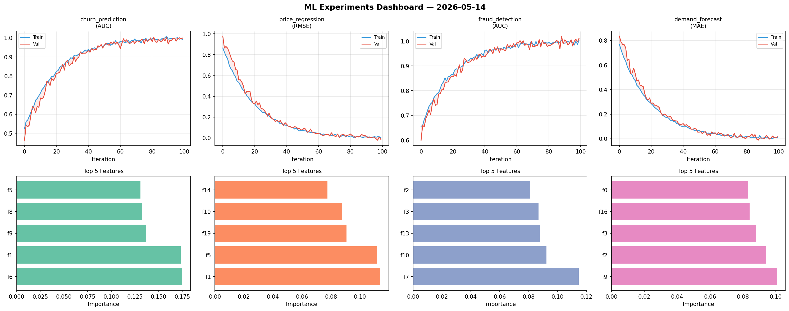
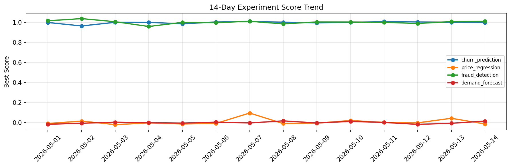

# ML Experiments Report — 2026-05-14

**Run ID:** `ea2895f1c1` | **Experiments:** 4 | **Trials:** 20

## Delta vs Yesterday

| Experiment | Today | Yesterday | Change |
|-----------|-------|-----------|--------|
| churn_prediction | 0.9988 | 1.0019 | 📉 -0.3% |
| price_regression | -0.0132 | 0.0433 | 📉 -130.5% |
| fraud_detection | 1.0115 | 1.0093 | 📈 0.2% |
| demand_forecast | 0.0157 | -0.007 | 📈 324.3% |

## churn_prediction (AUC)

**Best Score:** 0.9988 (Trial 1)

| Trial | Score | Overfit Gap | Time | LR | Trees | Leaves |
|-------|-------|-------------|------|-----|-------|--------|
| 1 ⭐ | 0.9988 | 0.0081 | 283.46s | 0.1 | 1000 | 63 |
| 2 | 0.7978 | 0.014 | 107.08s | 0.01 | 500 | 31 |
| 3 | 0.9947 | 0.005 | 117.28s | 0.2 | 500 | 127 |
| 4 | 0.9961 | 0.0001 | 56.54s | 0.1 | 200 | 31 |
| 5 | 0.9464 | 0.0101 | 124.27s | 0.05 | 1000 | 127 |
| 6 | 0.8117 | 0.0018 | 42.35s | 0.01 | 200 | 63 |

## price_regression (RMSE)

**Best Score:** -0.0132 (Trial 3)

| Trial | Score | Overfit Gap | Time | LR | Trees | Leaves |
|-------|-------|-------------|------|-----|-------|--------|
| 1 | 0.0866 | 0.0051 | 28.17s | 0.05 | 100 | 15 |
| 2 | 0.4094 | 0.0041 | 28.37s | 0.01 | 100 | 63 |
| 3 ⭐ | -0.0132 | 0.0175 | 20.41s | 0.1 | 200 | 31 |

## fraud_detection (AUC)

**Best Score:** 1.0115 (Trial 3)

| Trial | Score | Overfit Gap | Time | LR | Trees | Leaves |
|-------|-------|-------------|------|-----|-------|--------|
| 1 | 0.613 | 0.0409 | 43.25s | 0.01 | 200 | 63 |
| 2 | 0.9443 | 0.0058 | 88.04s | 0.05 | 1000 | 31 |
| 3 ⭐ | 1.0115 | 0.0073 | 11.39s | 0.1 | 500 | 127 |
| 4 | 0.9713 | 0.0054 | 22.73s | 0.05 | 100 | 63 |
| 5 | 0.6674 | 0.0391 | 22.53s | 0.01 | 100 | 127 |

## demand_forecast (MAE)

**Best Score:** 0.0157 (Trial 6)

| Trial | Score | Overfit Gap | Time | LR | Trees | Leaves |
|-------|-------|-------------|------|-----|-------|--------|
| 1 | 0.0209 | 0.0138 | 15.83s | 0.1 | 100 | 31 |
| 2 | 0.0215 | 0.0159 | 299.61s | 0.1 | 1000 | 127 |
| 3 | 0.1334 | 0.0098 | 224.1s | 0.05 | 1000 | 15 |
| 4 | 0.174 | 0.013 | 12.04s | 0.05 | 200 | 127 |
| 5 | 0.0959 | 0.0114 | 21.62s | 0.05 | 1000 | 127 |
| 6 ⭐ | 0.0157 | 0.0053 | 26.73s | 0.1 | 500 | 15 |
