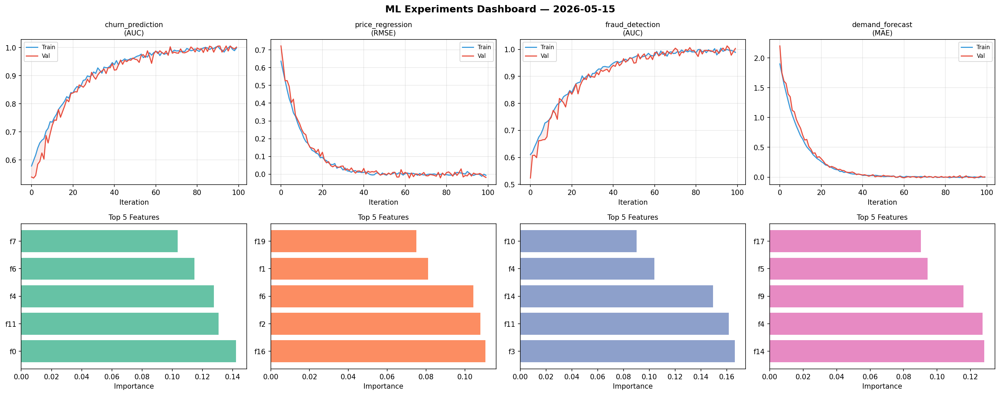
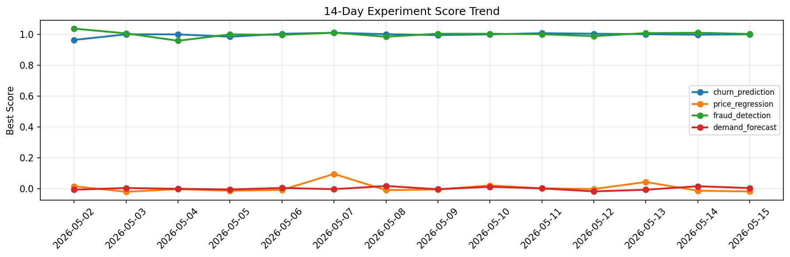

# ML Experiments Report — 2026-05-15

**Run ID:** `ee81aafbee` | **Experiments:** 4 | **Trials:** 16

## Delta vs Yesterday

| Experiment | Today | Yesterday | Change |
|-----------|-------|-----------|--------|
| churn_prediction | 1.0016 | 0.9988 | 📈 0.3% |
| price_regression | -0.0181 | -0.0132 | 📉 -37.1% |
| fraud_detection | 1.0034 | 1.0115 | 📉 -0.8% |
| demand_forecast | 0.0041 | 0.0157 | 📉 -73.9% |

## churn_prediction (AUC)

**Best Score:** 1.0016 (Trial 2)

| Trial | Score | Overfit Gap | Time | LR | Trees | Leaves |
|-------|-------|-------------|------|-----|-------|--------|
| 1 | 0.7658 | 0.0142 | 37.0s | 0.01 | 1000 | 15 |
| 2 ⭐ | 1.0016 | 0.0033 | 58.79s | 0.1 | 200 | 31 |
| 3 | 0.6885 | 0.0691 | 141.83s | 0.01 | 500 | 31 |
| 4 | 0.6367 | 0.007 | 39.24s | 0.01 | 1000 | 31 |

## price_regression (RMSE)

**Best Score:** -0.0181 (Trial 2)

| Trial | Score | Overfit Gap | Time | LR | Trees | Leaves |
|-------|-------|-------------|------|-----|-------|--------|
| 1 | 0.0064 | 0.0052 | 4.81s | 0.2 | 200 | 63 |
| 2 ⭐ | -0.0181 | 0.012 | 103.6s | 0.2 | 500 | 63 |
| 3 | 1.2531 | 0.1147 | 29.04s | 0.01 | 100 | 15 |
| 4 | 0.0117 | 0.0026 | 3.01s | 0.1 | 100 | 63 |

## fraud_detection (AUC)

**Best Score:** 1.0034 (Trial 2)

| Trial | Score | Overfit Gap | Time | LR | Trees | Leaves |
|-------|-------|-------------|------|-----|-------|--------|
| 1 | 0.9502 | 0.0162 | 10.56s | 0.05 | 100 | 31 |
| 2 ⭐ | 1.0034 | 0.0148 | 217.19s | 0.1 | 1000 | 63 |
| 3 | 0.9596 | 0.013 | 16.61s | 0.05 | 100 | 63 |

## demand_forecast (MAE)

**Best Score:** 0.0041 (Trial 2)

| Trial | Score | Overfit Gap | Time | LR | Trees | Leaves |
|-------|-------|-------------|------|-----|-------|--------|
| 1 | 1.0111 | 0.0788 | 1.63s | 0.01 | 100 | 31 |
| 2 ⭐ | 0.0041 | 0.0071 | 65.12s | 0.2 | 1000 | 31 |
| 3 | 0.0047 | 0.0001 | 28.12s | 0.1 | 1000 | 63 |
| 4 | 0.6027 | 0.026 | 5.69s | 0.01 | 100 | 31 |
| 5 | 0.0085 | 0.0057 | 144.23s | 0.1 | 500 | 127 |
