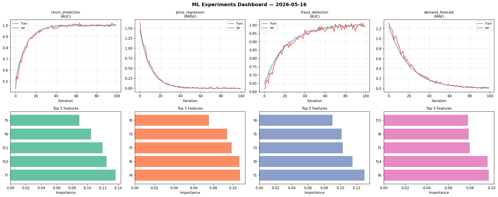
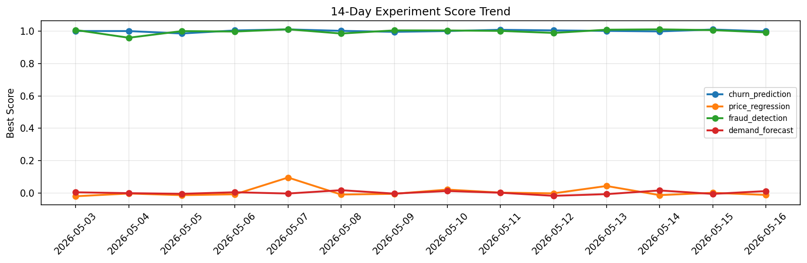

# ML Experiments Report — 2026-05-16

**Run ID:** `62071c4097` | **Experiments:** 4 | **Trials:** 20

## Delta vs Yesterday

| Experiment | Today | Yesterday | Change |
|-----------|-------|-----------|--------|
| churn_prediction | 0.9997 | 1.0105 | 📉 -1.1% |
| price_regression | -0.0119 | 0.0012 | 📉 -1091.7% |
| fraud_detection | 0.9927 | 1.0067 | 📉 -1.4% |
| demand_forecast | 0.0118 | -0.0056 | 📈 310.7% |

## churn_prediction (AUC)

**Best Score:** 0.9997 (Trial 2)

| Trial | Score | Overfit Gap | Time | LR | Trees | Leaves |
|-------|-------|-------------|------|-----|-------|--------|
| 1 | 0.9737 | 0.0038 | 31.74s | 0.05 | 500 | 127 |
| 2 ⭐ | 0.9997 | 0.0065 | 162.2s | 0.2 | 1000 | 127 |
| 3 | 0.9375 | 0.0247 | 288.56s | 0.05 | 1000 | 31 |
| 4 | 0.9731 | 0.0054 | 7.65s | 0.05 | 100 | 31 |
| 5 | 0.9495 | 0.0029 | 33.34s | 0.05 | 200 | 63 |

## price_regression (RMSE)

**Best Score:** -0.0119 (Trial 3)

| Trial | Score | Overfit Gap | Time | LR | Trees | Leaves |
|-------|-------|-------------|------|-----|-------|--------|
| 1 | -0.0048 | 0.0016 | 120.65s | 0.2 | 1000 | 15 |
| 2 | 0.0175 | 0.0035 | 13.74s | 0.1 | 500 | 15 |
| 3 ⭐ | -0.0119 | 0.0092 | 27.2s | 0.2 | 100 | 63 |
| 4 | 0.0174 | 0.0011 | 33.22s | 0.1 | 1000 | 31 |
| 5 | 0.1149 | 0.0218 | 53.93s | 0.05 | 200 | 127 |
| 6 | -0.0109 | 0.0183 | 242.82s | 0.2 | 1000 | 31 |

## fraud_detection (AUC)

**Best Score:** 0.9927 (Trial 5)

| Trial | Score | Overfit Gap | Time | LR | Trees | Leaves |
|-------|-------|-------------|------|-----|-------|--------|
| 1 | 0.9834 | 0.0156 | 166.15s | 0.2 | 1000 | 15 |
| 2 | 0.9848 | 0.0101 | 6.84s | 0.1 | 100 | 31 |
| 3 | 0.672 | 0.0411 | 105.06s | 0.01 | 1000 | 15 |
| 4 | 0.6914 | 0.007 | 64.09s | 0.01 | 500 | 31 |
| 5 ⭐ | 0.9927 | 0.0019 | 13.69s | 0.1 | 100 | 31 |
| 6 | 0.6856 | 0.0398 | 167.24s | 0.01 | 1000 | 15 |

## demand_forecast (MAE)

**Best Score:** 0.0118 (Trial 3)

| Trial | Score | Overfit Gap | Time | LR | Trees | Leaves |
|-------|-------|-------------|------|-----|-------|--------|
| 1 | 0.6972 | 0.0778 | 26.43s | 0.01 | 100 | 63 |
| 2 | 0.3786 | 0.0699 | 1.96s | 0.01 | 100 | 31 |
| 3 ⭐ | 0.0118 | 0.002 | 29.35s | 0.1 | 100 | 63 |
