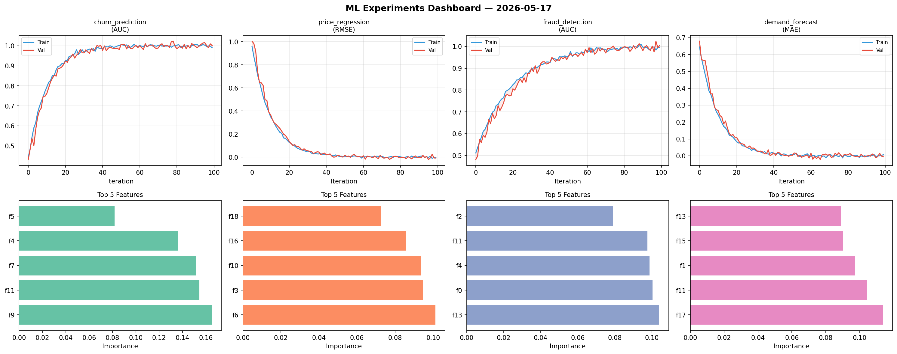
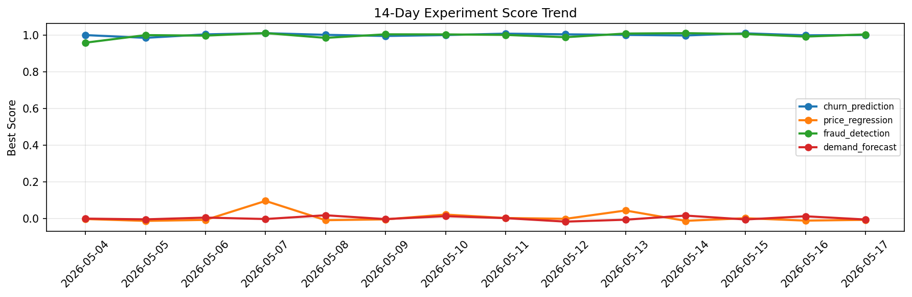

# ML Experiments Report — 2026-05-17

**Run ID:** `aa4fabf820` | **Experiments:** 4 | **Trials:** 16

## Delta vs Yesterday

| Experiment | Today | Yesterday | Change |
|-----------|-------|-----------|--------|
| churn_prediction | 1.0013 | 0.9997 | 📈 0.2% |
| price_regression | -0.0076 | -0.0119 | 📈 36.1% |
| fraud_detection | 1.0046 | 0.9927 | 📈 1.2% |
| demand_forecast | -0.0058 | 0.0118 | 📉 -149.2% |

## churn_prediction (AUC)

**Best Score:** 1.0013 (Trial 2)

| Trial | Score | Overfit Gap | Time | LR | Trees | Leaves |
|-------|-------|-------------|------|-----|-------|--------|
| 1 | 0.9929 | 0.0107 | 10.08s | 0.1 | 100 | 63 |
| 2 ⭐ | 1.0013 | 0.0108 | 77.64s | 0.2 | 500 | 63 |
| 3 | 0.9504 | 0.0153 | 40.9s | 0.05 | 200 | 15 |

## price_regression (RMSE)

**Best Score:** -0.0076 (Trial 2)

| Trial | Score | Overfit Gap | Time | LR | Trees | Leaves |
|-------|-------|-------------|------|-----|-------|--------|
| 1 | 0.0156 | 0.012 | 45.06s | 0.1 | 200 | 31 |
| 2 ⭐ | -0.0076 | 0.0019 | 78.19s | 0.2 | 1000 | 31 |
| 3 | 0.0611 | 0.0072 | 29.57s | 0.05 | 100 | 15 |

## fraud_detection (AUC)

**Best Score:** 1.0046 (Trial 3)

| Trial | Score | Overfit Gap | Time | LR | Trees | Leaves |
|-------|-------|-------------|------|-----|-------|--------|
| 1 | 0.9997 | 0.0095 | 6.84s | 0.1 | 100 | 127 |
| 2 | 0.9987 | 0.0003 | 21.94s | 0.1 | 100 | 31 |
| 3 ⭐ | 1.0046 | 0.0096 | 25.72s | 0.1 | 100 | 127 |
| 4 | 0.9456 | 0.0139 | 22.09s | 0.05 | 200 | 15 |
| 5 | 0.9892 | 0.0139 | 26.44s | 0.05 | 500 | 15 |

## demand_forecast (MAE)

**Best Score:** -0.0058 (Trial 5)

| Trial | Score | Overfit Gap | Time | LR | Trees | Leaves |
|-------|-------|-------------|------|-----|-------|--------|
| 1 | 0.0033 | 0.0051 | 174.82s | 0.1 | 1000 | 31 |
| 2 | -0.002 | 0.007 | 16.58s | 0.2 | 1000 | 31 |
| 3 | 0.066 | 0.0055 | 29.9s | 0.05 | 200 | 127 |
| 4 | 0.8645 | 0.1176 | 54.0s | 0.01 | 200 | 63 |
| 5 ⭐ | -0.0058 | 0.0117 | 127.97s | 0.2 | 500 | 63 |
