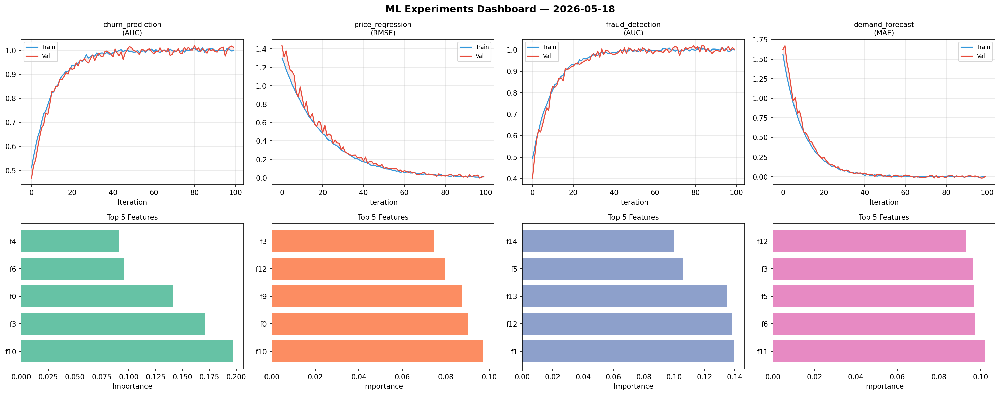
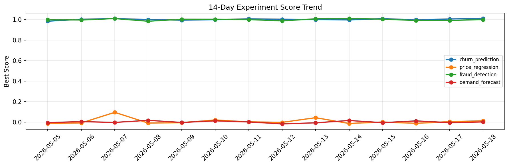

# ML Experiments Report — 2026-05-18

**Run ID:** `810c226af1` | **Experiments:** 4 | **Trials:** 19

## Delta vs Yesterday

| Experiment | Today | Yesterday | Change |
|-----------|-------|-----------|--------|
| churn_prediction | 1.0122 | 1.0076 | 📈 0.5% |
| price_regression | 0.0131 | 0.0045 | 📈 191.1% |
| fraud_detection | 1.0022 | 0.9933 | 📈 0.9% |
| demand_forecast | 0.0018 | -0.0055 | 📈 132.7% |

## churn_prediction (AUC)

**Best Score:** 1.0122 (Trial 4)

| Trial | Score | Overfit Gap | Time | LR | Trees | Leaves |
|-------|-------|-------------|------|-----|-------|--------|
| 1 | 0.9761 | 0.0007 | 92.23s | 0.05 | 500 | 127 |
| 2 | 1.0094 | 0.0157 | 1.1s | 0.1 | 100 | 31 |
| 3 | 0.7405 | 0.0417 | 22.31s | 0.01 | 1000 | 63 |
| 4 ⭐ | 1.0122 | 0.0141 | 29.71s | 0.2 | 100 | 15 |
| 5 | 0.9872 | 0.0151 | 89.52s | 0.2 | 500 | 63 |
| 6 | 0.9962 | 0.0029 | 45.66s | 0.1 | 200 | 15 |

## price_regression (RMSE)

**Best Score:** 0.0131 (Trial 1)

| Trial | Score | Overfit Gap | Time | LR | Trees | Leaves |
|-------|-------|-------------|------|-----|-------|--------|
| 1 ⭐ | 0.0131 | 0.0023 | 42.88s | 0.1 | 200 | 127 |
| 2 | 0.0169 | 0.0041 | 20.51s | 0.1 | 200 | 63 |
| 3 | 0.0768 | 0.0121 | 69.98s | 0.05 | 1000 | 127 |

## fraud_detection (AUC)

**Best Score:** 1.0022 (Trial 3)

| Trial | Score | Overfit Gap | Time | LR | Trees | Leaves |
|-------|-------|-------------|------|-----|-------|--------|
| 1 | 0.9975 | 0.0009 | 38.56s | 0.1 | 200 | 15 |
| 2 | 0.9961 | 0.0047 | 42.68s | 0.2 | 200 | 63 |
| 3 ⭐ | 1.0022 | 0.0022 | 24.67s | 0.2 | 200 | 127 |
| 4 | 0.9998 | 0.0018 | 18.08s | 0.2 | 100 | 63 |

## demand_forecast (MAE)

**Best Score:** 0.0018 (Trial 3)

| Trial | Score | Overfit Gap | Time | LR | Trees | Leaves |
|-------|-------|-------------|------|-----|-------|--------|
| 1 | 0.4679 | 0.0538 | 183.17s | 0.01 | 1000 | 63 |
| 2 | 0.0173 | 0.0023 | 73.35s | 0.1 | 500 | 127 |
| 3 ⭐ | 0.0018 | 0.0012 | 183.82s | 0.2 | 1000 | 63 |
| 4 | 0.1187 | 0.0117 | 20.29s | 0.05 | 500 | 127 |
| 5 | 0.0987 | 0.0192 | 197.1s | 0.05 | 1000 | 127 |
| 6 | 0.0994 | 0.0028 | 63.4s | 0.05 | 500 | 127 |
