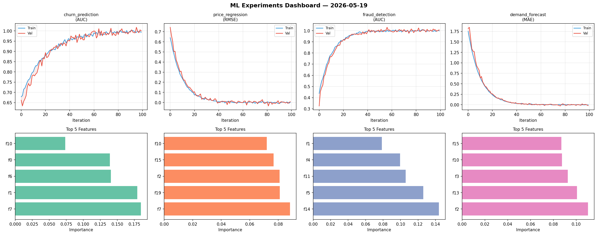
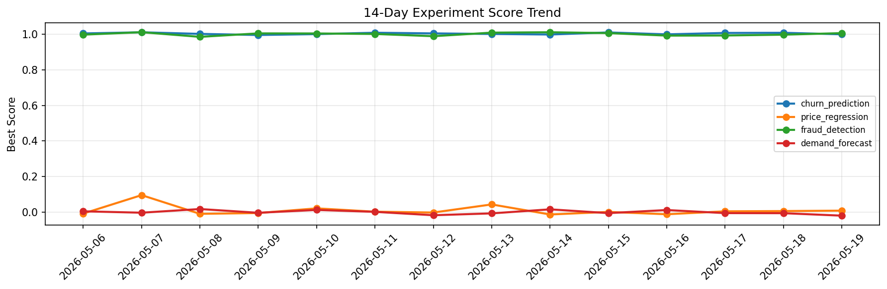

# ML Experiments Report — 2026-05-19

**Run ID:** `364b2a389b` | **Experiments:** 4 | **Trials:** 18

## Delta vs Yesterday

| Experiment | Today | Yesterday | Change |
|-----------|-------|-----------|--------|
| churn_prediction | 1.0 | 1.0084 | 📉 -0.8% |
| price_regression | 0.0084 | 0.0059 | 📈 42.4% |
| fraud_detection | 1.0065 | 0.9979 | 📈 0.9% |
| demand_forecast | -0.0198 | -0.0059 | 📉 -235.6% |

## churn_prediction (AUC)

**Best Score:** 1.0 (Trial 1)

| Trial | Score | Overfit Gap | Time | LR | Trees | Leaves |
|-------|-------|-------------|------|-----|-------|--------|
| 1 ⭐ | 1.0 | 0.0066 | 72.12s | 0.1 | 500 | 127 |
| 2 | 0.7128 | 0.0407 | 31.44s | 0.01 | 200 | 63 |
| 3 | 0.9271 | 0.0194 | 52.98s | 0.05 | 200 | 127 |

## price_regression (RMSE)

**Best Score:** 0.0084 (Trial 1)

| Trial | Score | Overfit Gap | Time | LR | Trees | Leaves |
|-------|-------|-------------|------|-----|-------|--------|
| 1 ⭐ | 0.0084 | 0.0068 | 105.16s | 0.2 | 500 | 127 |
| 2 | 0.0201 | 0.0152 | 2.45s | 0.1 | 100 | 15 |
| 3 | 0.1465 | 0.0139 | 13.79s | 0.05 | 200 | 31 |
| 4 | 0.0142 | 0.0047 | 6.59s | 0.1 | 1000 | 127 |
| 5 | 0.0112 | 0.018 | 21.72s | 0.2 | 200 | 63 |

## fraud_detection (AUC)

**Best Score:** 1.0065 (Trial 3)

| Trial | Score | Overfit Gap | Time | LR | Trees | Leaves |
|-------|-------|-------------|------|-----|-------|--------|
| 1 | 0.9983 | 0.0035 | 280.06s | 0.1 | 1000 | 31 |
| 2 | 1.0003 | 0.0077 | 14.75s | 0.1 | 100 | 31 |
| 3 ⭐ | 1.0065 | 0.0093 | 29.61s | 0.2 | 100 | 15 |
| 4 | 0.7624 | 0.0257 | 53.08s | 0.01 | 500 | 63 |

## demand_forecast (MAE)

**Best Score:** -0.0198 (Trial 5)

| Trial | Score | Overfit Gap | Time | LR | Trees | Leaves |
|-------|-------|-------------|------|-----|-------|--------|
| 1 | 0.0843 | 0.0251 | 19.38s | 0.05 | 200 | 15 |
| 2 | 0.6186 | 0.0448 | 151.68s | 0.01 | 1000 | 31 |
| 3 | 0.0033 | 0.008 | 113.53s | 0.1 | 500 | 15 |
| 4 | 0.1122 | 0.0179 | 11.44s | 0.05 | 200 | 31 |
| 5 ⭐ | -0.0198 | 0.0196 | 25.99s | 0.2 | 100 | 31 |
| 6 | 0.014 | 0.0139 | 37.32s | 0.1 | 500 | 63 |
