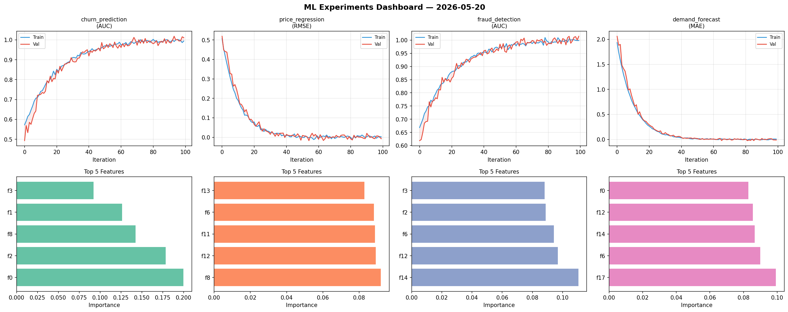
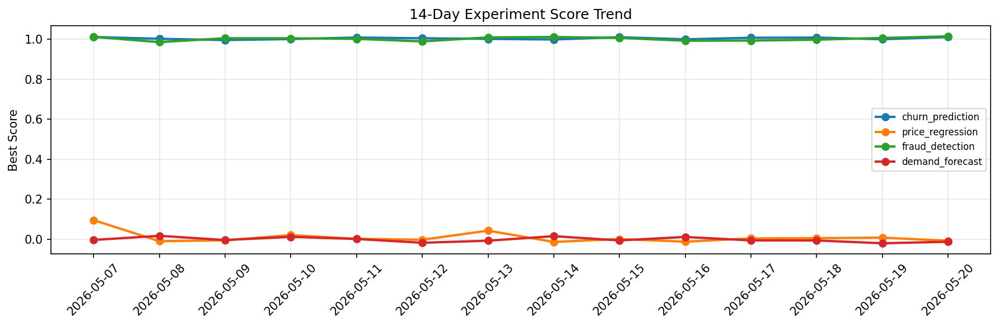

# ML Experiments Report — 2026-05-20

**Run ID:** `b6fe60abd2` | **Experiments:** 4 | **Trials:** 22

## Delta vs Yesterday

| Experiment | Today | Yesterday | Change |
|-----------|-------|-----------|--------|
| churn_prediction | 1.011 | 1.0 | 📈 1.1% |
| price_regression | -0.0073 | 0.0084 | 📉 -186.9% |
| fraud_detection | 1.0147 | 1.0065 | 📈 0.8% |
| demand_forecast | -0.0123 | -0.0198 | 📈 37.9% |

## churn_prediction (AUC)

**Best Score:** 1.011 (Trial 3)

| Trial | Score | Overfit Gap | Time | LR | Trees | Leaves |
|-------|-------|-------------|------|-----|-------|--------|
| 1 | 0.9574 | 0.0031 | 15.59s | 0.05 | 500 | 63 |
| 2 | 1.0031 | 0.007 | 30.68s | 0.2 | 200 | 63 |
| 3 ⭐ | 1.011 | 0.017 | 94.3s | 0.1 | 1000 | 127 |
| 4 | 0.992 | 0.0094 | 2.78s | 0.1 | 100 | 127 |
| 5 | 0.9977 | 0.0043 | 139.57s | 0.1 | 500 | 15 |

## price_regression (RMSE)

**Best Score:** -0.0073 (Trial 1)

| Trial | Score | Overfit Gap | Time | LR | Trees | Leaves |
|-------|-------|-------------|------|-----|-------|--------|
| 1 ⭐ | -0.0073 | 0.009 | 46.79s | 0.2 | 500 | 127 |
| 2 | 0.1901 | 0.0185 | 82.57s | 0.05 | 1000 | 15 |
| 3 | 0.1118 | 0.0044 | 88.93s | 0.05 | 500 | 63 |
| 4 | 0.0039 | 0.0142 | 22.62s | 0.2 | 100 | 127 |
| 5 | 0.005 | 0.0037 | 15.5s | 0.1 | 100 | 15 |

## fraud_detection (AUC)

**Best Score:** 1.0147 (Trial 3)

| Trial | Score | Overfit Gap | Time | LR | Trees | Leaves |
|-------|-------|-------------|------|-----|-------|--------|
| 1 | 1.0084 | 0.0118 | 37.06s | 0.2 | 200 | 31 |
| 2 | 0.9439 | 0.0068 | 27.87s | 0.05 | 500 | 127 |
| 3 ⭐ | 1.0147 | 0.0162 | 16.05s | 0.1 | 100 | 15 |
| 4 | 0.9919 | 0.0098 | 51.83s | 0.2 | 200 | 31 |
| 5 | 1.0049 | 0.0004 | 45.07s | 0.1 | 200 | 127 |
| 6 | 0.9943 | 0.0037 | 14.69s | 0.1 | 200 | 63 |

## demand_forecast (MAE)

**Best Score:** -0.0123 (Trial 4)

| Trial | Score | Overfit Gap | Time | LR | Trees | Leaves |
|-------|-------|-------------|------|-----|-------|--------|
| 1 | 0.0157 | 0.008 | 0.94s | 0.1 | 100 | 15 |
| 2 | 0.0996 | 0.0066 | 264.65s | 0.05 | 1000 | 127 |
| 3 | 0.0159 | 0.0157 | 146.78s | 0.1 | 1000 | 31 |
| 4 ⭐ | -0.0123 | 0.0179 | 25.0s | 0.2 | 100 | 127 |
| 5 | 0.0149 | 0.0154 | 56.1s | 0.2 | 200 | 63 |
| 6 | 0.0536 | 0.0057 | 267.22s | 0.05 | 1000 | 15 |
