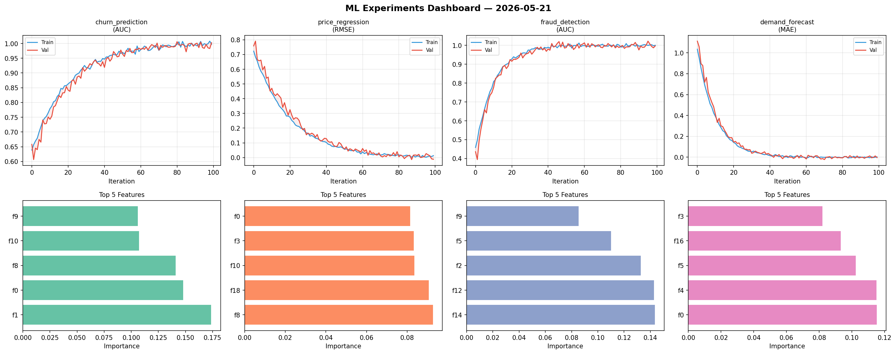
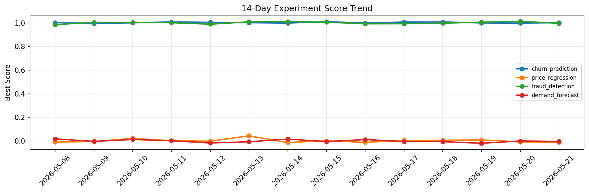

# ML Experiments Report — 2026-05-21

**Run ID:** `318c02eb3d` | **Experiments:** 4 | **Trials:** 16

## Delta vs Yesterday

| Experiment | Today | Yesterday | Change |
|-----------|-------|-----------|--------|
| churn_prediction | 1.0024 | 0.9986 | 📈 0.4% |
| price_regression | -0.0118 | -0.0076 | 📉 -55.3% |
| fraud_detection | 0.9972 | 1.0132 | 📉 -1.6% |
| demand_forecast | -0.0043 | -0.0001 | 📉 -420.0% |

## churn_prediction (AUC)

**Best Score:** 1.0024 (Trial 4)

| Trial | Score | Overfit Gap | Time | LR | Trees | Leaves |
|-------|-------|-------------|------|-----|-------|--------|
| 1 | 0.9872 | 0.0142 | 219.23s | 0.2 | 1000 | 31 |
| 2 | 0.9463 | 0.0121 | 240.93s | 0.05 | 1000 | 31 |
| 3 | 0.7742 | 0.0358 | 96.38s | 0.01 | 1000 | 15 |
| 4 ⭐ | 1.0024 | 0.0053 | 264.98s | 0.1 | 1000 | 63 |

## price_regression (RMSE)

**Best Score:** -0.0118 (Trial 2)

| Trial | Score | Overfit Gap | Time | LR | Trees | Leaves |
|-------|-------|-------------|------|-----|-------|--------|
| 1 | 1.1036 | 0.0117 | 282.66s | 0.01 | 1000 | 31 |
| 2 ⭐ | -0.0118 | 0.0247 | 9.18s | 0.1 | 100 | 15 |
| 3 | 0.0668 | 0.0089 | 57.27s | 0.05 | 200 | 31 |
| 4 | 0.5991 | 0.0305 | 10.51s | 0.01 | 500 | 127 |

## fraud_detection (AUC)

**Best Score:** 0.9972 (Trial 3)

| Trial | Score | Overfit Gap | Time | LR | Trees | Leaves |
|-------|-------|-------------|------|-----|-------|--------|
| 1 | 0.9527 | 0.0117 | 18.56s | 0.05 | 200 | 15 |
| 2 | 0.9487 | 0.0251 | 57.08s | 0.05 | 200 | 15 |
| 3 ⭐ | 0.9972 | 0.0035 | 11.4s | 0.2 | 100 | 127 |
| 4 | 0.6799 | 0.0101 | 59.46s | 0.01 | 200 | 15 |

## demand_forecast (MAE)

**Best Score:** -0.0043 (Trial 3)

| Trial | Score | Overfit Gap | Time | LR | Trees | Leaves |
|-------|-------|-------------|------|-----|-------|--------|
| 1 | 0.021 | 0.0044 | 83.03s | 0.1 | 1000 | 15 |
| 2 | 0.0699 | 0.0097 | 25.88s | 0.05 | 200 | 15 |
| 3 ⭐ | -0.0043 | 0.0071 | 186.46s | 0.2 | 1000 | 127 |
| 4 | 0.0311 | 0.0285 | 146.35s | 0.1 | 1000 | 15 |
