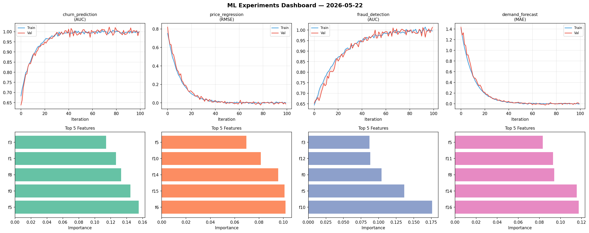
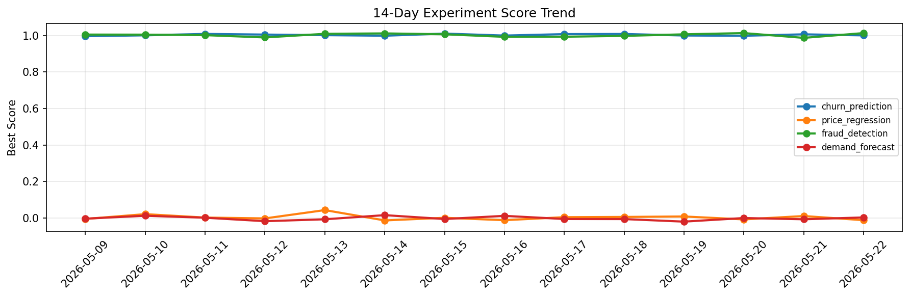

# ML Experiments Report — 2026-05-22

**Run ID:** `0fd9d00bbd` | **Experiments:** 4 | **Trials:** 21

## Delta vs Yesterday

| Experiment | Today | Yesterday | Change |
|-----------|-------|-----------|--------|
| churn_prediction | 1.0007 | 1.0065 | 📉 -0.6% |
| price_regression | -0.0119 | 0.0108 | 📉 -210.2% |
| fraud_detection | 1.0132 | 0.9871 | 📈 2.6% |
| demand_forecast | 0.0031 | -0.0069 | 📈 144.9% |

## churn_prediction (AUC)

**Best Score:** 1.0007 (Trial 5)

| Trial | Score | Overfit Gap | Time | LR | Trees | Leaves |
|-------|-------|-------------|------|-----|-------|--------|
| 1 | 0.954 | 0.0121 | 5.35s | 0.05 | 200 | 63 |
| 2 | 0.9939 | 0.0088 | 243.92s | 0.2 | 1000 | 31 |
| 3 | 0.9568 | 0.0088 | 7.55s | 0.05 | 100 | 127 |
| 4 | 0.9896 | 0.0053 | 11.6s | 0.1 | 200 | 127 |
| 5 ⭐ | 1.0007 | 0.0002 | 163.86s | 0.2 | 1000 | 127 |

## price_regression (RMSE)

**Best Score:** -0.0119 (Trial 4)

| Trial | Score | Overfit Gap | Time | LR | Trees | Leaves |
|-------|-------|-------------|------|-----|-------|--------|
| 1 | 0.8326 | 0.0096 | 1.23s | 0.01 | 200 | 31 |
| 2 | -0.0028 | 0.0071 | 99.7s | 0.2 | 500 | 31 |
| 3 | 0.0515 | 0.0021 | 24.64s | 0.05 | 200 | 63 |
| 4 ⭐ | -0.0119 | 0.0134 | 131.94s | 0.2 | 1000 | 127 |
| 5 | 1.2842 | 0.1473 | 104.32s | 0.01 | 1000 | 127 |
| 6 | 0.0173 | 0.0195 | 38.46s | 0.2 | 1000 | 127 |

## fraud_detection (AUC)

**Best Score:** 1.0132 (Trial 1)

| Trial | Score | Overfit Gap | Time | LR | Trees | Leaves |
|-------|-------|-------------|------|-----|-------|--------|
| 1 ⭐ | 1.0132 | 0.0178 | 242.98s | 0.1 | 1000 | 127 |
| 2 | 1.0096 | 0.0085 | 4.46s | 0.2 | 500 | 63 |
| 3 | 0.9837 | 0.0153 | 36.42s | 0.1 | 200 | 63 |
| 4 | 1.0042 | 0.0011 | 28.41s | 0.2 | 200 | 31 |
| 5 | 0.9643 | 0.0006 | 123.9s | 0.05 | 1000 | 127 |

## demand_forecast (MAE)

**Best Score:** 0.0031 (Trial 3)

| Trial | Score | Overfit Gap | Time | LR | Trees | Leaves |
|-------|-------|-------------|------|-----|-------|--------|
| 1 | 0.0163 | 0.0075 | 45.26s | 0.1 | 1000 | 15 |
| 2 | 0.6156 | 0.0322 | 9.09s | 0.01 | 100 | 15 |
| 3 ⭐ | 0.0031 | 0.0098 | 39.17s | 0.2 | 500 | 15 |
| 4 | 0.7759 | 0.1176 | 14.42s | 0.01 | 1000 | 15 |
| 5 | 0.0171 | 0.0193 | 41.35s | 0.1 | 1000 | 15 |
