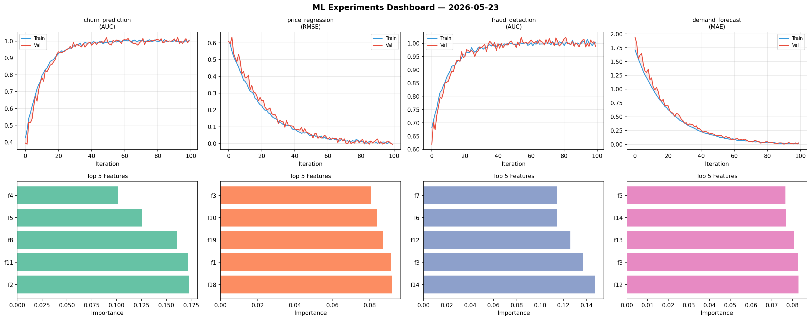
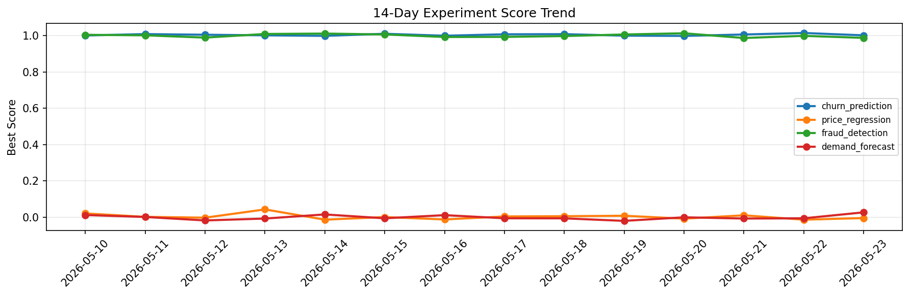

# ML Experiments Report — 2026-05-23

**Run ID:** `06826b14dc` | **Experiments:** 4 | **Trials:** 16

## Delta vs Yesterday

| Experiment | Today | Yesterday | Change |
|-----------|-------|-----------|--------|
| churn_prediction | 1.0019 | 1.0148 | 📉 -1.3% |
| price_regression | -0.0044 | -0.0131 | 📈 66.4% |
| fraud_detection | 0.9879 | 0.999 | 📉 -1.1% |
| demand_forecast | 0.0271 | -0.0057 | 📈 575.4% |

## churn_prediction (AUC)

**Best Score:** 1.0019 (Trial 3)

| Trial | Score | Overfit Gap | Time | LR | Trees | Leaves |
|-------|-------|-------------|------|-----|-------|--------|
| 1 | 0.9856 | 0.0163 | 60.41s | 0.2 | 500 | 63 |
| 2 | 0.9549 | 0.0124 | 14.87s | 0.05 | 100 | 127 |
| 3 ⭐ | 1.0019 | 0.0033 | 11.76s | 0.2 | 200 | 63 |

## price_regression (RMSE)

**Best Score:** -0.0044 (Trial 3)

| Trial | Score | Overfit Gap | Time | LR | Trees | Leaves |
|-------|-------|-------------|------|-----|-------|--------|
| 1 | -0.0034 | 0.0002 | 8.2s | 0.2 | 100 | 127 |
| 2 | 0.0026 | 0.0059 | 12.0s | 0.1 | 200 | 63 |
| 3 ⭐ | -0.0044 | 0.0004 | 28.14s | 0.1 | 200 | 15 |
| 4 | 0.0081 | 0.0057 | 42.4s | 0.1 | 1000 | 63 |
| 5 | 0.9124 | 0.0355 | 33.81s | 0.01 | 200 | 31 |
| 6 | 0.0085 | 0.0069 | 0.7s | 0.1 | 100 | 31 |

## fraud_detection (AUC)

**Best Score:** 0.9879 (Trial 3)

| Trial | Score | Overfit Gap | Time | LR | Trees | Leaves |
|-------|-------|-------------|------|-----|-------|--------|
| 1 | 0.7386 | 0.023 | 114.67s | 0.01 | 500 | 15 |
| 2 | 0.9476 | 0.0144 | 50.53s | 0.05 | 200 | 127 |
| 3 ⭐ | 0.9879 | 0.0165 | 89.42s | 0.2 | 500 | 15 |
| 4 | 0.7847 | 0.0266 | 38.54s | 0.01 | 200 | 63 |

## demand_forecast (MAE)

**Best Score:** 0.0271 (Trial 1)

| Trial | Score | Overfit Gap | Time | LR | Trees | Leaves |
|-------|-------|-------------|------|-----|-------|--------|
| 1 ⭐ | 0.0271 | 0.0093 | 74.92s | 0.1 | 500 | 127 |
| 2 | 1.2367 | 0.1066 | 59.49s | 0.01 | 200 | 15 |
| 3 | 0.1614 | 0.0152 | 178.65s | 0.05 | 1000 | 15 |
