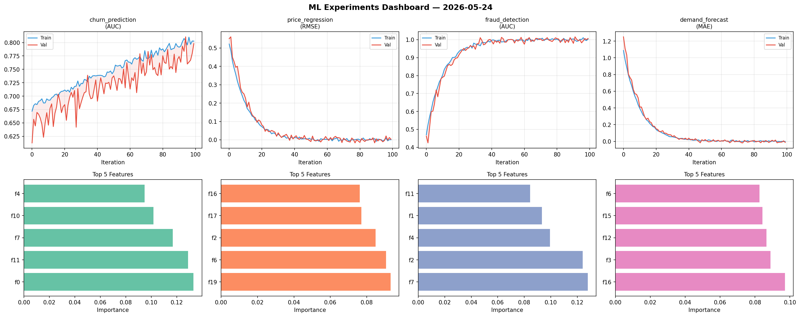
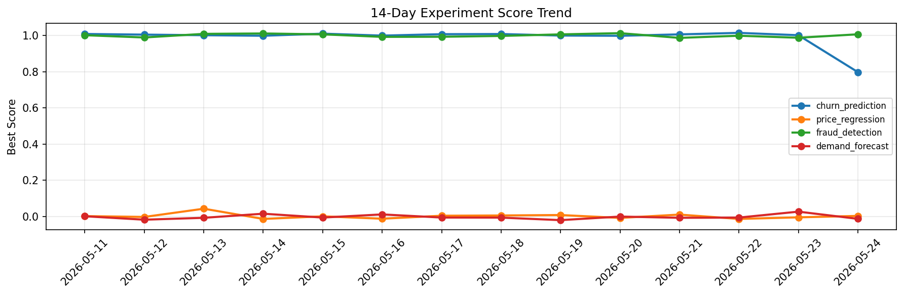

# ML Experiments Report — 2026-05-24

**Run ID:** `44f2d0cd9d` | **Experiments:** 4 | **Trials:** 15

## Delta vs Yesterday

| Experiment | Today | Yesterday | Change |
|-----------|-------|-----------|--------|
| churn_prediction | 0.798 | 1.0019 | 📉 -20.4% |
| price_regression | 0.0035 | -0.0044 | 📈 179.5% |
| fraud_detection | 1.0069 | 0.9879 | 📈 1.9% |
| demand_forecast | -0.0127 | 0.0271 | 📉 -146.9% |

## churn_prediction (AUC)

**Best Score:** 0.798 (Trial 2)

| Trial | Score | Overfit Gap | Time | LR | Trees | Leaves |
|-------|-------|-------------|------|-----|-------|--------|
| 1 | 0.6729 | 0.015 | 17.43s | 0.01 | 100 | 63 |
| 2 ⭐ | 0.798 | 0.0047 | 32.45s | 0.01 | 500 | 15 |
| 3 | 0.6235 | 0.0197 | 147.68s | 0.01 | 1000 | 31 |

## price_regression (RMSE)

**Best Score:** 0.0035 (Trial 3)

| Trial | Score | Overfit Gap | Time | LR | Trees | Leaves |
|-------|-------|-------------|------|-----|-------|--------|
| 1 | 0.1588 | 0.0216 | 28.54s | 0.05 | 1000 | 63 |
| 2 | 0.0979 | 0.02 | 164.22s | 0.05 | 1000 | 31 |
| 3 ⭐ | 0.0035 | 0.0031 | 32.51s | 0.2 | 200 | 127 |
| 4 | 0.015 | 0.0101 | 16.1s | 0.1 | 200 | 63 |

## fraud_detection (AUC)

**Best Score:** 1.0069 (Trial 1)

| Trial | Score | Overfit Gap | Time | LR | Trees | Leaves |
|-------|-------|-------------|------|-----|-------|--------|
| 1 ⭐ | 1.0069 | 0.0036 | 223.56s | 0.2 | 1000 | 127 |
| 2 | 0.9963 | 0.0063 | 9.02s | 0.1 | 100 | 31 |
| 3 | 0.9842 | 0.0106 | 9.26s | 0.1 | 200 | 63 |
| 4 | 0.7767 | 0.0034 | 6.36s | 0.01 | 500 | 31 |

## demand_forecast (MAE)

**Best Score:** -0.0127 (Trial 4)

| Trial | Score | Overfit Gap | Time | LR | Trees | Leaves |
|-------|-------|-------------|------|-----|-------|--------|
| 1 | 0.0271 | 0.0105 | 48.26s | 0.1 | 200 | 127 |
| 2 | 0.0195 | 0.0112 | 13.19s | 0.1 | 100 | 15 |
| 3 | -0.0087 | 0.0155 | 43.07s | 0.1 | 200 | 127 |
| 4 ⭐ | -0.0127 | 0.0119 | 297.33s | 0.2 | 1000 | 63 |
