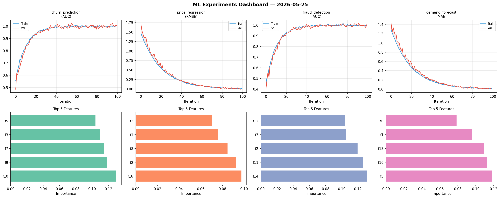
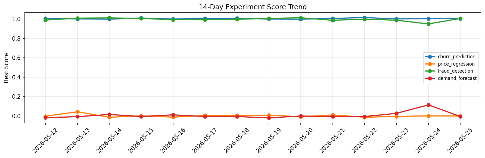

# ML Experiments Report — 2026-05-25

**Run ID:** `02ff2b7383` | **Experiments:** 4 | **Trials:** 16

## Delta vs Yesterday

| Experiment | Today | Yesterday | Change |
|-----------|-------|-----------|--------|
| churn_prediction | 1.0049 | 1.0035 | 📈 0.1% |
| price_regression | -0.0001 | 0.0012 | 📉 -108.3% |
| fraud_detection | 1.0061 | 0.9497 | 📈 5.9% |
| demand_forecast | -0.0048 | 0.1145 | 📉 -104.2% |

## churn_prediction (AUC)

**Best Score:** 1.0049 (Trial 3)

| Trial | Score | Overfit Gap | Time | LR | Trees | Leaves |
|-------|-------|-------------|------|-----|-------|--------|
| 1 | 0.7875 | 0.0147 | 29.33s | 0.01 | 200 | 127 |
| 2 | 0.9602 | 0.0046 | 75.96s | 0.05 | 500 | 31 |
| 3 ⭐ | 1.0049 | 0.0023 | 31.85s | 0.2 | 500 | 63 |
| 4 | 0.6865 | 0.015 | 102.78s | 0.01 | 500 | 15 |
| 5 | 1.0018 | 0.0106 | 26.34s | 0.1 | 100 | 15 |
| 6 | 0.9912 | 0.006 | 128.77s | 0.1 | 1000 | 31 |

## price_regression (RMSE)

**Best Score:** -0.0001 (Trial 1)

| Trial | Score | Overfit Gap | Time | LR | Trees | Leaves |
|-------|-------|-------------|------|-----|-------|--------|
| 1 ⭐ | -0.0001 | 0.0098 | 48.61s | 0.1 | 200 | 63 |
| 2 | 1.2007 | 0.1627 | 12.82s | 0.01 | 100 | 31 |
| 3 | 1.0788 | 0.0224 | 164.94s | 0.01 | 1000 | 31 |
| 4 | 0.062 | 0.0071 | 162.21s | 0.05 | 1000 | 127 |

## fraud_detection (AUC)

**Best Score:** 1.0061 (Trial 3)

| Trial | Score | Overfit Gap | Time | LR | Trees | Leaves |
|-------|-------|-------------|------|-----|-------|--------|
| 1 | 0.6854 | 0.03 | 130.05s | 0.01 | 500 | 31 |
| 2 | 0.9798 | 0.0218 | 246.39s | 0.1 | 1000 | 15 |
| 3 ⭐ | 1.0061 | 0.0116 | 66.91s | 0.2 | 1000 | 15 |

## demand_forecast (MAE)

**Best Score:** -0.0048 (Trial 2)

| Trial | Score | Overfit Gap | Time | LR | Trees | Leaves |
|-------|-------|-------------|------|-----|-------|--------|
| 1 | 0.0764 | 0.0027 | 6.1s | 0.05 | 1000 | 127 |
| 2 ⭐ | -0.0048 | 0.0203 | 260.38s | 0.1 | 1000 | 31 |
| 3 | 0.7274 | 0.1008 | 21.67s | 0.01 | 100 | 63 |
