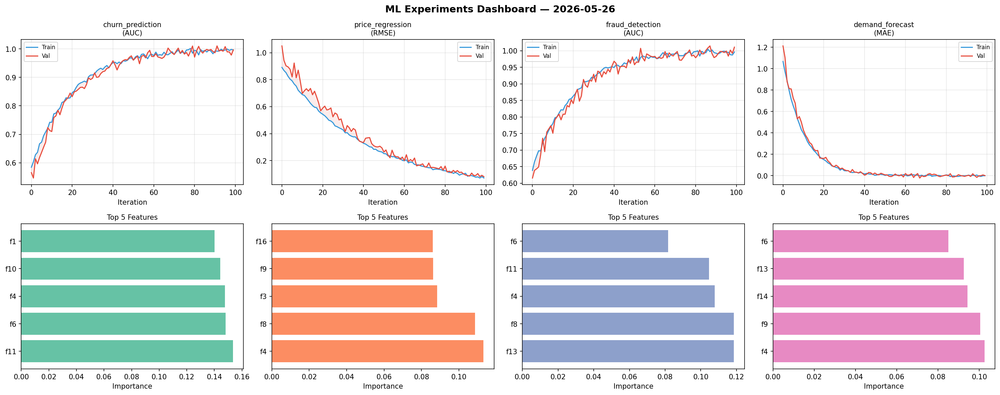
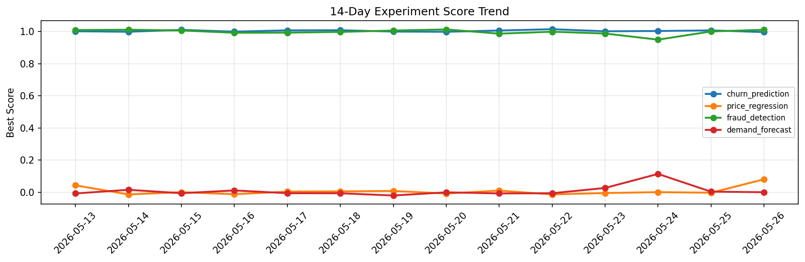

# ML Experiments Report — 2026-05-26

**Run ID:** `1ce0a9eafd` | **Experiments:** 4 | **Trials:** 17

## Delta vs Yesterday

| Experiment | Today | Yesterday | Change |
|-----------|-------|-----------|--------|
| churn_prediction | 0.9967 | 1.0074 | 📉 -1.1% |
| price_regression | 0.0808 | -0.0025 | 📈 3332.0% |
| fraud_detection | 1.0112 | 1.0006 | 📈 1.1% |
| demand_forecast | 0.0007 | 0.0041 | 📉 -82.9% |

## churn_prediction (AUC)

**Best Score:** 0.9967 (Trial 2)

| Trial | Score | Overfit Gap | Time | LR | Trees | Leaves |
|-------|-------|-------------|------|-----|-------|--------|
| 1 | 0.7573 | 0.0208 | 46.94s | 0.01 | 1000 | 63 |
| 2 ⭐ | 0.9967 | 0.0006 | 61.71s | 0.1 | 500 | 15 |
| 3 | 0.721 | 0.0186 | 144.57s | 0.01 | 500 | 63 |

## price_regression (RMSE)

**Best Score:** 0.0808 (Trial 5)

| Trial | Score | Overfit Gap | Time | LR | Trees | Leaves |
|-------|-------|-------------|------|-----|-------|--------|
| 1 | 0.6829 | 0.0507 | 42.62s | 0.01 | 500 | 63 |
| 2 | 0.6274 | 0.1078 | 286.67s | 0.01 | 1000 | 63 |
| 3 | 0.1524 | 0.0158 | 19.53s | 0.05 | 100 | 127 |
| 4 | 0.8074 | 0.0146 | 283.94s | 0.01 | 1000 | 15 |
| 5 ⭐ | 0.0808 | 0.01 | 53.53s | 0.05 | 200 | 15 |

## fraud_detection (AUC)

**Best Score:** 1.0112 (Trial 2)

| Trial | Score | Overfit Gap | Time | LR | Trees | Leaves |
|-------|-------|-------------|------|-----|-------|--------|
| 1 | 0.6365 | 0.0386 | 7.77s | 0.01 | 100 | 31 |
| 2 ⭐ | 1.0112 | 0.0147 | 45.84s | 0.1 | 1000 | 31 |
| 3 | 1.0041 | 0.0066 | 28.96s | 0.1 | 200 | 63 |
| 4 | 0.9453 | 0.0096 | 5.71s | 0.05 | 200 | 63 |

## demand_forecast (MAE)

**Best Score:** 0.0007 (Trial 5)

| Trial | Score | Overfit Gap | Time | LR | Trees | Leaves |
|-------|-------|-------------|------|-----|-------|--------|
| 1 | 1.1509 | 0.1521 | 189.82s | 0.01 | 1000 | 63 |
| 2 | 1.0144 | 0.1013 | 4.42s | 0.01 | 100 | 63 |
| 3 | 0.072 | 0.0183 | 37.27s | 0.05 | 200 | 63 |
| 4 | 0.0049 | 0.001 | 8.12s | 0.2 | 200 | 127 |
| 5 ⭐ | 0.0007 | 0.0012 | 233.81s | 0.2 | 1000 | 31 |
