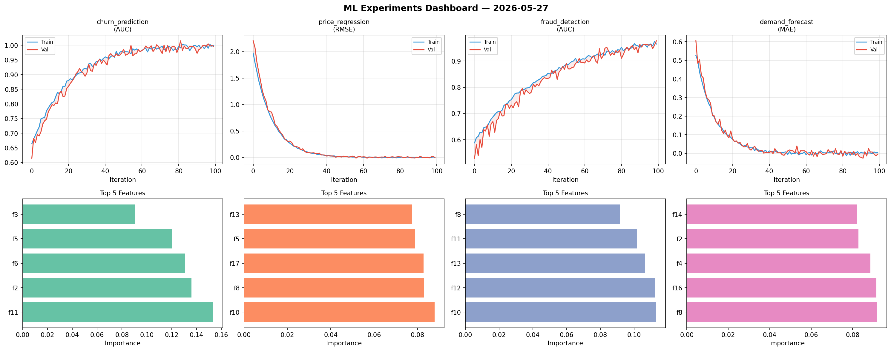
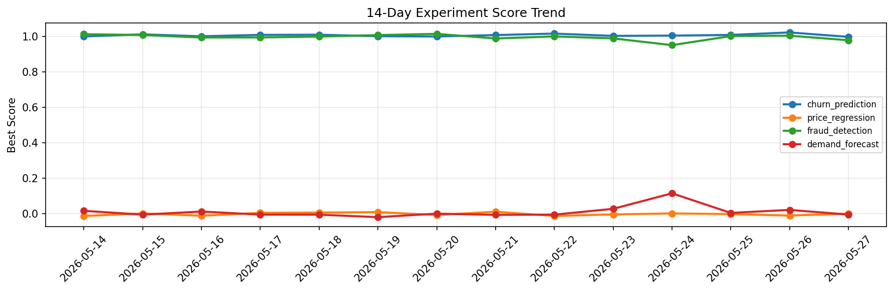

# ML Experiments Report — 2026-05-27

**Run ID:** `efc5313dac` | **Experiments:** 4 | **Trials:** 16

## Delta vs Yesterday

| Experiment | Today | Yesterday | Change |
|-----------|-------|-----------|--------|
| churn_prediction | 0.9963 | 1.0214 | 📉 -2.5% |
| price_regression | 0.0001 | -0.011 | 📈 100.9% |
| fraud_detection | 0.9773 | 1.0031 | 📉 -2.6% |
| demand_forecast | -0.0053 | 0.021 | 📉 -125.2% |

## churn_prediction (AUC)

**Best Score:** 0.9963 (Trial 2)

| Trial | Score | Overfit Gap | Time | LR | Trees | Leaves |
|-------|-------|-------------|------|-----|-------|--------|
| 1 | 0.7477 | 0.0255 | 54.24s | 0.01 | 200 | 15 |
| 2 ⭐ | 0.9963 | 0.0033 | 30.95s | 0.1 | 200 | 15 |
| 3 | 0.9893 | 0.0158 | 10.1s | 0.2 | 100 | 15 |

## price_regression (RMSE)

**Best Score:** 0.0001 (Trial 4)

| Trial | Score | Overfit Gap | Time | LR | Trees | Leaves |
|-------|-------|-------------|------|-----|-------|--------|
| 1 | 0.6815 | 0.0025 | 66.72s | 0.01 | 500 | 15 |
| 2 | 0.0092 | 0.0033 | 47.56s | 0.1 | 1000 | 63 |
| 3 | 0.0037 | 0.007 | 3.7s | 0.2 | 100 | 15 |
| 4 ⭐ | 0.0001 | 0.0037 | 84.73s | 0.2 | 1000 | 31 |
| 5 | 0.0028 | 0.0106 | 177.14s | 0.2 | 1000 | 15 |

## fraud_detection (AUC)

**Best Score:** 0.9773 (Trial 3)

| Trial | Score | Overfit Gap | Time | LR | Trees | Leaves |
|-------|-------|-------------|------|-----|-------|--------|
| 1 | 0.7756 | 0.0247 | 126.26s | 0.01 | 500 | 63 |
| 2 | 0.5851 | 0.0511 | 49.37s | 0.01 | 200 | 127 |
| 3 ⭐ | 0.9773 | 0.0124 | 92.37s | 0.05 | 500 | 15 |

## demand_forecast (MAE)

**Best Score:** -0.0053 (Trial 2)

| Trial | Score | Overfit Gap | Time | LR | Trees | Leaves |
|-------|-------|-------------|------|-----|-------|--------|
| 1 | 0.0365 | 0.0326 | 245.64s | 0.1 | 1000 | 15 |
| 2 ⭐ | -0.0053 | 0.0108 | 8.67s | 0.2 | 100 | 31 |
| 3 | 0.1672 | 0.0048 | 45.15s | 0.05 | 1000 | 15 |
| 4 | 0.6901 | 0.1269 | 15.03s | 0.01 | 500 | 15 |
| 5 | -0.0031 | 0.0034 | 297.32s | 0.1 | 1000 | 15 |
