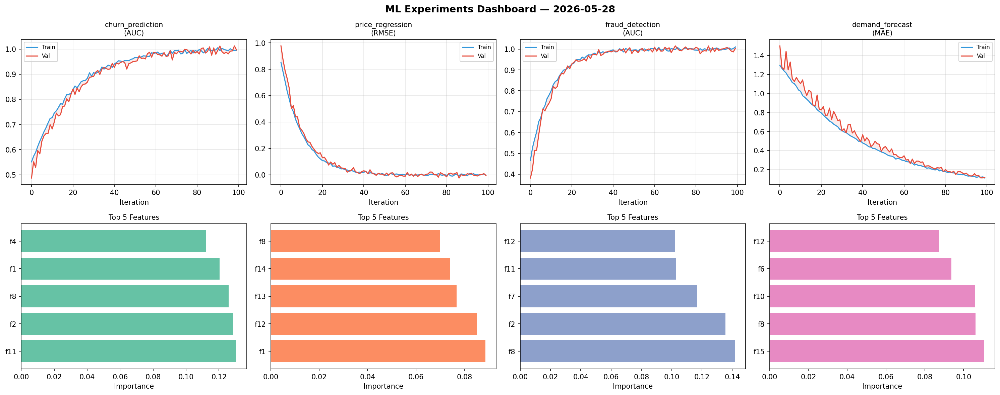
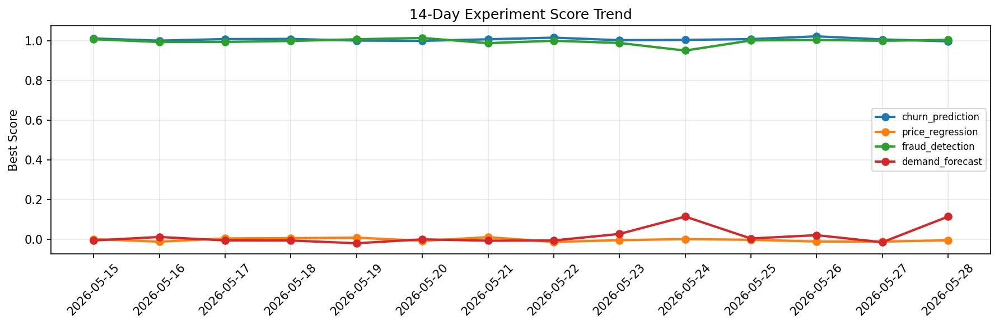

# ML Experiments Report — 2026-05-28

**Run ID:** `010d4de4f1` | **Experiments:** 4 | **Trials:** 18

## Delta vs Yesterday

| Experiment | Today | Yesterday | Change |
|-----------|-------|-----------|--------|
| churn_prediction | 0.9964 | 1.0057 | 📉 -0.9% |
| price_regression | -0.0049 | -0.0114 | 📈 57.0% |
| fraud_detection | 1.0035 | 0.9989 | 📈 0.5% |
| demand_forecast | 0.1142 | -0.0147 | 📈 876.9% |

## churn_prediction (AUC)

**Best Score:** 0.9964 (Trial 5)

| Trial | Score | Overfit Gap | Time | LR | Trees | Leaves |
|-------|-------|-------------|------|-----|-------|--------|
| 1 | 0.6638 | 0.0213 | 32.82s | 0.01 | 200 | 31 |
| 2 | 0.6498 | 0.0654 | 3.53s | 0.01 | 100 | 63 |
| 3 | 0.6017 | 0.0404 | 8.07s | 0.01 | 200 | 15 |
| 4 | 0.6895 | 0.0208 | 0.57s | 0.01 | 100 | 15 |
| 5 ⭐ | 0.9964 | 0.0016 | 5.44s | 0.1 | 100 | 31 |

## price_regression (RMSE)

**Best Score:** -0.0049 (Trial 3)

| Trial | Score | Overfit Gap | Time | LR | Trees | Leaves |
|-------|-------|-------------|------|-----|-------|--------|
| 1 | 0.0035 | 0.0073 | 232.56s | 0.2 | 1000 | 15 |
| 2 | 0.0078 | 0.0072 | 264.43s | 0.2 | 1000 | 31 |
| 3 ⭐ | -0.0049 | 0.0021 | 28.63s | 0.2 | 100 | 127 |
| 4 | 0.8494 | 0.117 | 21.92s | 0.01 | 500 | 127 |

## fraud_detection (AUC)

**Best Score:** 1.0035 (Trial 1)

| Trial | Score | Overfit Gap | Time | LR | Trees | Leaves |
|-------|-------|-------------|------|-----|-------|--------|
| 1 ⭐ | 1.0035 | 0.0064 | 267.07s | 0.2 | 1000 | 15 |
| 2 | 0.6187 | 0.0297 | 41.31s | 0.01 | 500 | 31 |
| 3 | 0.9915 | 0.0025 | 274.3s | 0.1 | 1000 | 63 |

## demand_forecast (MAE)

**Best Score:** 0.1142 (Trial 4)

| Trial | Score | Overfit Gap | Time | LR | Trees | Leaves |
|-------|-------|-------------|------|-----|-------|--------|
| 1 | 0.6735 | 0.0766 | 5.75s | 0.01 | 500 | 31 |
| 2 | 1.0388 | 0.0219 | 128.65s | 0.01 | 500 | 31 |
| 3 | 0.7187 | 0.0559 | 71.23s | 0.01 | 1000 | 31 |
| 4 ⭐ | 0.1142 | 0.004 | 2.2s | 0.05 | 100 | 63 |
| 5 | 0.749 | 0.0071 | 247.09s | 0.01 | 1000 | 15 |
| 6 | 0.1698 | 0.0151 | 23.04s | 0.05 | 200 | 31 |
