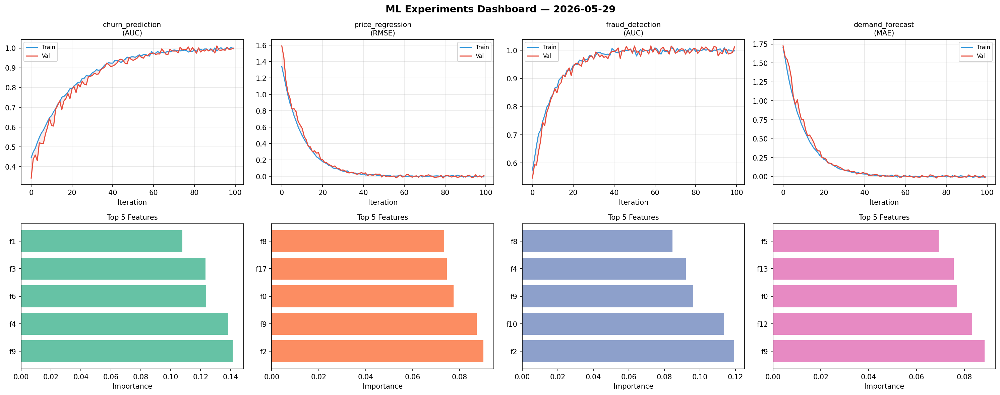
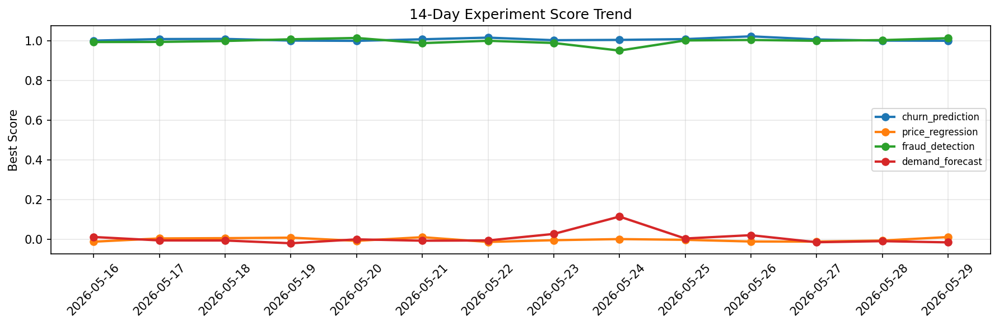

# ML Experiments Report — 2026-05-29

**Run ID:** `e3c503dbf8` | **Experiments:** 4 | **Trials:** 21

## Delta vs Yesterday

| Experiment | Today | Yesterday | Change |
|-----------|-------|-----------|--------|
| churn_prediction | 0.999 | 0.9998 | 📉 -0.1% |
| price_regression | 0.0115 | -0.0062 | 📈 285.5% |
| fraud_detection | 1.0121 | 1.0024 | 📈 1.0% |
| demand_forecast | -0.0153 | -0.0092 | 📉 -66.3% |

## churn_prediction (AUC)

**Best Score:** 0.999 (Trial 6)

| Trial | Score | Overfit Gap | Time | LR | Trees | Leaves |
|-------|-------|-------------|------|-----|-------|--------|
| 1 | 0.7531 | 0.0169 | 8.79s | 0.01 | 100 | 15 |
| 2 | 0.9675 | 0.0072 | 43.31s | 0.05 | 200 | 31 |
| 3 | 0.9638 | 0.0038 | 8.9s | 0.05 | 1000 | 15 |
| 4 | 0.9892 | 0.0113 | 121.05s | 0.1 | 500 | 15 |
| 5 | 0.9915 | 0.0051 | 17.29s | 0.1 | 100 | 15 |
| 6 ⭐ | 0.999 | 0.0027 | 8.91s | 0.1 | 100 | 127 |

## price_regression (RMSE)

**Best Score:** 0.0115 (Trial 3)

| Trial | Score | Overfit Gap | Time | LR | Trees | Leaves |
|-------|-------|-------------|------|-----|-------|--------|
| 1 | 0.0248 | 0.0093 | 115.74s | 0.1 | 500 | 31 |
| 2 | 1.2003 | 0.0713 | 28.23s | 0.01 | 500 | 127 |
| 3 ⭐ | 0.0115 | 0.018 | 149.21s | 0.2 | 500 | 63 |

## fraud_detection (AUC)

**Best Score:** 1.0121 (Trial 1)

| Trial | Score | Overfit Gap | Time | LR | Trees | Leaves |
|-------|-------|-------------|------|-----|-------|--------|
| 1 ⭐ | 1.0121 | 0.0141 | 28.06s | 0.2 | 500 | 31 |
| 2 | 0.9544 | 0.018 | 33.0s | 0.05 | 200 | 15 |
| 3 | 0.6495 | 0.0381 | 63.6s | 0.01 | 500 | 127 |
| 4 | 0.9653 | 0.011 | 22.01s | 0.05 | 500 | 15 |
| 5 | 0.7362 | 0.0264 | 58.25s | 0.01 | 200 | 15 |
| 6 | 1.0011 | 0.0071 | 6.14s | 0.2 | 200 | 31 |

## demand_forecast (MAE)

**Best Score:** -0.0153 (Trial 6)

| Trial | Score | Overfit Gap | Time | LR | Trees | Leaves |
|-------|-------|-------------|------|-----|-------|--------|
| 1 | 0.0734 | 0.0022 | 9.04s | 0.05 | 100 | 127 |
| 2 | 0.563 | 0.0329 | 15.73s | 0.01 | 200 | 15 |
| 3 | 0.7718 | 0.1306 | 86.3s | 0.01 | 500 | 31 |
| 4 | 0.0141 | 0.0099 | 27.46s | 0.2 | 200 | 127 |
| 5 | 0.0112 | 0.013 | 40.23s | 0.2 | 200 | 63 |
| 6 ⭐ | -0.0153 | 0.0123 | 58.77s | 0.2 | 500 | 31 |
