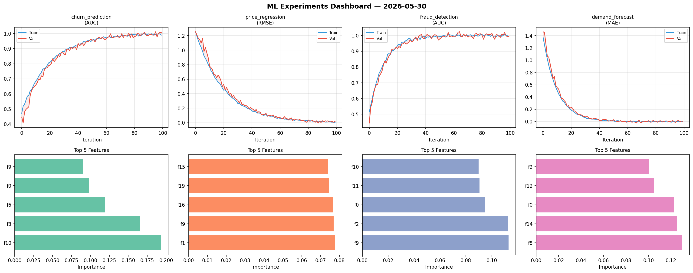
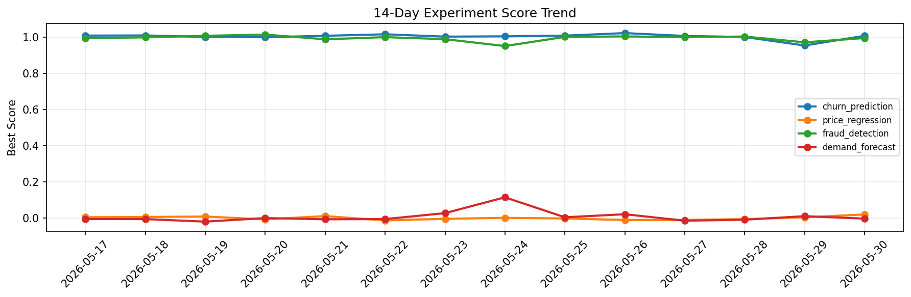

# ML Experiments Report — 2026-05-30

**Run ID:** `692a37d753` | **Experiments:** 4 | **Trials:** 15

## Delta vs Yesterday

| Experiment | Today | Yesterday | Change |
|-----------|-------|-----------|--------|
| churn_prediction | 1.0063 | 0.9529 | 📈 5.6% |
| price_regression | 0.0198 | 0.0041 | 📈 382.9% |
| fraud_detection | 0.9941 | 0.9704 | 📈 2.4% |
| demand_forecast | -0.0032 | 0.0102 | 📉 -131.4% |

## churn_prediction (AUC)

**Best Score:** 1.0063 (Trial 3)

| Trial | Score | Overfit Gap | Time | LR | Trees | Leaves |
|-------|-------|-------------|------|-----|-------|--------|
| 1 | 0.7765 | 0.0326 | 51.76s | 0.01 | 500 | 127 |
| 2 | 0.9775 | 0.019 | 76.01s | 0.2 | 1000 | 31 |
| 3 ⭐ | 1.0063 | 0.017 | 134.53s | 0.1 | 500 | 63 |
| 4 | 0.9637 | 0.0063 | 19.74s | 0.05 | 100 | 31 |

## price_regression (RMSE)

**Best Score:** 0.0198 (Trial 3)

| Trial | Score | Overfit Gap | Time | LR | Trees | Leaves |
|-------|-------|-------------|------|-----|-------|--------|
| 1 | 0.0798 | 0.0131 | 18.18s | 0.05 | 100 | 127 |
| 2 | 0.0481 | 0.0084 | 16.72s | 0.05 | 200 | 63 |
| 3 ⭐ | 0.0198 | 0.0157 | 25.24s | 0.1 | 100 | 127 |

## fraud_detection (AUC)

**Best Score:** 0.9941 (Trial 1)

| Trial | Score | Overfit Gap | Time | LR | Trees | Leaves |
|-------|-------|-------------|------|-----|-------|--------|
| 1 ⭐ | 0.9941 | 0.0004 | 26.43s | 0.2 | 100 | 31 |
| 2 | 0.7164 | 0.0291 | 3.58s | 0.01 | 100 | 31 |
| 3 | 0.7266 | 0.0396 | 46.73s | 0.01 | 200 | 31 |

## demand_forecast (MAE)

**Best Score:** -0.0032 (Trial 3)

| Trial | Score | Overfit Gap | Time | LR | Trees | Leaves |
|-------|-------|-------------|------|-----|-------|--------|
| 1 | -0.0016 | 0.0075 | 15.48s | 0.1 | 100 | 63 |
| 2 | 0.7261 | 0.0501 | 2.46s | 0.01 | 200 | 31 |
| 3 ⭐ | -0.0032 | 0.0047 | 241.92s | 0.2 | 1000 | 63 |
| 4 | 0.1853 | 0.0234 | 264.22s | 0.05 | 1000 | 63 |
| 5 | 0.0199 | 0.0116 | 241.2s | 0.1 | 1000 | 127 |
