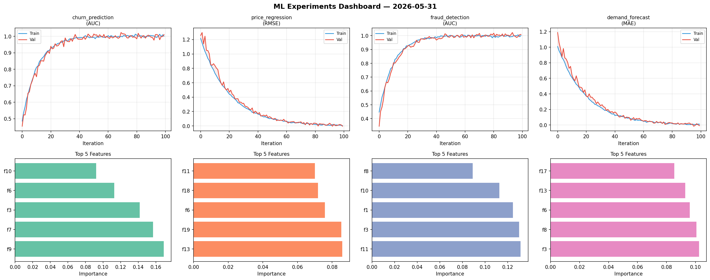
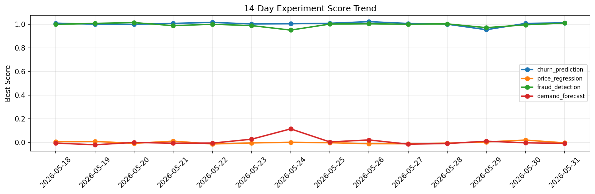

# ML Experiments Report — 2026-05-31

**Run ID:** `9c3f743a58` | **Experiments:** 4 | **Trials:** 21

## Delta vs Yesterday

| Experiment | Today | Yesterday | Change |
|-----------|-------|-----------|--------|
| churn_prediction | 1.011 | 1.0063 | 📈 0.5% |
| price_regression | -0.0038 | 0.0198 | 📉 -119.2% |
| fraud_detection | 1.0091 | 0.9941 | 📈 1.5% |
| demand_forecast | -0.0084 | -0.0032 | 📉 -162.5% |

## churn_prediction (AUC)

**Best Score:** 1.011 (Trial 3)

| Trial | Score | Overfit Gap | Time | LR | Trees | Leaves |
|-------|-------|-------------|------|-----|-------|--------|
| 1 | 1.0035 | 0.0011 | 40.31s | 0.1 | 500 | 127 |
| 2 | 0.9978 | 0.0082 | 28.48s | 0.1 | 100 | 63 |
| 3 ⭐ | 1.011 | 0.0098 | 143.74s | 0.2 | 500 | 127 |

## price_regression (RMSE)

**Best Score:** -0.0038 (Trial 6)

| Trial | Score | Overfit Gap | Time | LR | Trees | Leaves |
|-------|-------|-------------|------|-----|-------|--------|
| 1 | 0.4105 | 0.0644 | 21.97s | 0.01 | 100 | 31 |
| 2 | 0.4556 | 0.0554 | 18.98s | 0.01 | 100 | 15 |
| 3 | -0.0002 | 0.0 | 114.72s | 0.2 | 500 | 31 |
| 4 | 1.4028 | 0.2289 | 25.47s | 0.01 | 100 | 127 |
| 5 | 0.0106 | 0.0054 | 98.03s | 0.1 | 500 | 63 |
| 6 ⭐ | -0.0038 | 0.0085 | 80.9s | 0.1 | 500 | 127 |

## fraud_detection (AUC)

**Best Score:** 1.0091 (Trial 2)

| Trial | Score | Overfit Gap | Time | LR | Trees | Leaves |
|-------|-------|-------------|------|-----|-------|--------|
| 1 | 0.9681 | 0.0029 | 8.84s | 0.05 | 500 | 63 |
| 2 ⭐ | 1.0091 | 0.0089 | 185.7s | 0.2 | 1000 | 15 |
| 3 | 0.9718 | 0.0388 | 268.37s | 0.2 | 1000 | 127 |
| 4 | 0.7828 | 0.0078 | 101.61s | 0.01 | 500 | 31 |
| 5 | 0.9981 | 0.0059 | 86.55s | 0.1 | 500 | 127 |
| 6 | 0.9996 | 0.0 | 29.95s | 0.2 | 500 | 15 |

## demand_forecast (MAE)

**Best Score:** -0.0084 (Trial 4)

| Trial | Score | Overfit Gap | Time | LR | Trees | Leaves |
|-------|-------|-------------|------|-----|-------|--------|
| 1 | 0.8055 | 0.1251 | 14.26s | 0.01 | 500 | 15 |
| 2 | 0.153 | 0.012 | 27.53s | 0.05 | 500 | 15 |
| 3 | 0.0801 | 0.0114 | 173.09s | 0.05 | 1000 | 63 |
| 4 ⭐ | -0.0084 | 0.0191 | 29.38s | 0.1 | 100 | 63 |
| 5 | 0.0736 | 0.0061 | 119.75s | 0.05 | 1000 | 63 |
| 6 | 0.0228 | 0.009 | 45.15s | 0.1 | 200 | 15 |
