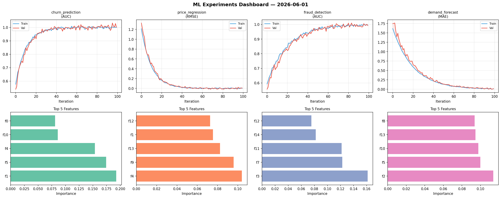
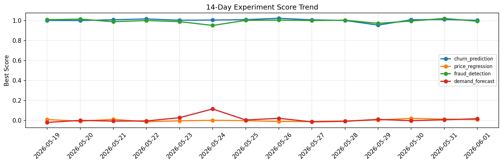

# ML Experiments Report — 2026-06-01

**Run ID:** `8eeef0bfc0` | **Experiments:** 4 | **Trials:** 14

## Delta vs Yesterday

| Experiment | Today | Yesterday | Change |
|-----------|-------|-----------|--------|
| churn_prediction | 1.0008 | 1.009 | 📉 -0.8% |
| price_regression | 0.0084 | 0.0124 | 📉 -32.3% |
| fraud_detection | 0.9919 | 1.0196 | 📉 -2.7% |
| demand_forecast | 0.0165 | 0.006 | 📈 175.0% |

## churn_prediction (AUC)

**Best Score:** 1.0008 (Trial 3)

| Trial | Score | Overfit Gap | Time | LR | Trees | Leaves |
|-------|-------|-------------|------|-----|-------|--------|
| 1 | 0.9904 | 0.0025 | 132.49s | 0.2 | 500 | 127 |
| 2 | 0.9933 | 0.0003 | 56.79s | 0.1 | 1000 | 63 |
| 3 ⭐ | 1.0008 | 0.0008 | 211.38s | 0.2 | 1000 | 15 |

## price_regression (RMSE)

**Best Score:** 0.0084 (Trial 1)

| Trial | Score | Overfit Gap | Time | LR | Trees | Leaves |
|-------|-------|-------------|------|-----|-------|--------|
| 1 ⭐ | 0.0084 | 0.0079 | 52.05s | 0.2 | 200 | 127 |
| 2 | 0.1744 | 0.0348 | 13.33s | 0.05 | 100 | 63 |
| 3 | 0.447 | 0.0122 | 22.38s | 0.01 | 100 | 15 |
| 4 | 1.1706 | 0.0709 | 17.65s | 0.01 | 200 | 31 |

## fraud_detection (AUC)

**Best Score:** 0.9919 (Trial 1)

| Trial | Score | Overfit Gap | Time | LR | Trees | Leaves |
|-------|-------|-------------|------|-----|-------|--------|
| 1 ⭐ | 0.9919 | 0.0037 | 21.5s | 0.1 | 200 | 63 |
| 2 | 0.9664 | 0.0068 | 15.16s | 0.05 | 200 | 63 |
| 3 | 0.7151 | 0.0159 | 3.84s | 0.01 | 200 | 127 |
| 4 | 0.7816 | 0.0239 | 140.68s | 0.01 | 1000 | 127 |

## demand_forecast (MAE)

**Best Score:** 0.0165 (Trial 1)

| Trial | Score | Overfit Gap | Time | LR | Trees | Leaves |
|-------|-------|-------------|------|-----|-------|--------|
| 1 ⭐ | 0.0165 | 0.005 | 71.13s | 0.1 | 500 | 15 |
| 2 | 1.1769 | 0.1672 | 16.57s | 0.01 | 1000 | 15 |
| 3 | 0.6597 | 0.0026 | 34.76s | 0.01 | 500 | 31 |
