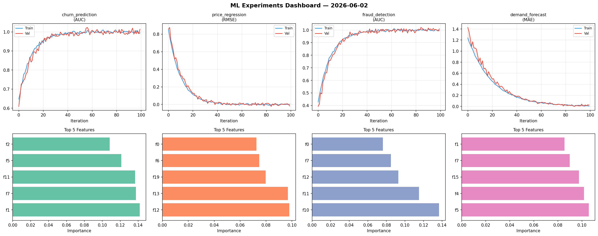
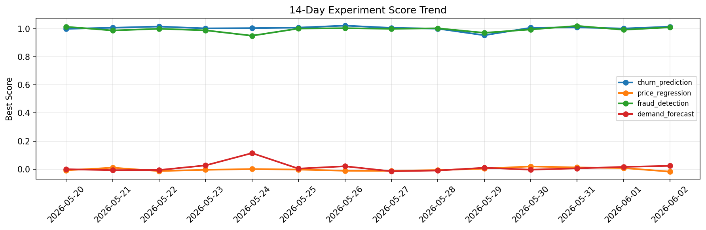

# ML Experiments Report — 2026-06-02

**Run ID:** `d438f24980` | **Experiments:** 4 | **Trials:** 20

## Delta vs Yesterday

| Experiment | Today | Yesterday | Change |
|-----------|-------|-----------|--------|
| churn_prediction | 1.0141 | 1.0008 | 📈 1.3% |
| price_regression | -0.0172 | 0.0084 | 📉 -304.8% |
| fraud_detection | 1.0095 | 0.9919 | 📈 1.8% |
| demand_forecast | 0.0237 | 0.0165 | 📈 43.6% |

## churn_prediction (AUC)

**Best Score:** 1.0141 (Trial 1)

| Trial | Score | Overfit Gap | Time | LR | Trees | Leaves |
|-------|-------|-------------|------|-----|-------|--------|
| 1 ⭐ | 1.0141 | 0.0197 | 3.54s | 0.2 | 100 | 15 |
| 2 | 0.9567 | 0.0131 | 295.94s | 0.05 | 1000 | 31 |
| 3 | 0.9552 | 0.0005 | 60.4s | 0.05 | 500 | 127 |
| 4 | 0.7883 | 0.0047 | 24.66s | 0.01 | 100 | 15 |
| 5 | 0.9678 | 0.0015 | 53.5s | 0.05 | 500 | 127 |
| 6 | 1.0094 | 0.0185 | 159.79s | 0.1 | 1000 | 15 |

## price_regression (RMSE)

**Best Score:** -0.0172 (Trial 4)

| Trial | Score | Overfit Gap | Time | LR | Trees | Leaves |
|-------|-------|-------------|------|-----|-------|--------|
| 1 | 0.131 | 0.0223 | 5.85s | 0.05 | 200 | 127 |
| 2 | 0.0054 | 0.0034 | 37.25s | 0.2 | 1000 | 63 |
| 3 | 0.0099 | 0.0187 | 16.29s | 0.2 | 200 | 127 |
| 4 ⭐ | -0.0172 | 0.0199 | 158.9s | 0.2 | 1000 | 31 |
| 5 | 0.1146 | 0.0255 | 110.2s | 0.05 | 1000 | 127 |

## fraud_detection (AUC)

**Best Score:** 1.0095 (Trial 5)

| Trial | Score | Overfit Gap | Time | LR | Trees | Leaves |
|-------|-------|-------------|------|-----|-------|--------|
| 1 | 0.7546 | 0.041 | 14.77s | 0.01 | 100 | 63 |
| 2 | 1.0055 | 0.002 | 36.32s | 0.1 | 200 | 15 |
| 3 | 0.9647 | 0.0002 | 56.24s | 0.05 | 200 | 127 |
| 4 | 1.0052 | 0.0 | 0.61s | 0.1 | 100 | 127 |
| 5 ⭐ | 1.0095 | 0.0143 | 121.33s | 0.2 | 500 | 63 |
| 6 | 0.935 | 0.0211 | 18.37s | 0.05 | 100 | 15 |

## demand_forecast (MAE)

**Best Score:** 0.0237 (Trial 2)

| Trial | Score | Overfit Gap | Time | LR | Trees | Leaves |
|-------|-------|-------------|------|-----|-------|--------|
| 1 | 0.8407 | 0.0304 | 39.71s | 0.01 | 200 | 15 |
| 2 ⭐ | 0.0237 | 0.0195 | 5.15s | 0.1 | 200 | 15 |
| 3 | 1.2116 | 0.1768 | 169.28s | 0.01 | 1000 | 15 |
