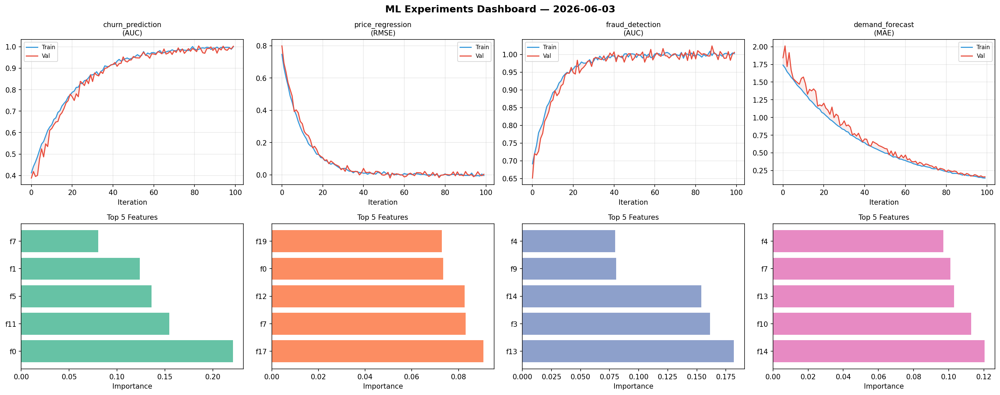
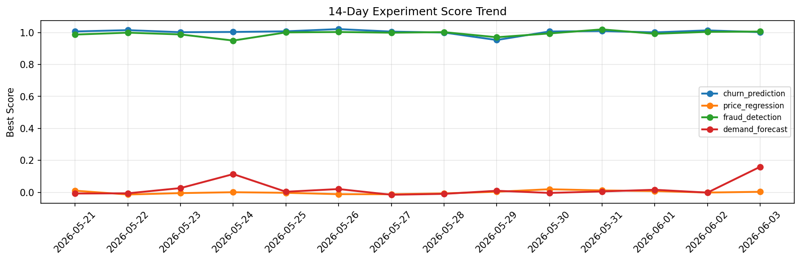

# ML Experiments Report — 2026-06-03

**Run ID:** `c2e5fa75b6` | **Experiments:** 4 | **Trials:** 15

## Delta vs Yesterday

| Experiment | Today | Yesterday | Change |
|-----------|-------|-----------|--------|
| churn_prediction | 1.0021 | 1.0133 | 📉 -1.1% |
| price_regression | 0.0037 | -0.0008 | 📈 450.0% |
| fraud_detection | 1.006 | 1.0041 | 📈 0.2% |
| demand_forecast | 0.1601 | -0.0012 | 📈 13441.7% |

## churn_prediction (AUC)

**Best Score:** 1.0021 (Trial 4)

| Trial | Score | Overfit Gap | Time | LR | Trees | Leaves |
|-------|-------|-------------|------|-----|-------|--------|
| 1 | 0.9808 | 0.0128 | 54.19s | 0.2 | 200 | 15 |
| 2 | 0.7195 | 0.0542 | 7.82s | 0.01 | 200 | 15 |
| 3 | 0.9875 | 0.0126 | 13.39s | 0.2 | 200 | 63 |
| 4 ⭐ | 1.0021 | 0.0019 | 27.5s | 0.1 | 200 | 31 |

## price_regression (RMSE)

**Best Score:** 0.0037 (Trial 5)

| Trial | Score | Overfit Gap | Time | LR | Trees | Leaves |
|-------|-------|-------------|------|-----|-------|--------|
| 1 | 0.1195 | 0.018 | 24.64s | 0.05 | 200 | 15 |
| 2 | 0.0648 | 0.0029 | 133.67s | 0.05 | 500 | 63 |
| 3 | 0.8309 | 0.0975 | 47.35s | 0.01 | 1000 | 15 |
| 4 | 0.0109 | 0.0091 | 3.57s | 0.2 | 200 | 63 |
| 5 ⭐ | 0.0037 | 0.0083 | 0.83s | 0.2 | 100 | 31 |

## fraud_detection (AUC)

**Best Score:** 1.006 (Trial 1)

| Trial | Score | Overfit Gap | Time | LR | Trees | Leaves |
|-------|-------|-------------|------|-----|-------|--------|
| 1 ⭐ | 1.006 | 0.0035 | 47.99s | 0.2 | 200 | 15 |
| 2 | 0.9779 | 0.0023 | 16.42s | 0.05 | 500 | 127 |
| 3 | 0.9956 | 0.0066 | 19.99s | 0.1 | 100 | 127 |

## demand_forecast (MAE)

**Best Score:** 0.1601 (Trial 3)

| Trial | Score | Overfit Gap | Time | LR | Trees | Leaves |
|-------|-------|-------------|------|-----|-------|--------|
| 1 | 0.7454 | 0.0545 | 37.27s | 0.01 | 1000 | 31 |
| 2 | 0.5642 | 0.0742 | 3.31s | 0.01 | 200 | 127 |
| 3 ⭐ | 0.1601 | 0.0172 | 9.93s | 0.05 | 500 | 31 |
