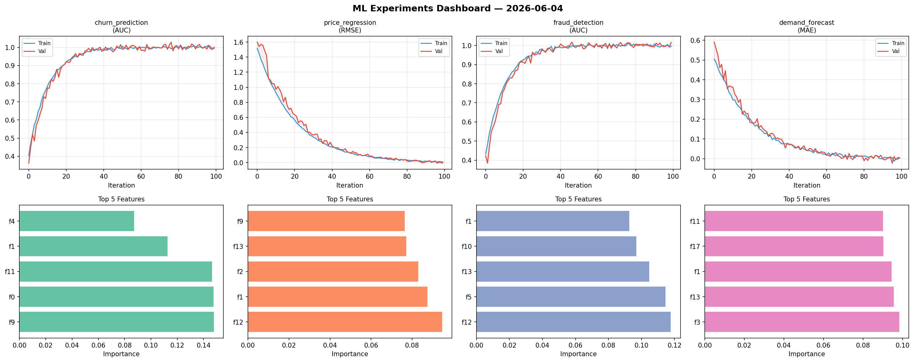
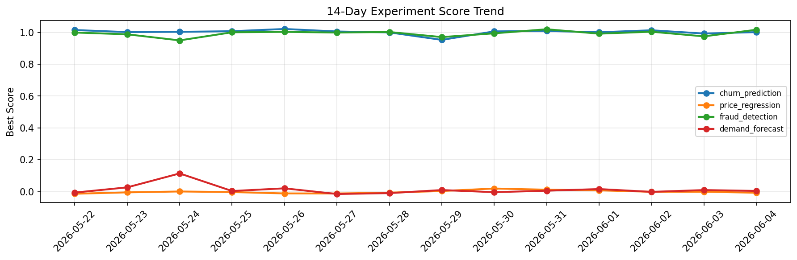

# ML Experiments Report — 2026-06-04

**Run ID:** `ab74634cc0` | **Experiments:** 4 | **Trials:** 16

## Delta vs Yesterday

| Experiment | Today | Yesterday | Change |
|-----------|-------|-----------|--------|
| churn_prediction | 1.0016 | 0.9928 | 📈 0.9% |
| price_regression | -0.0068 | -0.0003 | 📉 -650.0% |
| fraud_detection | 1.0165 | 0.975 | 📈 4.3% |
| demand_forecast | 0.0048 | 0.0101 | 📉 -52.5% |

## churn_prediction (AUC)

**Best Score:** 1.0016 (Trial 1)

| Trial | Score | Overfit Gap | Time | LR | Trees | Leaves |
|-------|-------|-------------|------|-----|-------|--------|
| 1 ⭐ | 1.0016 | 0.0076 | 24.64s | 0.2 | 100 | 31 |
| 2 | 0.9987 | 0.0086 | 287.37s | 0.1 | 1000 | 15 |
| 3 | 0.9985 | 0.0009 | 127.01s | 0.1 | 1000 | 15 |
| 4 | 0.9966 | 0.0132 | 212.11s | 0.1 | 1000 | 63 |
| 5 | 0.6546 | 0.0059 | 10.42s | 0.01 | 100 | 127 |
| 6 | 0.9899 | 0.0112 | 5.85s | 0.1 | 200 | 63 |

## price_regression (RMSE)

**Best Score:** -0.0068 (Trial 2)

| Trial | Score | Overfit Gap | Time | LR | Trees | Leaves |
|-------|-------|-------------|------|-----|-------|--------|
| 1 | 0.6346 | 0.0279 | 84.05s | 0.01 | 1000 | 127 |
| 2 ⭐ | -0.0068 | 0.015 | 67.69s | 0.1 | 1000 | 15 |
| 3 | 0.0083 | 0.0049 | 38.64s | 0.1 | 200 | 63 |
| 4 | 0.0005 | 0.0068 | 282.08s | 0.1 | 1000 | 15 |

## fraud_detection (AUC)

**Best Score:** 1.0165 (Trial 2)

| Trial | Score | Overfit Gap | Time | LR | Trees | Leaves |
|-------|-------|-------------|------|-----|-------|--------|
| 1 | 0.5985 | 0.0665 | 254.8s | 0.01 | 1000 | 31 |
| 2 ⭐ | 1.0165 | 0.0209 | 78.52s | 0.2 | 500 | 127 |
| 3 | 0.9524 | 0.0189 | 54.47s | 0.05 | 200 | 127 |

## demand_forecast (MAE)

**Best Score:** 0.0048 (Trial 2)

| Trial | Score | Overfit Gap | Time | LR | Trees | Leaves |
|-------|-------|-------------|------|-----|-------|--------|
| 1 | 0.0079 | 0.0013 | 32.8s | 0.1 | 500 | 63 |
| 2 ⭐ | 0.0048 | 0.0009 | 11.79s | 0.1 | 100 | 127 |
| 3 | 0.0118 | 0.0061 | 44.54s | 0.1 | 200 | 15 |
