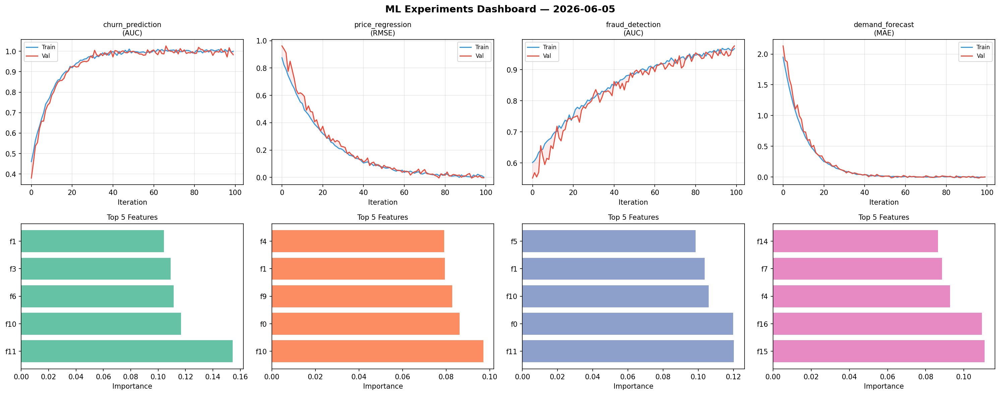
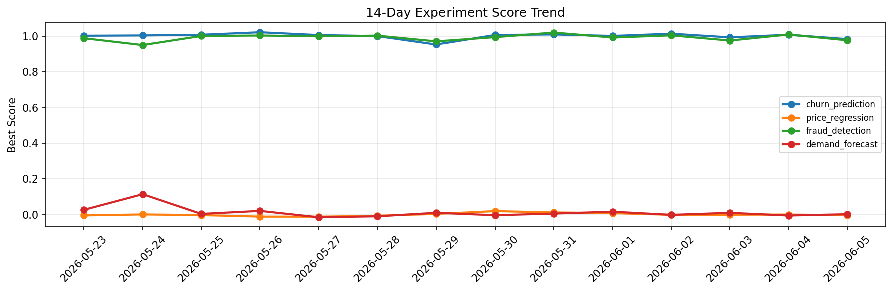

# ML Experiments Report — 2026-06-05

**Run ID:** `d38eee80cd` | **Experiments:** 4 | **Trials:** 16

## Delta vs Yesterday

| Experiment | Today | Yesterday | Change |
|-----------|-------|-----------|--------|
| churn_prediction | 0.983 | 1.0074 | 📉 -2.4% |
| price_regression | -0.0029 | 0.0005 | 📉 -340.0% |
| fraud_detection | 0.9765 | 1.0087 | 📉 -3.2% |
| demand_forecast | 0.0024 | -0.0049 | 📈 149.0% |

## churn_prediction (AUC)

**Best Score:** 0.983 (Trial 2)

| Trial | Score | Overfit Gap | Time | LR | Trees | Leaves |
|-------|-------|-------------|------|-----|-------|--------|
| 1 | 0.9584 | 0.006 | 57.16s | 0.05 | 200 | 31 |
| 2 ⭐ | 0.983 | 0.0168 | 297.17s | 0.2 | 1000 | 31 |
| 3 | 0.946 | 0.0149 | 44.43s | 0.05 | 1000 | 31 |

## price_regression (RMSE)

**Best Score:** -0.0029 (Trial 4)

| Trial | Score | Overfit Gap | Time | LR | Trees | Leaves |
|-------|-------|-------------|------|-----|-------|--------|
| 1 | 1.404 | 0.1878 | 278.42s | 0.01 | 1000 | 15 |
| 2 | 0.0125 | 0.013 | 107.28s | 0.1 | 1000 | 63 |
| 3 | 0.9695 | 0.0006 | 290.09s | 0.01 | 1000 | 127 |
| 4 ⭐ | -0.0029 | 0.0052 | 145.04s | 0.1 | 500 | 15 |
| 5 | 0.6361 | 0.0236 | 267.63s | 0.01 | 1000 | 31 |

## fraud_detection (AUC)

**Best Score:** 0.9765 (Trial 4)

| Trial | Score | Overfit Gap | Time | LR | Trees | Leaves |
|-------|-------|-------------|------|-----|-------|--------|
| 1 | 0.955 | 0.0122 | 11.94s | 0.05 | 100 | 15 |
| 2 | 0.9688 | 0.015 | 21.92s | 0.05 | 100 | 127 |
| 3 | 0.9631 | 0.0048 | 4.45s | 0.05 | 100 | 63 |
| 4 ⭐ | 0.9765 | 0.0088 | 248.76s | 0.05 | 1000 | 63 |

## demand_forecast (MAE)

**Best Score:** 0.0024 (Trial 2)

| Trial | Score | Overfit Gap | Time | LR | Trees | Leaves |
|-------|-------|-------------|------|-----|-------|--------|
| 1 | 0.1421 | 0.0207 | 27.08s | 0.05 | 100 | 31 |
| 2 ⭐ | 0.0024 | 0.0018 | 22.24s | 0.2 | 100 | 31 |
| 3 | 0.0284 | 0.0088 | 39.25s | 0.1 | 200 | 63 |
| 4 | 0.0095 | 0.0063 | 270.96s | 0.1 | 1000 | 127 |
