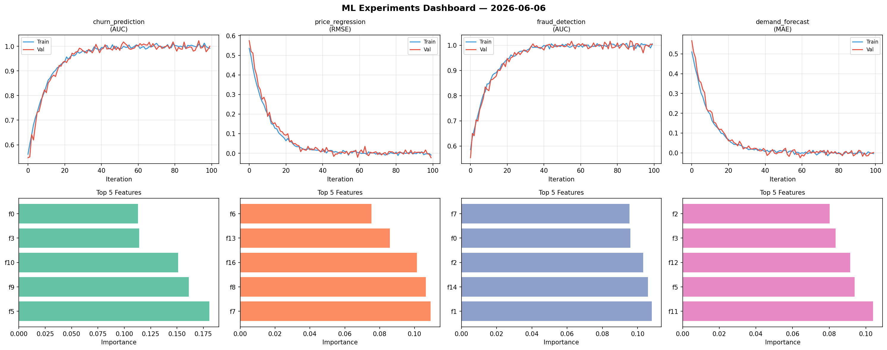
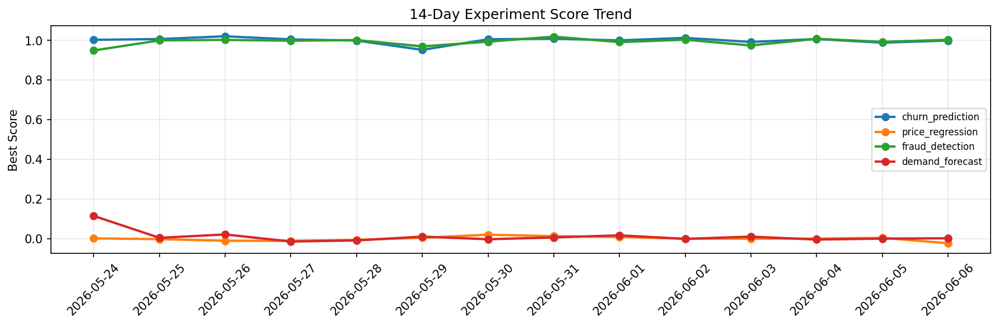

# ML Experiments Report — 2026-06-06

**Run ID:** `50922c458f` | **Experiments:** 4 | **Trials:** 21

## Delta vs Yesterday

| Experiment | Today | Yesterday | Change |
|-----------|-------|-----------|--------|
| churn_prediction | 0.9998 | 0.9891 | 📈 1.1% |
| price_regression | -0.0232 | 0.0037 | 📉 -727.0% |
| fraud_detection | 1.0035 | 0.9933 | 📈 1.0% |
| demand_forecast | 0.0016 | 0.0002 | 📈 140.0% |

## churn_prediction (AUC)

**Best Score:** 0.9998 (Trial 2)

| Trial | Score | Overfit Gap | Time | LR | Trees | Leaves |
|-------|-------|-------------|------|-----|-------|--------|
| 1 | 0.9481 | 0.001 | 23.15s | 0.05 | 500 | 63 |
| 2 ⭐ | 0.9998 | 0.008 | 44.46s | 0.2 | 200 | 63 |
| 3 | 0.7055 | 0.0529 | 47.55s | 0.01 | 200 | 63 |
| 4 | 0.6492 | 0.0198 | 46.43s | 0.01 | 200 | 63 |

## price_regression (RMSE)

**Best Score:** -0.0232 (Trial 2)

| Trial | Score | Overfit Gap | Time | LR | Trees | Leaves |
|-------|-------|-------------|------|-----|-------|--------|
| 1 | 0.9192 | 0.1396 | 256.05s | 0.01 | 1000 | 127 |
| 2 ⭐ | -0.0232 | 0.0139 | 5.11s | 0.2 | 100 | 63 |
| 3 | 0.0101 | 0.0011 | 47.49s | 0.2 | 500 | 15 |
| 4 | 0.0003 | 0.0111 | 10.02s | 0.1 | 200 | 15 |
| 5 | 0.1593 | 0.0066 | 2.7s | 0.05 | 200 | 127 |
| 6 | 0.0095 | 0.0069 | 43.13s | 0.2 | 500 | 127 |

## fraud_detection (AUC)

**Best Score:** 1.0035 (Trial 4)

| Trial | Score | Overfit Gap | Time | LR | Trees | Leaves |
|-------|-------|-------------|------|-----|-------|--------|
| 1 | 0.9899 | 0.0097 | 45.42s | 0.1 | 200 | 63 |
| 2 | 0.9957 | 0.0033 | 58.27s | 0.2 | 200 | 31 |
| 3 | 1.0017 | 0.012 | 9.55s | 0.2 | 200 | 31 |
| 4 ⭐ | 1.0035 | 0.0025 | 49.55s | 0.2 | 200 | 63 |
| 5 | 0.9875 | 0.0217 | 20.7s | 0.1 | 500 | 127 |

## demand_forecast (MAE)

**Best Score:** 0.0016 (Trial 5)

| Trial | Score | Overfit Gap | Time | LR | Trees | Leaves |
|-------|-------|-------------|------|-----|-------|--------|
| 1 | 1.0887 | 0.1273 | 37.87s | 0.01 | 200 | 15 |
| 2 | 0.0113 | 0.0045 | 26.46s | 0.1 | 100 | 63 |
| 3 | 0.0096 | 0.0022 | 56.1s | 0.1 | 200 | 31 |
| 4 | 0.0018 | 0.0067 | 2.44s | 0.2 | 200 | 31 |
| 5 ⭐ | 0.0016 | 0.0061 | 48.94s | 0.2 | 200 | 63 |
| 6 | 0.0252 | 0.0073 | 85.3s | 0.1 | 500 | 63 |
