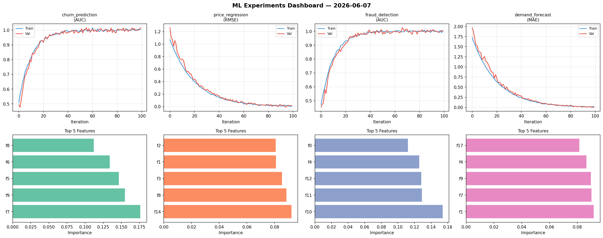
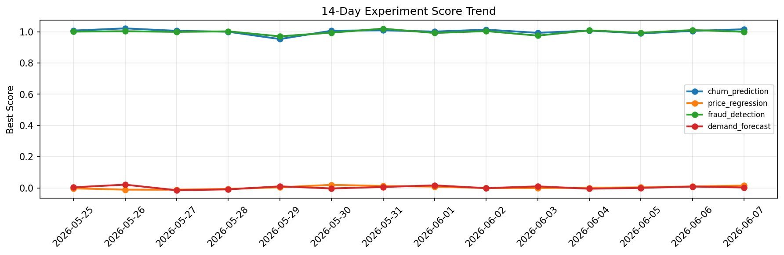

# ML Experiments Report — 2026-06-07

**Run ID:** `802134164e` | **Experiments:** 4 | **Trials:** 20

## Delta vs Yesterday

| Experiment | Today | Yesterday | Change |
|-----------|-------|-----------|--------|
| churn_prediction | 1.0158 | 1.0051 | 📈 1.1% |
| price_regression | 0.015 | 0.0097 | 📈 54.6% |
| fraud_detection | 0.9996 | 1.0107 | 📉 -1.1% |
| demand_forecast | 0.0029 | 0.0089 | 📉 -67.4% |

## churn_prediction (AUC)

**Best Score:** 1.0158 (Trial 1)

| Trial | Score | Overfit Gap | Time | LR | Trees | Leaves |
|-------|-------|-------------|------|-----|-------|--------|
| 1 ⭐ | 1.0158 | 0.0096 | 7.62s | 0.2 | 500 | 15 |
| 2 | 0.9989 | 0.0074 | 140.11s | 0.1 | 1000 | 15 |
| 3 | 0.945 | 0.0142 | 136.84s | 0.05 | 1000 | 15 |
| 4 | 0.6946 | 0.0087 | 14.17s | 0.01 | 200 | 63 |
| 5 | 0.6352 | 0.002 | 7.89s | 0.01 | 100 | 127 |
| 6 | 0.7729 | 0.0227 | 35.18s | 0.01 | 1000 | 127 |

## price_regression (RMSE)

**Best Score:** 0.015 (Trial 3)

| Trial | Score | Overfit Gap | Time | LR | Trees | Leaves |
|-------|-------|-------------|------|-----|-------|--------|
| 1 | 0.4983 | 0.0265 | 18.12s | 0.01 | 500 | 31 |
| 2 | 0.1102 | 0.0176 | 133.88s | 0.05 | 1000 | 127 |
| 3 ⭐ | 0.015 | 0.0017 | 119.24s | 0.1 | 1000 | 31 |
| 4 | 0.0194 | 0.0054 | 28.36s | 0.1 | 100 | 127 |

## fraud_detection (AUC)

**Best Score:** 0.9996 (Trial 3)

| Trial | Score | Overfit Gap | Time | LR | Trees | Leaves |
|-------|-------|-------------|------|-----|-------|--------|
| 1 | 0.6322 | 0.0478 | 28.5s | 0.01 | 1000 | 63 |
| 2 | 0.9604 | 0.0044 | 106.74s | 0.05 | 1000 | 63 |
| 3 ⭐ | 0.9996 | 0.007 | 46.97s | 0.2 | 200 | 63 |
| 4 | 0.99 | 0.0005 | 22.86s | 0.2 | 200 | 15 |
| 5 | 0.9854 | 0.0118 | 109.26s | 0.1 | 500 | 31 |
| 6 | 0.6706 | 0.0304 | 186.88s | 0.01 | 1000 | 31 |

## demand_forecast (MAE)

**Best Score:** 0.0029 (Trial 1)

| Trial | Score | Overfit Gap | Time | LR | Trees | Leaves |
|-------|-------|-------------|------|-----|-------|--------|
| 1 ⭐ | 0.0029 | 0.0125 | 49.96s | 0.1 | 200 | 63 |
| 2 | 0.9012 | 0.1398 | 4.35s | 0.01 | 100 | 31 |
| 3 | 1.0362 | 0.0618 | 42.13s | 0.01 | 200 | 15 |
| 4 | 0.0221 | 0.0176 | 34.66s | 0.1 | 200 | 63 |
