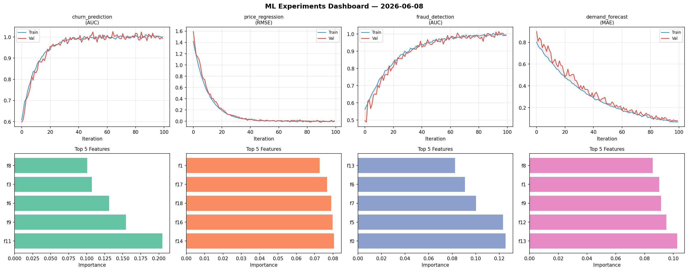
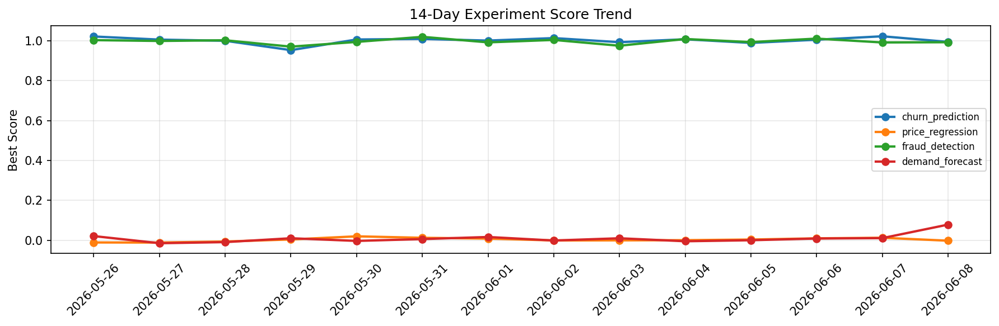

# ML Experiments Report — 2026-06-08

**Run ID:** `4dba249ffa` | **Experiments:** 4 | **Trials:** 19

## Delta vs Yesterday

| Experiment | Today | Yesterday | Change |
|-----------|-------|-----------|--------|
| churn_prediction | 0.9943 | 1.0224 | 📉 -2.7% |
| price_regression | -0.0021 | 0.0126 | 📉 -116.7% |
| fraud_detection | 0.9926 | 0.9914 | 📈 0.1% |
| demand_forecast | 0.0785 | 0.0108 | 📈 626.9% |

## churn_prediction (AUC)

**Best Score:** 0.9943 (Trial 3)

| Trial | Score | Overfit Gap | Time | LR | Trees | Leaves |
|-------|-------|-------------|------|-----|-------|--------|
| 1 | 0.765 | 0.0362 | 22.09s | 0.01 | 200 | 63 |
| 2 | 0.9561 | 0.0121 | 1.11s | 0.05 | 200 | 127 |
| 3 ⭐ | 0.9943 | 0.0059 | 145.15s | 0.2 | 1000 | 31 |
| 4 | 0.9742 | 0.0223 | 17.7s | 0.2 | 200 | 127 |
| 5 | 0.9749 | 0.0235 | 22.09s | 0.1 | 1000 | 63 |

## price_regression (RMSE)

**Best Score:** -0.0021 (Trial 2)

| Trial | Score | Overfit Gap | Time | LR | Trees | Leaves |
|-------|-------|-------------|------|-----|-------|--------|
| 1 | 0.8489 | 0.136 | 29.2s | 0.01 | 100 | 15 |
| 2 ⭐ | -0.0021 | 0.0096 | 0.69s | 0.2 | 100 | 15 |
| 3 | 0.8885 | 0.0826 | 10.14s | 0.01 | 100 | 15 |
| 4 | 0.6083 | 0.0411 | 28.1s | 0.01 | 100 | 63 |

## fraud_detection (AUC)

**Best Score:** 0.9926 (Trial 5)

| Trial | Score | Overfit Gap | Time | LR | Trees | Leaves |
|-------|-------|-------------|------|-----|-------|--------|
| 1 | 0.6345 | 0.046 | 5.93s | 0.01 | 200 | 15 |
| 2 | 0.9761 | 0.0073 | 113.94s | 0.05 | 1000 | 31 |
| 3 | 0.9555 | 0.0039 | 18.62s | 0.05 | 100 | 15 |
| 4 | 0.9726 | 0.0128 | 16.19s | 0.05 | 100 | 63 |
| 5 ⭐ | 0.9926 | 0.0032 | 19.33s | 0.1 | 100 | 31 |
| 6 | 0.9893 | 0.0062 | 15.26s | 0.1 | 100 | 15 |

## demand_forecast (MAE)

**Best Score:** 0.0785 (Trial 2)

| Trial | Score | Overfit Gap | Time | LR | Trees | Leaves |
|-------|-------|-------------|------|-----|-------|--------|
| 1 | 0.8531 | 0.0339 | 198.21s | 0.01 | 1000 | 31 |
| 2 ⭐ | 0.0785 | 0.0105 | 34.92s | 0.05 | 500 | 127 |
| 3 | 0.493 | 0.084 | 21.63s | 0.01 | 100 | 127 |
| 4 | 0.9074 | 0.0653 | 27.22s | 0.01 | 100 | 63 |
