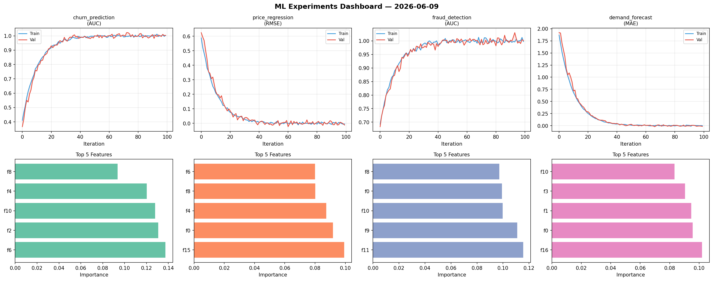
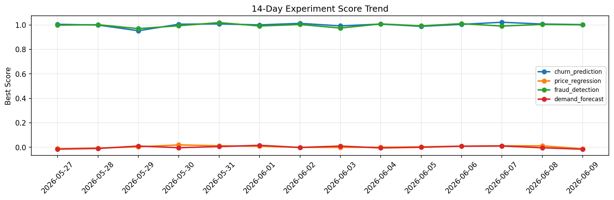

# ML Experiments Report — 2026-06-09

**Run ID:** `ce99a70410` | **Experiments:** 4 | **Trials:** 18

## Delta vs Yesterday

| Experiment | Today | Yesterday | Change |
|-----------|-------|-----------|--------|
| churn_prediction | 1.0033 | 1.0079 | 📉 -0.5% |
| price_regression | -0.012 | 0.0119 | 📉 -200.8% |
| fraud_detection | 1.0013 | 1.0046 | 📉 -0.3% |
| demand_forecast | -0.0155 | -0.0038 | 📉 -307.9% |

## churn_prediction (AUC)

**Best Score:** 1.0033 (Trial 1)

| Trial | Score | Overfit Gap | Time | LR | Trees | Leaves |
|-------|-------|-------------|------|-----|-------|--------|
| 1 ⭐ | 1.0033 | 0.0001 | 253.35s | 0.2 | 1000 | 127 |
| 2 | 0.673 | 0.0359 | 65.42s | 0.01 | 500 | 31 |
| 3 | 0.9525 | 0.0135 | 25.3s | 0.05 | 200 | 15 |
| 4 | 0.7789 | 0.0354 | 125.44s | 0.01 | 500 | 127 |
| 5 | 0.9785 | 0.0031 | 28.93s | 0.05 | 100 | 63 |
| 6 | 0.7831 | 0.0262 | 111.94s | 0.01 | 1000 | 63 |

## price_regression (RMSE)

**Best Score:** -0.012 (Trial 3)

| Trial | Score | Overfit Gap | Time | LR | Trees | Leaves |
|-------|-------|-------------|------|-----|-------|--------|
| 1 | 0.0051 | 0.0117 | 16.9s | 0.1 | 200 | 15 |
| 2 | 0.0701 | 0.0014 | 20.53s | 0.05 | 100 | 127 |
| 3 ⭐ | -0.012 | 0.0074 | 25.61s | 0.2 | 100 | 15 |

## fraud_detection (AUC)

**Best Score:** 1.0013 (Trial 6)

| Trial | Score | Overfit Gap | Time | LR | Trees | Leaves |
|-------|-------|-------------|------|-----|-------|--------|
| 1 | 0.9963 | 0.0082 | 30.78s | 0.2 | 1000 | 127 |
| 2 | 0.9822 | 0.0308 | 86.93s | 0.2 | 500 | 127 |
| 3 | 0.9802 | 0.0086 | 26.39s | 0.05 | 1000 | 31 |
| 4 | 0.6062 | 0.0461 | 50.36s | 0.01 | 200 | 31 |
| 5 | 0.6938 | 0.0367 | 2.48s | 0.01 | 200 | 127 |
| 6 ⭐ | 1.0013 | 0.0037 | 51.68s | 0.2 | 200 | 127 |

## demand_forecast (MAE)

**Best Score:** -0.0155 (Trial 1)

| Trial | Score | Overfit Gap | Time | LR | Trees | Leaves |
|-------|-------|-------------|------|-----|-------|--------|
| 1 ⭐ | -0.0155 | 0.0156 | 14.41s | 0.2 | 100 | 15 |
| 2 | 0.0055 | 0.0102 | 4.83s | 0.1 | 100 | 127 |
| 3 | 0.0048 | 0.0005 | 20.55s | 0.1 | 100 | 127 |
