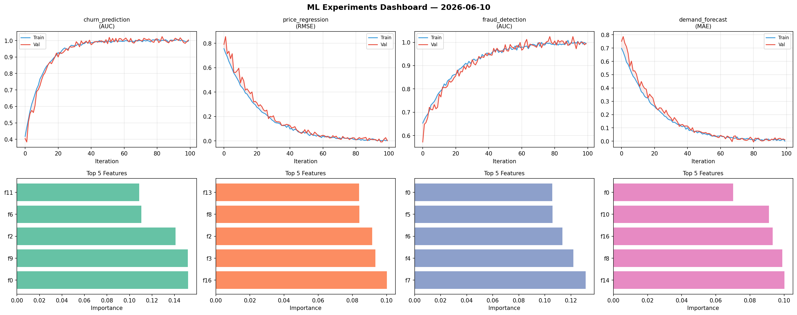
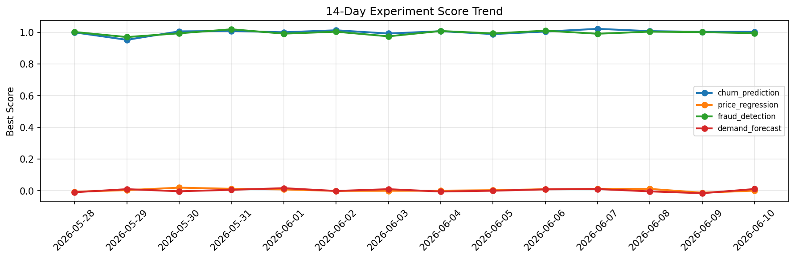

# ML Experiments Report — 2026-06-10

**Run ID:** `07d4feec9d` | **Experiments:** 4 | **Trials:** 20

## Delta vs Yesterday

| Experiment | Today | Yesterday | Change |
|-----------|-------|-----------|--------|
| churn_prediction | 1.0036 | 1.0033 | 📉 0.0% |
| price_regression | 0.0006 | -0.012 | 📈 105.0% |
| fraud_detection | 0.9951 | 1.0013 | 📉 -0.6% |
| demand_forecast | 0.0111 | -0.0155 | 📈 171.6% |

## churn_prediction (AUC)

**Best Score:** 1.0036 (Trial 2)

| Trial | Score | Overfit Gap | Time | LR | Trees | Leaves |
|-------|-------|-------------|------|-----|-------|--------|
| 1 | 0.9715 | 0.0047 | 2.56s | 0.05 | 200 | 63 |
| 2 ⭐ | 1.0036 | 0.0059 | 57.97s | 0.2 | 200 | 127 |
| 3 | 0.9471 | 0.0146 | 45.33s | 0.05 | 500 | 15 |
| 4 | 0.9834 | 0.0119 | 11.74s | 0.2 | 500 | 15 |
| 5 | 1.0005 | 0.0067 | 11.52s | 0.2 | 100 | 127 |

## price_regression (RMSE)

**Best Score:** 0.0006 (Trial 1)

| Trial | Score | Overfit Gap | Time | LR | Trees | Leaves |
|-------|-------|-------------|------|-----|-------|--------|
| 1 ⭐ | 0.0006 | 0.0053 | 25.12s | 0.1 | 100 | 15 |
| 2 | 0.0168 | 0.0001 | 21.23s | 0.1 | 100 | 31 |
| 3 | 0.9325 | 0.08 | 10.95s | 0.01 | 1000 | 31 |

## fraud_detection (AUC)

**Best Score:** 0.9951 (Trial 3)

| Trial | Score | Overfit Gap | Time | LR | Trees | Leaves |
|-------|-------|-------------|------|-----|-------|--------|
| 1 | 0.7095 | 0.029 | 150.44s | 0.01 | 1000 | 15 |
| 2 | 0.971 | 0.0204 | 42.45s | 0.05 | 200 | 63 |
| 3 ⭐ | 0.9951 | 0.0016 | 132.92s | 0.1 | 1000 | 63 |
| 4 | 0.9661 | 0.0254 | 7.88s | 0.05 | 100 | 63 |
| 5 | 0.9909 | 0.0139 | 21.42s | 0.2 | 100 | 63 |
| 6 | 0.956 | 0.0012 | 29.34s | 0.05 | 500 | 63 |

## demand_forecast (MAE)

**Best Score:** 0.0111 (Trial 3)

| Trial | Score | Overfit Gap | Time | LR | Trees | Leaves |
|-------|-------|-------------|------|-----|-------|--------|
| 1 | 0.626 | 0.011 | 198.69s | 0.01 | 1000 | 127 |
| 2 | 0.138 | 0.0272 | 273.67s | 0.05 | 1000 | 31 |
| 3 ⭐ | 0.0111 | 0.0108 | 38.89s | 0.1 | 200 | 63 |
| 4 | 0.0777 | 0.01 | 3.0s | 0.05 | 100 | 127 |
| 5 | 0.1579 | 0.0202 | 23.02s | 0.05 | 200 | 63 |
| 6 | 0.0115 | 0.0031 | 14.48s | 0.2 | 100 | 15 |
