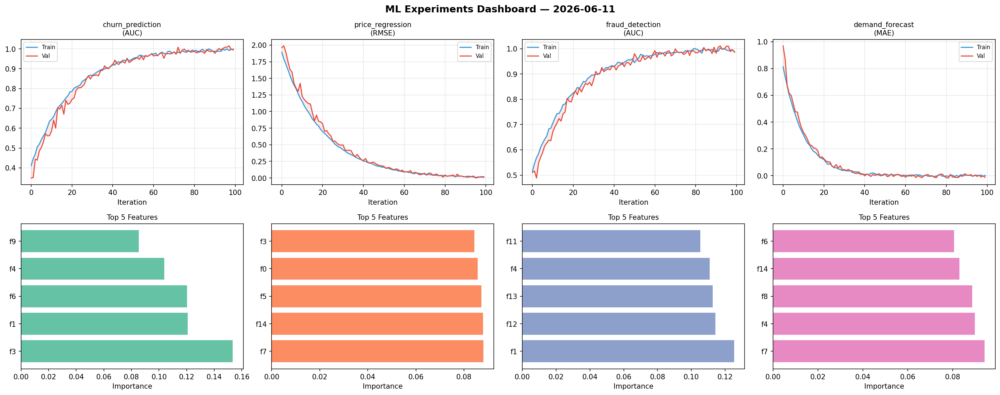
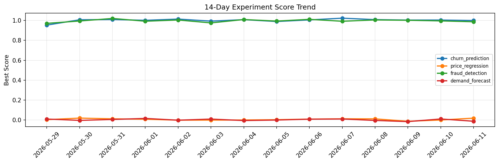

# ML Experiments Report — 2026-06-11

**Run ID:** `260cedf4e3` | **Experiments:** 4 | **Trials:** 12

## Delta vs Yesterday

| Experiment | Today | Yesterday | Change |
|-----------|-------|-----------|--------|
| churn_prediction | 0.9989 | 1.0036 | 📉 -0.5% |
| price_regression | 0.0193 | 0.0006 | 📈 1870.0% |
| fraud_detection | 0.9864 | 0.9951 | 📉 -0.9% |
| demand_forecast | -0.0119 | 0.0111 | 📉 -207.2% |

## churn_prediction (AUC)

**Best Score:** 0.9989 (Trial 3)

| Trial | Score | Overfit Gap | Time | LR | Trees | Leaves |
|-------|-------|-------------|------|-----|-------|--------|
| 1 | 0.9412 | 0.0142 | 39.44s | 0.05 | 200 | 127 |
| 2 | 0.9571 | 0.0122 | 141.56s | 0.05 | 500 | 63 |
| 3 ⭐ | 0.9989 | 0.0045 | 4.5s | 0.1 | 100 | 63 |

## price_regression (RMSE)

**Best Score:** 0.0193 (Trial 2)

| Trial | Score | Overfit Gap | Time | LR | Trees | Leaves |
|-------|-------|-------------|------|-----|-------|--------|
| 1 | 1.0526 | 0.0675 | 1.12s | 0.01 | 100 | 31 |
| 2 ⭐ | 0.0193 | 0.0111 | 128.21s | 0.1 | 1000 | 15 |
| 3 | 0.177 | 0.0257 | 43.29s | 0.05 | 200 | 15 |

## fraud_detection (AUC)

**Best Score:** 0.9864 (Trial 3)

| Trial | Score | Overfit Gap | Time | LR | Trees | Leaves |
|-------|-------|-------------|------|-----|-------|--------|
| 1 | 0.6202 | 0.0227 | 254.4s | 0.01 | 1000 | 63 |
| 2 | 0.9533 | 0.0112 | 244.45s | 0.05 | 1000 | 31 |
| 3 ⭐ | 0.9864 | 0.0028 | 38.09s | 0.1 | 500 | 63 |

## demand_forecast (MAE)

**Best Score:** -0.0119 (Trial 3)

| Trial | Score | Overfit Gap | Time | LR | Trees | Leaves |
|-------|-------|-------------|------|-----|-------|--------|
| 1 | 0.0087 | 0.0001 | 3.26s | 0.1 | 200 | 127 |
| 2 | -0.0066 | 0.0032 | 2.29s | 0.2 | 200 | 63 |
| 3 ⭐ | -0.0119 | 0.0147 | 182.55s | 0.2 | 1000 | 31 |
