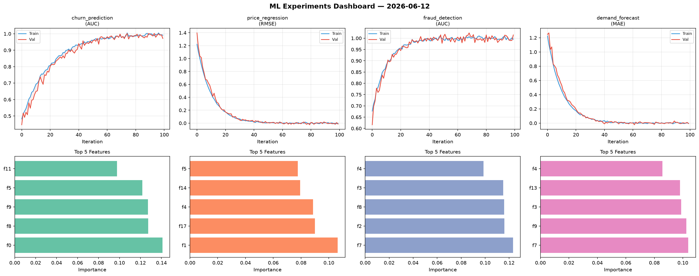
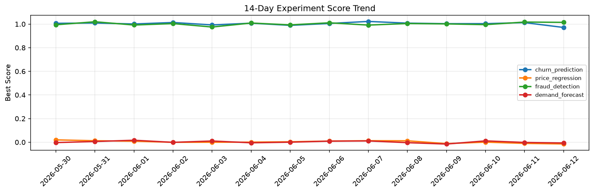

# ML Experiments Report — 2026-06-12

**Run ID:** `b0312dcfd5` | **Experiments:** 4 | **Trials:** 21

## Delta vs Yesterday

| Experiment | Today | Yesterday | Change |
|-----------|-------|-----------|--------|
| churn_prediction | 0.9713 | 1.0123 | 📉 -4.1% |
| price_regression | -0.0145 | -0.0101 | 📉 -43.6% |
| fraud_detection | 1.0145 | 1.0171 | 📉 -0.3% |
| demand_forecast | -0.0067 | -0.002 | 📉 -235.0% |

## churn_prediction (AUC)

**Best Score:** 0.9713 (Trial 3)

| Trial | Score | Overfit Gap | Time | LR | Trees | Leaves |
|-------|-------|-------------|------|-----|-------|--------|
| 1 | 0.9326 | 0.0303 | 85.59s | 0.05 | 1000 | 31 |
| 2 | 0.703 | 0.0434 | 165.62s | 0.01 | 1000 | 31 |
| 3 ⭐ | 0.9713 | 0.02 | 262.23s | 0.1 | 1000 | 31 |
| 4 | 0.965 | 0.0075 | 47.22s | 0.05 | 1000 | 127 |

## price_regression (RMSE)

**Best Score:** -0.0145 (Trial 1)

| Trial | Score | Overfit Gap | Time | LR | Trees | Leaves |
|-------|-------|-------------|------|-----|-------|--------|
| 1 ⭐ | -0.0145 | 0.0128 | 169.57s | 0.2 | 1000 | 31 |
| 2 | 0.0048 | 0.0002 | 5.59s | 0.2 | 100 | 63 |
| 3 | 1.0376 | 0.1542 | 55.79s | 0.01 | 200 | 63 |
| 4 | 0.0004 | 0.0012 | 101.23s | 0.2 | 500 | 31 |
| 5 | 0.0546 | 0.0122 | 24.01s | 0.05 | 200 | 31 |
| 6 | -0.01 | 0.0123 | 3.74s | 0.2 | 100 | 63 |

## fraud_detection (AUC)

**Best Score:** 1.0145 (Trial 3)

| Trial | Score | Overfit Gap | Time | LR | Trees | Leaves |
|-------|-------|-------------|------|-----|-------|--------|
| 1 | 1.0076 | 0.0079 | 138.17s | 0.1 | 500 | 63 |
| 2 | 0.9749 | 0.021 | 112.99s | 0.2 | 1000 | 127 |
| 3 ⭐ | 1.0145 | 0.0192 | 27.24s | 0.2 | 500 | 15 |
| 4 | 1.0058 | 0.0124 | 27.85s | 0.1 | 100 | 15 |
| 5 | 0.9965 | 0.0031 | 16.57s | 0.1 | 100 | 63 |

## demand_forecast (MAE)

**Best Score:** -0.0067 (Trial 6)

| Trial | Score | Overfit Gap | Time | LR | Trees | Leaves |
|-------|-------|-------------|------|-----|-------|--------|
| 1 | 0.1147 | 0.0172 | 10.06s | 0.05 | 100 | 31 |
| 2 | 0.0099 | 0.0041 | 7.92s | 0.2 | 200 | 127 |
| 3 | 0.1206 | 0.0016 | 14.48s | 0.05 | 200 | 15 |
| 4 | 0.1757 | 0.0353 | 6.44s | 0.05 | 200 | 127 |
| 5 | 0.5837 | 0.0683 | 1.44s | 0.01 | 100 | 127 |
| 6 ⭐ | -0.0067 | 0.0049 | 268.89s | 0.2 | 1000 | 15 |
