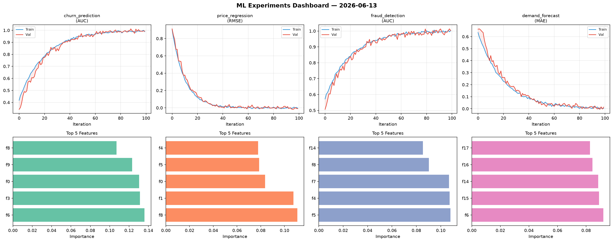
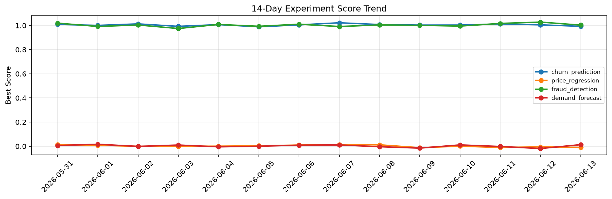

# ML Experiments Report — 2026-06-13

**Run ID:** `7810642609` | **Experiments:** 4 | **Trials:** 16

## Delta vs Yesterday

| Experiment | Today | Yesterday | Change |
|-----------|-------|-----------|--------|
| churn_prediction | 0.9932 | 1.0054 | 📉 -1.2% |
| price_regression | -0.0093 | -0.0055 | 📉 -69.1% |
| fraud_detection | 1.0031 | 1.0282 | 📉 -2.4% |
| demand_forecast | 0.0133 | -0.0188 | 📈 170.7% |

## churn_prediction (AUC)

**Best Score:** 0.9932 (Trial 3)

| Trial | Score | Overfit Gap | Time | LR | Trees | Leaves |
|-------|-------|-------------|------|-----|-------|--------|
| 1 | 0.6754 | 0.0231 | 16.85s | 0.01 | 200 | 63 |
| 2 | 0.98 | 0.016 | 146.7s | 0.2 | 1000 | 63 |
| 3 ⭐ | 0.9932 | 0.0044 | 95.74s | 0.1 | 500 | 15 |

## price_regression (RMSE)

**Best Score:** -0.0093 (Trial 4)

| Trial | Score | Overfit Gap | Time | LR | Trees | Leaves |
|-------|-------|-------------|------|-----|-------|--------|
| 1 | 0.0023 | 0.0059 | 6.48s | 0.2 | 200 | 31 |
| 2 | 0.0275 | 0.0231 | 168.85s | 0.1 | 1000 | 127 |
| 3 | 0.4459 | 0.024 | 50.39s | 0.01 | 200 | 63 |
| 4 ⭐ | -0.0093 | 0.005 | 17.26s | 0.2 | 100 | 15 |
| 5 | 0.006 | 0.0066 | 7.53s | 0.2 | 100 | 31 |
| 6 | 0.0137 | 0.0216 | 14.23s | 0.2 | 200 | 15 |

## fraud_detection (AUC)

**Best Score:** 1.0031 (Trial 1)

| Trial | Score | Overfit Gap | Time | LR | Trees | Leaves |
|-------|-------|-------------|------|-----|-------|--------|
| 1 ⭐ | 1.0031 | 0.0008 | 26.51s | 0.1 | 500 | 63 |
| 2 | 0.9709 | 0.0007 | 31.75s | 0.05 | 200 | 127 |
| 3 | 0.9971 | 0.0061 | 56.69s | 0.2 | 200 | 63 |

## demand_forecast (MAE)

**Best Score:** 0.0133 (Trial 3)

| Trial | Score | Overfit Gap | Time | LR | Trees | Leaves |
|-------|-------|-------------|------|-----|-------|--------|
| 1 | 0.5362 | 0.0535 | 3.61s | 0.01 | 100 | 127 |
| 2 | 1.0174 | 0.1102 | 52.56s | 0.01 | 500 | 31 |
| 3 ⭐ | 0.0133 | 0.0113 | 132.66s | 0.1 | 500 | 127 |
| 4 | 1.0681 | 0.1008 | 56.58s | 0.01 | 200 | 15 |
